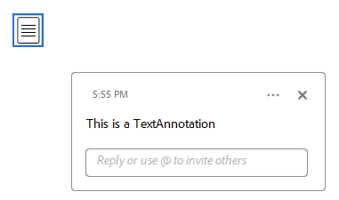

# Text Annotation  

A **Text annotation** represents a *sticky note* attached to a point in the PDF document. When closed, the annotation appears as an icon; when opened, it displays a pop-up window containing the text of the note in a font and size chosen by the viewer application.

>note Text annotations do not scale and rotate with the page. They behave as if the NoZoom and NoRotate annotation flags were always set.

The **TextAnnotation** class is a derivative of the **MarkupAnnotation** (descendent of **ContentAnnotation**) and it exposes the following properties:

|Property|Description|
|---|---|
|**Opacity**|Gets or sets the opacity of the annotation.|
|**Contents**|Gets or sets the text that shall be displayed for the annotation.|
|**Color**|Gets or sets the color of the annotation.|
|**Content**|Gets the source defining the visual content of the annotation. This content is with bigger priority compared to the annotation appearance characteristics and text properties and it is visualized by default when opening the exported document in some PDF viewer.|


### Creating a TextAnnotation

```csharp
            string sampleText = "sample text here";
            RadFixedDocument fixedDocument = new RadFixedDocument();
            using (RadFixedDocumentEditor editor = new RadFixedDocumentEditor(fixedDocument))
            {
                editor.InsertRun(sampleText);
            } 
            RadFixedPage page = fixedDocument.Pages[0];
            TextAnnotation annotation = page.Annotations.AddText(new Rect(200, 100, 200, 200));
            annotation.Contents = "This is a TextAnnotation";
            annotation.Opacity = 0.5;
            annotation.Color = new RgbColor(255, 0, 0); //Default RgbColor(255, 255, 255)
```

  

### Creating a TextAnnotation with FixedContentEditor

The FixedContentEditor offers the public **DrawTextAnnotation** method which creates a new TextAnnotation and draws it with a specified size and text and can create a PopupAnnotation to go with it.

```csharp
            RadFixedDocument fixedDocument = new RadFixedDocument();
            FixedContentEditor editor = new FixedContentEditor(fixedDocument.Pages.AddPage());
            editor.Position.Translate(100, 100);
            Size annotationSize = new Size(50, 50);
            Size popupSize = new Size(250, 100);
            string text = "This is a TextAnnotation";
            bool addPopup = true;
            editor.DrawTextAnnotation(annotationSize, popupSize, text, addPopup);
            PopupAnnotation popupAnnotation = fixedDocument.Pages[0].Annotations[1] as PopupAnnotation;
```

   

### Creating a TextAnnotation with Appearance

The **AnnotationContentSource** class, accessed by the **Content** property of the annotation object, represents the [FormSource]() instances used for displaying the widget content. The following example shows how to change the annotation's visual appearance when the mouse is not interacting with the widget (**NormalContentSource**) and when the mouse is over the widget (**MouseOverContentSource**):

```csharp 
        private RadFixedDocument CreateTextAnnotation()
        {
            RadFixedDocument fixedDocument = new RadFixedDocument();
            RadFixedPage page = fixedDocument.Pages.AddPage();

            TextAnnotation annotation = page.Annotations.AddText(new Rect(100, 100, 100, 50));
            annotation.Contents = "This is a TextAnnotation";
            FormSource normalForm = new FormSource();
            CreateContentFormWithText(normalForm, "Hover me");
            FormSource hoverForm = new FormSource();
            CreateContentFormWithText(hoverForm, "Done");

            annotation.Content.NormalContentSource = normalForm;
            annotation.Content.MouseOverContentSource = hoverForm;
            return fixedDocument;
        }

        private static void CreateContentFormWithText(FormSource normalForm, string text)
        {
            Size s = new Size(100, 40);
            Random rand = new Random();
            normalForm.Size = s;

            FixedContentEditor formEditor = new FixedContentEditor(normalForm);

            using (formEditor.SaveProperties())
            {
                formEditor.GraphicProperties.IsFilled = true;
                formEditor.GraphicProperties.IsStroked = true;
                formEditor.GraphicProperties.StrokeThickness = 1;
                formEditor.GraphicProperties.StrokeColor = new RgbColor(255, 0, 0);
                formEditor.GraphicProperties.FillColor = new RgbColor(255, 255, 0);
                formEditor.GraphicProperties.StrokeDashArray = new double[] { 17, 4 };
                formEditor.DrawRectangle(new Rect(s));
            }

            formEditor.TextProperties.FontSize = 10;
            formEditor.Position.Translate(10, 10);
            formEditor.DrawText(text);
        }
```

  

It is possible to modify the content source displayed when the mouse button is pressed on the widget via the **MouseDownContentSource** property of the AnnotationContentSource.

## See Also

* [AcroForm]()
* [FormField]()
* [Annotations Overview]()
* [FormSource]()
