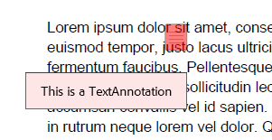

# Text Annotation  

A **Text annotation** represents a *sticky note* attached to a point in the PDF document. When closed, the annotation appears as an icon; when opened, it displays a pop-up window containing the text of the note in a font and size chosen by the viewer application.

>note Text annotations do not scale and rotate with the page. They behave as if the NoZoom and NoRotate annotation flags were always set.

The **TextAnnotation** class is a derivative of the **MarkupAnnotation** (descendent of **ContentAnnotation**) and it exposes the following properties:

|Property|Description|
|---|---|
|**Opacity**|Gets or sets the opacity of the annotation.|
|**Contents**|Gets or sets the text that shall be displayed for the annotation.|
|**Color**|Gets or sets the color of the annotation.|
|**Content**|Gets the source defining the visual content of the annotation. This content is with bigger priority compared to the annotation appearance characteristics and text properties and it is visualized by default when opening the exported document in some PDF viewer.|

### Creating a TextAnnotation

<snippet id='codeblock_144'/>

  

### Creating a TextAnnotation with FixedContentEditor

The FixedContentEditor offers the public **DrawTextAnnotation** method which creates a new TextAnnotation and draws it with a specified size and text and can create a PopupAnnotation to go with it.

<snippet id='codeblock_145'/>

   

### Creating a TextAnnotation with Appearance

The **AnnotationContentSource** class, accessed by the **Content** property of the annotation object, represents the [FormSource]() instances used for displaying the widget content. The following example shows how to change the annotation's visual appearance when the mouse is not interacting with the widget (**NormalContentSource**) and when the mouse is over the widget (**MouseOverContentSource**):

>important In **.NET Standard/.NET (Target OS: None)** environments, fonts beyond the [14 standard ones](#standard-fonts) require a [FontsProvider implementation]() to be resolved correctly.

<snippet id='codeblock_146'/>

  

It is possible to modify the content source displayed when the mouse button is pressed on the widget via the **MouseDownContentSource** property of the AnnotationContentSource.

## See Also

* [AcroForm]()
* [FormField]()
* [Annotations Overview]()
* [FormSource]()
