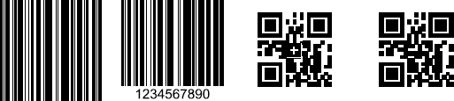

# Barcode FormSource

As of **Q1 2025** RadPdfProcessing provides support for adding Barcodes (1D and 2D) into a PDF document. This is possible through the static FormSource.**FromBarcode** and FormSource.**From2DBarcode** methods. They utilize the **Symbology1DType** and **Symbology2DType** enums that represent the different types of 1D and 2D barcode symbologies supported by the barcode model. These are the publicly available overloads:

|Method|Description|
|----|----|
|**FormSource.FromBarcode(Symbology1DType symbology, string value)**|Creates a **FormSource** object from a one-dimensional (1D) barcode parameters, with a default **Width** and **Height** of **100**.|
|**FormSource.FromBarcode(Symbology1DType symbology, string value, int width, int height)**|Creates a **FormSource** object from a one-dimensional (1D) barcode parameters with custom **Width** and **Height**.|
|**FormSource.FromBarcode(Symbology1DType symbology, string value, int width, int height, bool showText)**|Creates a **FormSource** object from a one-dimensional (1D) barcode parameters with custom **Width** and **Height** while specifying whether the text should be shown or not (**showText** is **false** by default).|
|**FormSource.FromBarcode(Symbology1DType symbology, string value, bool showText)**|Creates a **FormSource** object from a one-dimensional (1D) barcode parameters while specifying whether the text should be shown or not (**showText** is **false** by default). **Width** and **Height** are **100** by default.|
|**FormSource.From2DBarcode(Symbology2DType symbology, string value)**|Creates a **FormSource** object from a two-dimensional (2D) barcode parameters, with a default **Width** and **Height** of **100**.|
|**FormSource.From2DBarcode(Symbology2DType symbology, string value, int width, int height)**|Creates a **FormSource** object from a two-dimensional (2D) barcode parameters, with custom **Width** and **Height**.|

The following example shows how to create a **Barcode** as a **FormSource** object and insert it in a page using the [FixedContentEditor]():

<snippet id='libraries-pdf-model-formsource-adding-barcode'/>

## See Also

 * [FormSource]()
 * [SVG FormSource]()