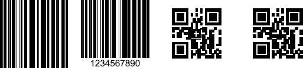

# Barcode FormSource

|Minimum Version|Q1 2025|
|----|----|

RadPdfProcessing supports adding barcodes (1D and 2D) into a PDF document. The static `FormSource.FromBarcode` and `FormSource.From2DBarcode` methods use the `Symbology1DType` and `Symbology2DType` enums that represent the different types of 1D and 2D barcode symbologies supported by the barcode model. The following overloads are available:

|Method|Description|
|----|----|
|`FormSource.FromBarcode(Symbology1DType symbology, string value)`|Creates a `FormSource` object from one-dimensional (1D) barcode parameters, with a default `Width` and `Height` of 100.|
|`FormSource.FromBarcode(Symbology1DType symbology, string value, int width, int height)`|Creates a `FormSource` object from one-dimensional (1D) barcode parameters with custom `Width` and `Height`.|
|`FormSource.FromBarcode(Symbology1DType symbology, string value, int width, int height, bool showText)`|Creates a `FormSource` object from one-dimensional (1D) barcode parameters with custom `Width` and `Height` while specifying whether to show the text (`showText` is `false` by default).|
|`FormSource.FromBarcode(Symbology1DType symbology, string value, bool showText)`|Creates a `FormSource` object from one-dimensional (1D) barcode parameters while specifying whether to show the text (`showText` is `false` by default). `Width` and `Height` are 100 by default.|
|`FormSource.From2DBarcode(Symbology2DType symbology, string value)`|Creates a `FormSource` object from two-dimensional (2D) barcode parameters, with a default `Width` and `Height` of 100.|
|`FormSource.From2DBarcode(Symbology2DType symbology, string value, int width, int height)`|Creates a `FormSource` object from two-dimensional (2D) barcode parameters, with custom `Width` and `Height`.|

The following example shows how to create a barcode as a `FormSource` object and insert it in a page by using the [FixedContentEditor]():

<snippet id='libraries-pdf-model-formsource-barcode'/>

## See Also

* [FormSource]()
* [SVG FormSource]()