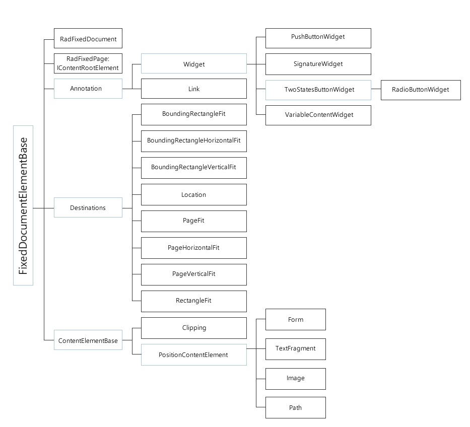
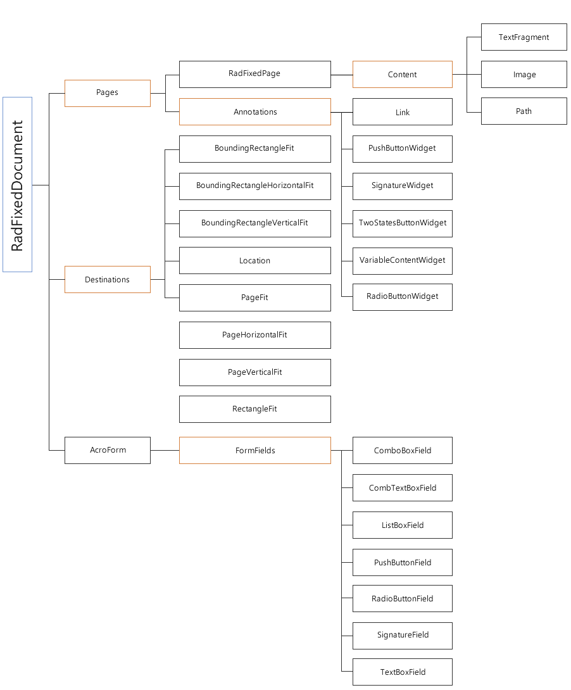

# General Information

This article explains the structure of __RadPdfProcessing__'s document model and how you can add content to it.

## Document Elements

[RadFixedDocument]() is the root element of all document elements. All document elements inherit from the __FixedDocumentElementBase__ abstract class. The diagram below describes the hierarchy in __RadPdfProcessing__.
        

## Composition of Document Elements

__RadFixedDocument__ represents a tree of [RadFixedPage]() where the fixed content is hosted. The diagram below describes the composition of the fixed content. The document elements are denoted in black and collections - in orange.
        

## Creating or Editing document content 

The RadPdfProcessing library provides API for editing existing or crating brand new documents. This is achieve via the following editors: 
* [RadFixedDocumentEditor](): This editor is suitable for creating new documents or adding content to existing documents. It allows you to add elements in a flow-like manner without explicitly setting positions and sizes. The RadFixedDocumentEditor takes care to arrange the document elements automatically and separates the content on different pages when needed.

* [FixedContentEditor](): This editor provides you with the great flexibility of the PDF format. It is suitable for adding content to existing pages. With it, you must specify the exact position of each new element and manually separate the content on different pages when needed.

## See Also

 * [RadFixedDocument]()
 * [RadFixedPage]()
