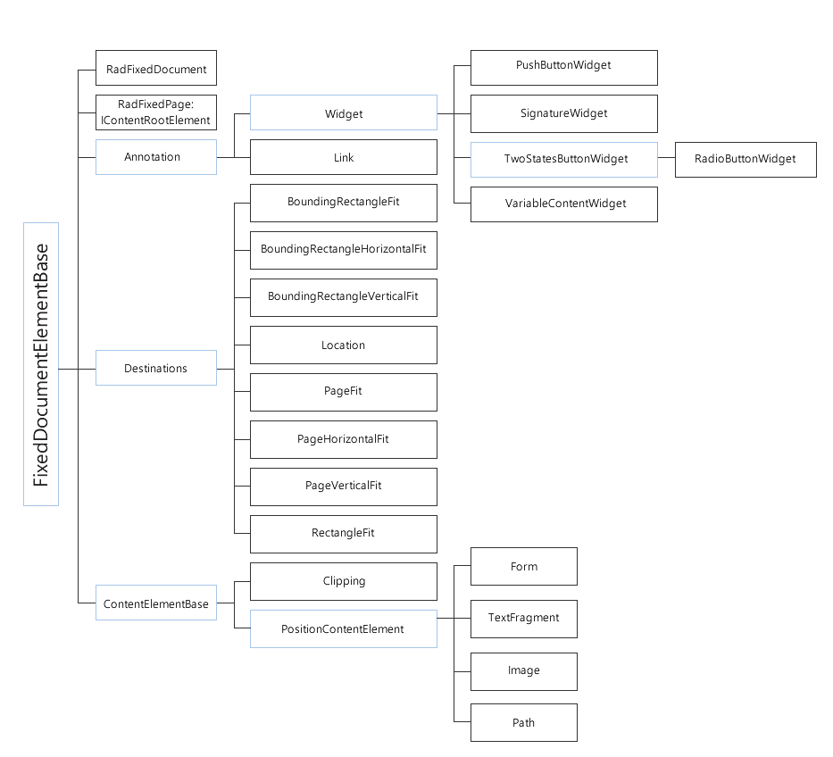
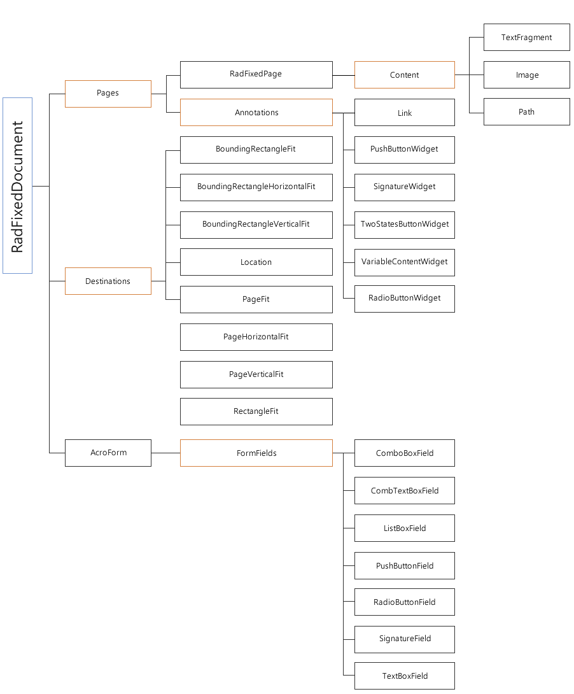

# General Information

The RadPdfProcessing document model defines a hierarchy of elements that represent PDF content. The following sections describe the element structure and how to add content.

## Document Elements

[RadFixedDocument]() is the root element of all document elements. All document elements inherit from the `FixedDocumentElementBase` abstract class. The following diagram describes the hierarchy in RadPdfProcessing:

* **FixedDocumentElementBase**
  * [RadFixedDocument]()
  * [RadFixedPage](): IContentRootElement
  * [Annotation]()
    * ContentAnnotationBase
      * [Widget]()
        * [PushButtonWidget](#pushbuttonwidget-class)
        * [SignatureWidget](#signaturewidget-class)
        * [TwoStatesButtonWidget](#twostatesbuttonwidget-class)
          * [RadioButtonWidget](#radiobuttonwidget-class)
        * VariableContentWidget

      * ContentAnnotation
        * [MarkupAnnotation]()
          * [LineAnnotation]()
          * [StampAnnotation]()
          * [TextAnnotation]()
          * [TextMarkupAnnotation]()

  * Destination
    * BoundingRectangleFit
    * BoundingRectangleHorizontalFit
    * BoundingRectangleVerticalFit
    * Location
    * PageFit
    * PageHorizontalFit
    * PageVerticalFit
    * RectangleFit
  * ContentElementBase
    * Clipping
    * PositionContentElement
      * [Form]()
      * [Image]()
      * [Path]()
      * [TextFragment]()

<!--  -->

## Composition of Document Elements

`RadFixedDocument` represents a tree of [RadFixedPage]() instances where the fixed content is hosted. The following diagram describes the composition of the fixed content. Document elements are denoted in black and collections in orange.

 * RadFixedDocument
   * [Pages]()
     * [Annotations]()
     * [Actions](#pageactioncollection) (PageActionCollection)
   * [NamedDestinations]()
   * [EmbeddedFiles]()
   * [AcroForm]()
      * [FormFields]()
   * [Bookmarks]()
   * [Actions]() (DocumentActionCollection)

<!--  -->

## Creating or Editing Document Content

The RadPdfProcessing library provides an API for editing existing or creating new documents. You can use the following editors:

* [RadFixedDocumentEditor](): This editor is suitable for creating new documents or adding content to existing documents. It allows you to add elements in a flow-like manner without explicitly setting positions and sizes. The `RadFixedDocumentEditor` arranges document elements automatically and separates the content on different pages when needed.

* [FixedContentEditor](): This editor provides the flexibility of the PDF format. It is suitable for adding content to existing pages. With it, you must specify the exact position of each new element and manually separate the content on different pages when needed.

## See Also

* [RadFixedDocument]()
* [RadFixedPage]()
