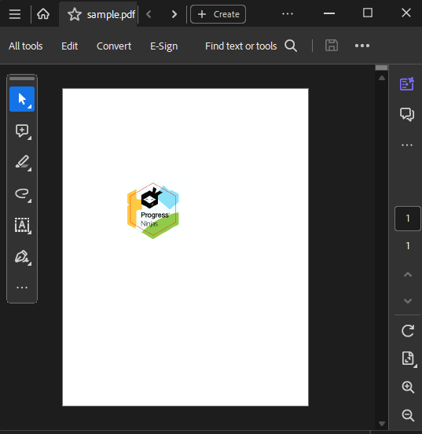

# Image

**Image** is a content element, which contains an [ImageSource]() and represents an image. It can be added in the **Content** collection of a **IContainerElement** such as [RadFixedPage](). 

## Public API

| **Property**          | **Description**                                                                                 |
|-----------------------|-------------------------------------------------------------------------------------------------|
| **ImageSource**       | Specifies the [ImageSource]() that will be visualized in the Image object. |
| **Width**             | The width of the image.                                                                     |
| **Height**            | The height of the image.                                                                    |
| **Position**          | The [Position]() of the image inside the **IContainerElement**. |
| **AlphaConstant**     | Specifies the constant shape or constant opacity value to be used for nonstroking operations.   |

| **Method**            | **Description**                                                                                 |
|-----------------------|-------------------------------------------------------------------------------------------------|
| **GetBitmapSource**  (_Unavailable in .NET Standard_) | Creates a [BitmapSource](https://docs.microsoft.com/en-us/dotnet/api/system.windows.media.imaging.bitmapsource) from the image element.|
| **Clone** (_since Q2 2025_)                | Creates a deep copy of this document element.                                                  |

### Working With an Image

You can edit an __Image__ element using the properties the class exposes. The properties are listed in the [Public API](#public-api) section.       

>note As of **Q3 2024** RadPdfProcessing provides support for SVG FormSource(vector graphics image format): [Adding SVG FormSource into a Document]().
            
__Example 1__ shows how to initialize an Image object, assigns an ImageSource to it and add it to a previously defined container (page).
      
#### __[C#] Example 1: Create image__

{{region cs-radpdfprocessing-model-image_0}}
    RadFixedDocument fixedDocument = new RadFixedDocument();
    RadFixedPage fixedPage = fixedDocument.Pages.AddPage();

    Image image = new Image();
    string imageFilePath = "ProgressNinjas.png";
    using (FileStream fileStream = new FileStream(imageFilePath, FileMode.Open))
    {
        ImageSource imageSrc = new ImageSource(fileStream);
        image.ImageSource = imageSrc;
        image.Width = 200;
        image.Height = 200;
        image.AlphaConstant = 0.5;
        SimplePosition simplePosition = new SimplePosition();
        simplePosition.Translate(200, 300);
        image.Position = simplePosition;
        fixedPage.Content.Add(image);
    }
{{endregion}}

Once the above RadFixedDocument is [exported](), the following document with an image is created:

    

__Example 2__ demonstrates how to use one of the factory methods of the __ContentElementCollection__ to create a new image and insert it into the respective container.     

#### __[C#] Example 2: Add image to container__

{{region cs-radpdfprocessing-model-image_1}}
	Image image = container.Content.AddImage();
	Image imageWithSource = container.Content.AddImage(imageSource);
{{endregion}}

>tipThere are other methods that allow adding an image to a document by passing image size, format and source. They could be used through the [FixedContentEditor class]().     

The Image class exposes also the **GetBitmapSource()** method, enabling you to obtain a [BitmapSource](https://docs.microsoft.com/en-us/dotnet/api/system.windows.media.imaging.bitmapsource) instance representing the image.

>  The GetBitmapSource() method is not available in the .NET Standard version of the PdfProcessing binaries.

#### __[C#] Example 3: Obtain BitmapSource__

{{region cs-radpdfprocessing-model-image_2}}

	BitmapSource source = image.GetBitmapSource();
{{endregion}}

## See Also
 
 * [ImageSource]()
 * [RadFixedPage]()
 * [FixedContentEditor]()
 * [Position]()
 * [How to Generate a PDF Document from Images with FixedContentEditor]()
 * [How to Generate a PDF Document from Images with RadFixedDocumentEditor]()
 * [Change file size of a PDF with images through ImageCompression and ImageQuality]()
 * [Adding Images with a Shadow in PDF Documents]()
 * [Splitting a Large Image Across Multiple PDF Pages]()
 * [Change file size of a PDF with images through ImageCompression and ImageQuality]()
 * [Adding a Barcode to a PDF Document using PdfProcessing and the WinForms BarcodeView]()
