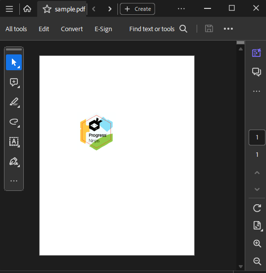

# Image

`Image` is a content element that contains an [ImageSource]() and represents an image. You can add it to the `Content` collection of an `IContainerElement` such as [RadFixedPage]().

## Public API

| **Property**          | **Description**                                                                                 |
|-----------------------|-------------------------------------------------------------------------------------------------|
| `ImageSource`       | Specifies the [ImageSource]() that the Image object visualizes. |
| `Width`             | The width of the image.                                                                     |
| `Height`            | The height of the image.                                                                    |
| `Position`          | The [Position]() of the image inside the `IContainerElement`. |
| `AlphaConstant`     | Specifies the constant shape or constant opacity value for nonstroking operations.   |

| **Method**            | **Description**                                                                                 |
|-----------------------|-------------------------------------------------------------------------------------------------|
| `GetBitmapSource` (not available in .NET Standard) | Creates a [BitmapSource](https://learn.microsoft.com/en-us/dotnet/api/system.windows.media.imaging.bitmapsource) from the image element.|
| `Clone` (starting with Q2 2025)                | Creates a deep copy of this document element.                                                  |

### Working with an Image

You can edit an `Image` element using the properties the class exposes. The properties are listed in the [Public API](#public-api) section.

>note Starting with **Q3 2024** RadPdfProcessing provides support for SVG FormSource (vector graphics image format): [Adding SVG FormSource into a Document]().

**Example 1** shows how to initialize an `Image` object, assign an `ImageSource` to it, and add it to a previously defined container (page).

**Example 1: Create image**

<snippet id='pdf-create-image'/>

Once you [export]() the `RadFixedDocument`, the following document with an image is created:

**Example 2** demonstrates how to use one of the factory methods of the `ContentElementCollection` to create a new image and insert it into the respective container.

**Example 2: Add image to container**

<snippet id='pdf-image-source'/>

>tip There are other methods that allow adding an image to a document by passing image size, format, and source. You can use them through the [FixedContentEditor]() class.

The `Image` class also exposes the `GetBitmapSource()` method, which allows you to obtain a [BitmapSource](https://learn.microsoft.com/en-us/dotnet/api/system.windows.media.imaging.bitmapsource) instance representing the image.

> The `GetBitmapSource()` method is not available in the .NET Standard version of the PdfProcessing packages.

**Obtain BitmapSource**

<snippet id='pdf-obtain-botmap-source'/>

## See Also

* [ImageSource]()
* [RadFixedPage]()
* [FixedContentEditor]()
* [Position]()
* [How to Generate a PDF Document from Images with FixedContentEditor]()
* [How to Generate a PDF Document from Images with RadFixedDocumentEditor]()
* [Change File Size of a PDF with Images Through ImageCompression and ImageQuality]()
* [Adding Images with a Shadow in PDF Documents]()
* [Splitting a Large Image Across Multiple PDF Pages]()
* [Adding a Barcode to a PDF Document Using PdfProcessing and the WinForms BarcodeView]()
* [Adding an Image Border in PdfProcessing]()
* [Adding a .HEIC Image to PDF Documents in PdfProcessing]()
* [Copying Images from RadFixedDocument to Windows Clipboard]()
