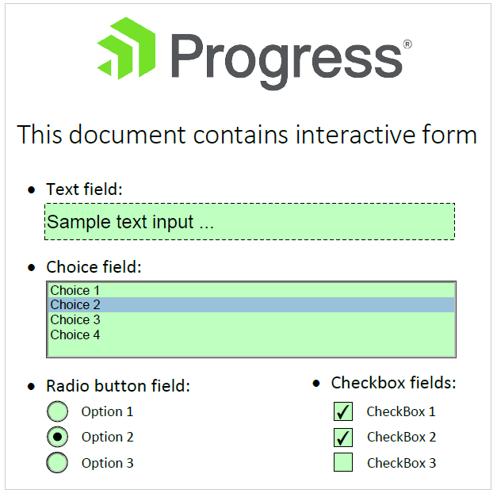

# Interactive Forms concept

The interactive forms feature (also known as AcroForm) allows you to create PDF files containing textboxes, buttons, listboxes and other interactive controls enabling the PDF file user to interactively fill some data in the PDF document and/or digitally sign the filled document. The responsibilities for preserving this data and interactively modifying it are separated into two base concepts – [Form Fields]() and [Widget Annotations]().

#### Interactive Forms in a PDF document

>note You can find complete examples for [Creating Interactive Forms](https://github.com/telerik/document-processing-sdk/tree/master/PdfProcessing/CreateInteractiveForms) and [Modifying Forms](https://github.com/telerik/document-processing-sdk/tree/master/PdfProcessing/ModifyForms) in our SDK repository.

## Form Fields

The data in an interactive form is separated into form fields restricting the different data input to different input formats – buttons, text fields or choice fields. Additionally, the interactive form can contain [signature fields](), which are responsible for preserving [Digital Signature]() information when signing the document. Each form field is a container for its specific type of data.

### Flattening Form Fields
Since R2 2021 the form fields can be flattened. This way the fields will be removed, the values preserved and the document can no longer be edited. You can find more information here: [Flatten Form Fields]()

## Widget Annotations

Widget annotations are used in order to visualize the Form Fields data on the PDF pages. Each field can have several widget annotations visualizing its information on the same or on several PDF pages. Each widget can specify its dynamic appearance differently by using different properties for its color, geometry and text representation. 

## See Also

* [FormField]()
* [Widgets]()
* [Annotations and Destinations]()
