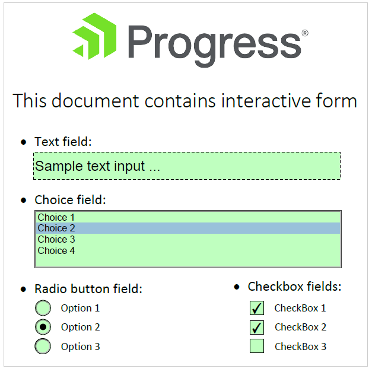

# Overview

The interactive forms feature (also known as AcroForm) allows you to create PDF files that contain text boxes, buttons, list boxes, and other interactive controls. Users can fill in data in the PDF document or digitally sign the completed document. The responsibilities for preserving this data and interactively modifying it are separated into two base concepts – [Form Fields]() and [Widget Annotations]().

The following image shows interactive forms in a PDF document:

>note You can find complete examples for [Creating Interactive Forms](https://github.com/telerik/document-processing-sdk/tree/master/PdfProcessing/CreateInteractiveForms) and [Modifying Forms](https://github.com/telerik/document-processing-sdk/tree/master/PdfProcessing/ModifyForms) in the SDK repository.

## Form Fields

The data in an interactive form is separated into form fields that restrict the different data input to different input formats – buttons, text fields, or choice fields. The interactive form can also contain [signature fields](), which preserve [Digital Signature]() information when signing the document. Each form field is a container for its specific type of data.

### Flattening Form Fields

Starting with R2 2021, you can flatten the form fields. Flattening removes the fields, preserves the values, and makes the document no longer editable. For more information, refer to [Flatten Form Fields]().

## Widget Annotations

Widget annotations visualize the form fields data on the PDF pages. Each field can have several widget annotations that display its information on the same or on several PDF pages. Each widget can specify its dynamic appearance differently by using different properties for its color, geometry, and text representation.

## See Also

* [FormField]()
* [Widgets]()
* [Annotations]()
* [PdfProcessing Form Fields Reading and Writing Demo](https://demos.telerik.com/document-processing/pdfprocessing/read_write_form_fields)
