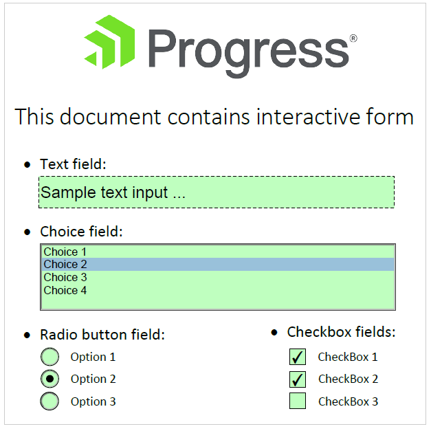

# Overview

The interactive forms feature, also known as *AcroForm*, lets you create PDF files that contain text boxes, buttons, list boxes, and other interactive controls. In Telerik Document Processing, `RadPdfProcessing` separates this functionality into two main concepts: [form fields]() and [widget annotations](). Users can fill in data in the PDF document or digitally sign the completed document.

The following image shows interactive forms in a PDF document:

>note You can find complete examples for [creating interactive forms](https://github.com/telerik/document-processing-sdk/tree/master/PdfProcessing/CreateInteractiveForms) and [modifying forms](https://github.com/telerik/document-processing-sdk/tree/master/PdfProcessing/ModifyForms) in the SDK repository.

## Form Fields

An interactive form stores its data in form fields. Different field types support different input formats, such as buttons, text fields, and choice fields. The form can also contain [signature fields](), which store [digital signature]() data when you sign the document.

### Flattening Form Fields

Starting with R2 2021, you can flatten form fields. Flattening removes the fields, preserves their values, and makes the document no longer editable. For more information, refer to [flatten form fields]().

## Widget Annotations

Widget annotations display form field data on PDF pages. Each field can have several widget annotations on the same page or on multiple pages. Each widget can define its own appearance through properties such as color, geometry, and text representation.

## XFA Forms

XFA packets are separate from `AcroForm` fields. `RadPdfProcessing` can import and preserve XFA packet data. See [XFA forms and export limitations]() for packet inspection, `ShouldExportXfa`, and the limits of XFA authoring support.

## See Also

* [FormField]()
* [PDF Annotation Widgets]()
* [Annotations]()
* [PdfProcessing Form Fields Reading and Writing Demo](https://demos.telerik.com/document-processing/pdfprocessing/read_write_form_fields)
