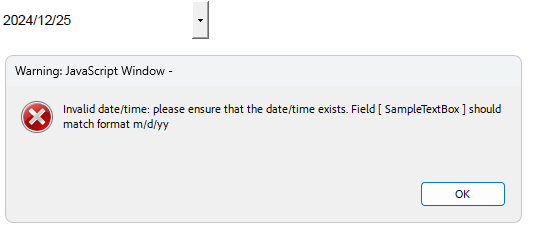
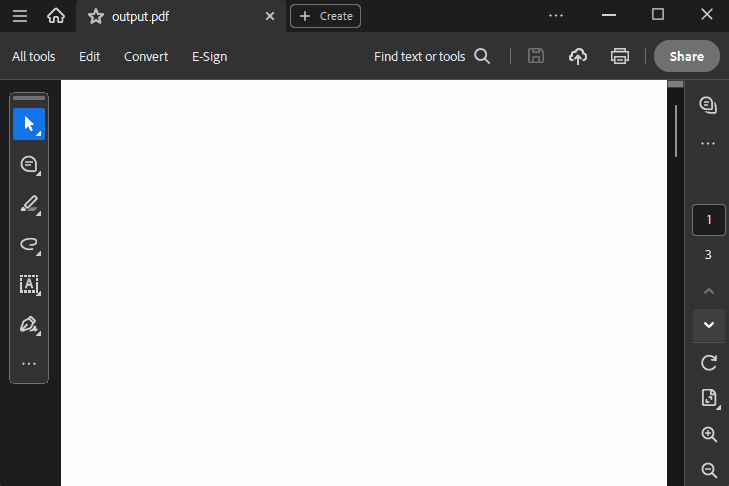

# Action Collections

Depending on the [document element]() associated with the actions, there are different collection types that store the actions providing the appropriate public API.  

## ActionCollection

Represents a basic collection of [Action](#action) objects. The collection allows manipulating the items by the following public methods:

|Method Name|Description|
|----|----|
|Add|Adds the specified Action to the end of the collection.|
|AddRange|Adds the elements of the specified collection to the end of the current collection.|
|Insert|Inserts an Action into the collection at the specified index.|
|Clear|Removes all elements from the collection.|
|Remove|Removes the first occurrence of a specific Action from the collection.|
|RemoveRange|Removes a range of elements from the collection.|
|RemoveAt|Removes the element at the specified index of the collection.|
|Find|Finds the first Action that matches the conditions defined by the specified predicate.|
|FindAll|Finds all Action objects that match the conditions defined by the specified predicate.|
|Reverse|Reverses the order of the elements in the collection.|
|GetRange|Returns a range of elements from the collection.|

## AnnotationActionCollection

An abstract class that represents a collection of Action objects. It is the base class for the WidgetActionCollection exposing the following API:

|Property Name|Description|
|----|----|
|MouseEnter|Gets the collection of actions triggered when the mouse enters the annotation area.|
|MouseExit|Gets the collection of actions triggered when the mouse exits the annotation area.|
|MouseDown|Gets the collection of actions triggered when the mouse button is pressed within the annotation area.|
|MouseUp|Gets  the collection of actions triggered when the mouse button is released within the annotation area.|

## WidgetActionCollection

Represents a collection of Action objects, specifically for widget annotations.

|Property Name|Description|
|----|----|
|OnFocus|Gets or sets the collection of actions triggered when the widget gains the input focus.|
|OnBlur|Gets or sets the collection of actions triggered when the widget loses the input focus.|
|OnPageOpen|Gets or sets the collection of actions triggered when the page containing the widget is opened.|
|OnPageClose|Gets or sets the collection of actions triggered when the page containing the widget is closed.|
|OnPageVisible|Gets or sets the collection of actions triggered when the page containing the widget becomes visible.|
|OnPageInvisible|Gets or sets the collection of actions triggered when the page containing the widget becomes invisible.|

## FormFieldActionCollection

Represents a collection of JavaScriptAction objects associated with a [FormField]().

|Property Name|Description|
|----|----|
|Keystroke|Gets or sets the JavaScript action to be performed when the user types a keystroke into a text field or combo box or modifies the selection in a scrollable list box.|
|Format|Gets or sets the JavaScript action to be performed before the field is formatted to display its current value.|
|Validate|Gets or sets the JavaScript action to be performed when the field’s value is changed.|
|Calculate|Gets or sets the JavaScript action to be performed to recalculate the value of this field when that of another field changes.|

It is suitable for cases when a certain calculation needs to be performed after entering user values. A sample approach is demonstrated in the [Multiplying TextBoxField Values with JavaScript Actions]() article. 

A common case is restricting the user's input, e.g. when entering a date in a specific format:

{{region cs-radpdfprocessing-formfieldactioncollection}}

    RadFixedDocument document = new RadFixedDocument();
    document.Pages.AddPage();

    TextBoxField textField = new TextBoxField("SampleTextBox");
    textField.Actions.Format = new Telerik.Windows.Documents.Fixed.Model.Actions.JavaScriptAction("AFDate_FormatEx(\"m/d/yy\");");
    textField.Actions.Keystroke = new Telerik.Windows.Documents.Fixed.Model.Actions.JavaScriptAction("AFDate_KeystrokeEx(\"m/d/yy\");");

    VariableContentWidget widget = textField.Widgets.AddWidget();
    widget.Rect = new Rect(new Size(250, 50));

    document.AcroForm.FormFields.Add(textField);
    document.Pages[0].Annotations.Add(widget);    
    
{{endregion}} 

The achieved result is illustrated below: 

  

## PageActionCollection

Represents a collection of Action objects associated with a [RadFixedPage]().

|Property Name|Description|
|----|----|
|OnPageOpen|Gets or sets the collection of actions triggered when the page is opened.|
|OnPageClose|Gets or sets the collection of actions triggered when the page is closed.|

The following example shows how to utilize the JavaScript Actions functionality showing an alert when the second page in a document is closed

{{region cs-radpdfprocessing-pageactioncollection}}

   RadFixedDocument document = new RadFixedDocument();
   document.Pages.AddPage();//first page
   RadFixedPage page = document.Pages.AddPage();//second page
   JavaScriptAction action = new JavaScriptAction("app.alert('JS Action when second page is closed!');");
   page.Actions.OnPageClose.Add(action);
   document.Pages.AddPage();//third page 

{{endregion}} 

  

## DocumentActionCollection

Represents a collection of JavaScriptAction objects associated with [RadFixedDocument]().

|Property Name|Description|
|----|----|
|DocumentWillClose|Gets or sets the JavaScript action that will be triggered before the document is closed.|
|DocumentWillSave|Gets or sets the JavaScript action that will be triggered before the document is saved.|
|DocumentDidSave|Gets or sets the JavaScript action that will be triggered after the document is saved.|
|DocumentWillPrint|Gets or sets the JavaScript action that will be triggered before the document is printed.|
|DocumentDidPrint|Gets or sets the JavaScript action that will be triggered after the document is printed.|

## See Also

* [FormField]()
* [FormFieldCollection class]()
* [Widgets]() 
* [Multiplying TextBoxField Values with JavaScript Actions and RadPdfProcessing]()
