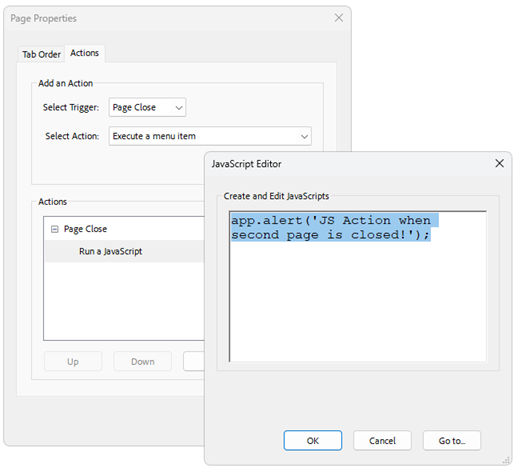

# JavaScript Actions  

As of **Q4 2024** RadPdfProcessing provides support for:

*  **JavaScript actions** associated with documents, pages, form fields, etc.
*  **Trigger events** - represent a set of events that can trigger the execution of an action.

JavaScript Actions are represented by the **JavaScriptAction** class storing in its public **Script** property the JS content as plain text. JS actions can be added by using the public **Actions** property of the following classes: 

|Class|Collection Type|
|----|----|
|Link*|ActionCollection| 
|BookmarkItem*|ActionCollection|
|Widget|WidgetActionCollection| 
|FormField|FormFieldActionCollection|
|RadFixedDocument|DocumentActionCollection| 
|RadFixedPage|PageActionCollection|

\* The existing **Action** property is obsolete. 

  

### Adding a JavaScript Action to a TextBoxField

The following example demonstrates how to create a PDF document with three TextBoxFields where the third field calculates the sum of the values entered in the first two widgets:

   

```csharp

   RadFixedDocument document = new RadFixedDocument();
   document.Pages.AddPage();

   TextBoxField field1 = new TextBoxField("Field1");
   VariableContentWidget widget1 = field1.Widgets.AddWidget();
   widget1.Rect = new Rect(new Size(150, 30));

   TextBoxField field2 = new TextBoxField("Field2");
   VariableContentWidget widget2 = field2.Widgets.AddWidget();
   widget2.Rect = new Rect(new Point(0, 50), new Size(150, 30));

   TextBoxField totalField = new TextBoxField("Total");
   totalField.IsReadOnly = true;
   totalField.Actions.Calculate = new Telerik.Windows.Documents.Fixed.Model.Actions.JavaScriptAction
       ("AFSimple_Calculate(\"SUM\", new Array (\"Field1\", \"Field2\"));");
   VariableContentWidget totalWidget = totalField.Widgets.AddWidget();
   totalWidget.Rect = new Rect(new Point(0, 100), new Size(150, 30));

   widget1.RecalculateContent();
   widget2.RecalculateContent();
   totalWidget.RecalculateContent();

   document.AcroForm.FormFields.Add(field1);
   document.AcroForm.FormFields.Add(field2);
   document.AcroForm.FormFields.Add(totalField);
   document.Pages[0].Annotations.Add(widget1);
   document.Pages[0].Annotations.Add(widget2);
   document.Pages[0].Annotations.Add(totalWidget);
	 
```
 

## See Also

* [FormField]()
* [FormFieldCollection class]()
* [Widgets]() 
* [Multiplying TextBoxField Values with JavaScript Actions and RadPdfProcessing]()
