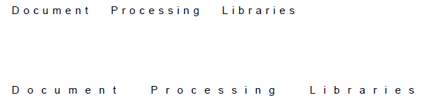

# TextFragment

[RadPdfProcessing]() offers a **TextFragment** that represents a **single-line** text object.    

* [Creating a TextFragment](#inserting-a-textfragment)

* [Modifying a TextFragment](#modifying-a-textfragment) 

## Creating a TextFragment

**TextFragment** is a content element that can be added to the **Content** collection of an **IContainerElement** such as [RadFixedPage](). There are several approaches that can be adopted:

* Create a TextFragment and add it to a page container
* Use one of the factory methods of the __ContentElementCollection__ to create a new text fragment and insert it into the respective container

 Both methods return the actual TextFragment instance, so you can modify it.

#### __[C#] Example 1: Create TextFragments and add them to a page__

 <snippet id='libraries-pdf-model-text-fragment-create'/>

>caption Figure 1: Inserted TextFragments

  

>tip **TextFragment** represents a **single line of text**. In order to make your text "flow" in a document you should make sure all fragments you add can fit in a line or you can use [FixedContentEditor]().
          
>The '\r' and '\n' characters don't have the usual meaning of *"go to next line"* when they are inserted into a PDF document and you cannot simply insert text, containing these characters, to produce multiline text. Instead, you should split the text and insert it line by line. An alternative approach is to use the [RadFixedDocumentEditor]() which allows you to create a document in a flow-like manner. 

## Modifying a TextFragment

TextFragment exposes the following properties that can modify the look of the represented text:
        
|Property|Description|
|----|----|
|**CharacterSpacing**|The spacing between the characters in the text.|
|**WordSpacing**|The spacing between the words in the text. (*Only space character (Unicode 0x32) is considered a word break in RadPdfProcessing's document model.*)|
|**HorizontalScaling**|The horizontal scaling that is applied to the characters.|
|**Font**|The font that is used to draw the text.|
|**FontSize**|The font size. The measurement unit used for font size is [Device Independent Pixels]() (DIPs). You can convert it to points or other units using the [Unit](https://docs.telerik.com/devtools/document-processing/api/Telerik.Windows.Documents.Media.Unit.html) class.|
|**RenderingMode**|Enumeration representing the way the text should be rendered. It can have one of the following values: <table><tr><td>**Fill**</td><td>Fill text (the default value).</td></tr><tr><td>**Stroke**</td><td>Stroke text.</td></tr><tr><td>**FillAndStroke**</td><td>Fill, then stroke text.</td></tr><tr><td>**None**</td><td>Neither fill nor stroke text (invisible).</tr><tr></td><td>**FillAndAddToClippingPath**</td><td>Fill text and add to path for clipping (see above).</td></tr><tr><td>**StrokeAndAddToClippingPath**</td><td>Stroke text and add to path for clipping.</td></tr><tr><td>**FillStrokeAndAddToClippingPath**</td><td>Fill, then stroke text and add to path for clipping</td></tr><tr><td>**AddToClippingPath**</td><td>Add text to path for clipping.</td></tr></table>|
|**TextRise**|Specifies the distance, in unscaled text space units, to move the baseline up or down from its default location.|
|**Fill**|The color that is used to fill the text. The default value is Black.|
|**Stroke**|The color that is used to stroke text. The default value is Black.|
|**StrokeThickness**|The width of the stroke line.|
|**StrokeLineCap**|Specifies the shape, which is used at the ends of open paths, used to draw a letter, when they are stroked. It can have one of the following values:<table><tr><td>**Flat**</td><td>Flat line cap.</td></tr><tr><td>**Round**</td><td>Round line cap.</td></tr><tr><td>**Square**</td><td>Square line cap.</td></tr></table>|
|**StrokeLineJoin**|Specifies the shape to be used at the corners of paths that are stroked. Join styles are significant only at the points where consecutive segments of a path connect at an angle. Available options: <table><tr><td>**Bevel**</td><td>Produces a diagonal corner.</td></tr><tr><td>**Miter**</td><td>Produces a sharp corner. If the segments meet at too sharp an angle, a bevel join is used instead.</td></tr><tr><td>**Round**</td><td>Produces a smooth, circular arc between the lines.</td></tr></table>|
|**StrokeDashArray**|The pattern of dashes and gaps used to stroke paths.|
|**StrokeDashOffset**|The distance from the start of a line to the beginning of a dash pattern.|
|**AlphaConstant**|Specifying the constant shape or constant opacity value to be used for nonstroking operations.|
|**MiterLimit**|The limit of the thickness of the join on a mitered corner.|
|**Text**|Represents the text that is drawn.|
|**Position**|The [Position]() where the text element is drawn.|

>note If you want to use a font, that is not part of the [standard fonts](#standard-fonts), you can register it using the [RegisterFont()](#registering-a-font) method of the FontRepository static class. 
     
#### __[C#] Example 2: Modifying TextFragment's properties__

 <snippet id='libraries-pdf-model-text-fragment-modify'/>

>caption Figure 2: Modified TextFragments

  

            
## See Also

 * [RadFixedPage]()
 * [FixedContentEditor]()
 * [Position]()
 * [Block]()
 * [Extracting Text Within a Specific Rectangle in PDF Documents]()
 * [Getting Position and Size of TextFragment in PDF Documents]()
