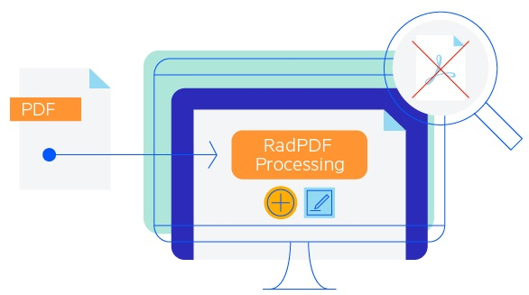

# Overview

**Telerik PdfProcessing Library** enables code-only generation, import, and export of PDF documents with text blocks, images, forms, tables, shapes, and more. The library supports flow-like editing as well as great control over native PDF elements. You can use **RadPdfProcessing** in any web or desktop .NET application without relying on third-party software like Adobe Acrobat.

  

In this article, we list the library's most popular features. If you want to learn how to use the library, head straight to the **[Getting Started with RadPdfProcessing]()** article.

>note If you still don't have **Telerik Document Processing installed**, check the **[First Steps]()** topic to learn how to obtain the packages through the different suites with Telerik controls.

The API of RadPdfProcessing contains two different editors,  [RadFixedDocumentEditor]() and  [FixedContentEditor](), enabling you to choose between editing in a **flow-like** manner or using the much more powerful and flexible **fixed** document structure that allows you to draw on the page.

## Key Features 

* Generate PDF documents from scratch.
* Edit existing documents - delete headers/footers or watermarks, change images and colors.
* Add content to existing document: all features of the existing PDF document are preserved, and just some content is added.
* Merge document pages: Combine pages from different documents into a single document.
* Interactive forms
    * Automatic filling of forms (e.g. tax forms).
    * Automatic extraction of data from already filled forms.
* Digital signatures
    * Signing a document with digital signature.
    * Validate digital signature of already signed document.
* GenAI-powered Document Insights
* Accessibility Support
            
The document model of the library provides support for:

| Feature | Description |
|---------|-------------|
| [**Pages**]() | Adding, modifying or removing of pages in a document. The properties enable you to change the size of the page, its rotation, and more. |
| **Automatic layout** | Although the PDF format is fixed, sometimes you will need to insert the content in a way that flows on the page. RadPdfProcessing enables to achieve this easily by using  [blocks](), [tables]() and [lists](). |
| [**Images**]() | Decoded on demand to achieve better performance. The API enables you to obtain the encoded image data. You can also control the image quality when saving the document. As of **Q3 2024** RadPdfProcessing provides support for SVG FormSource (vector graphics image format).|
| [**Geometries**]() | Enable you to describe the geometry of a 2D shape. |
| [**Form XObjects**]() | The Form XObjects enables you to describe composite objects (consisting of text, images, vector elements, etc.) within a PDF file and reuse this content among the document, for smaller document size and better rendering performance. |
| [**Interactive Forms**]() | Create and modify PDF files containing textboxes, buttons, list boxes, and other interactive controls making available for the PDF file user to interactively fill some data in the PDF document and/or digitally sign the filled document. You can flatten the fields as well. |
| [**Digital Signature**]() | The digital signature feature enables you to sign and validate PDF documents. It supports signing PDF documents [using a TimeStamp Server]() or [external signing](). |
|[**Embedded File Streams**]()|The embed a file stream feature allows adding external files to the PDF document.|
| [**Clipping**]() | You can define the outline of other content elements like images and paths. |
| [**Bookmarks (Outlines)**]() | Add, remove or modify the bookmarks in a PDF document. |
| [**Annotations**]() | Associate an object with a location on a page of the PDF document. |
| [**Destinations**](#destination) | Defines a particular view of a document.|
| [**Colors and Color Spaces**]() | Support for different types of both. |
| [**Fonts**]() | Support for the standard PDF fonts, Type0, Type1, Type 3, CIDFontType2, TrueType and more. |
| [**Text and Graphic properties**]() | Provide options for changing the properties of the different elements in the document elements so you can achieve a unique look. |
| [**Password Protection**](#import-settings) | Support for documents encrypted with **Encryption Algorithm 4 (RC4/AES-128) and Encryption Algorithm 5 with AES 256** |
| [**Merge documents**]() and [**document pages**]() | You can combine the pages from multiple documents into a single document. |
| [**PdfStreamWriter**]()| The API exposes a functionality that provides an option for exporting PDF files with unmatched performance and minimized memory footprint. Extremely useful when you need to add some content to an existing document, merge or split documents. |
| [**Import of PDF and export to PDF or plain text**]() | You can import or export PDF files and convert PDF files to plain text. |
|[**JavaScript Actions and Trigger Events**]()|As of Q4 2024 you can import or export the javascript actions associated with pages, form fields, etc. so that they can be executed when the exported document is opened with Adobe Acrobat. |
|[**Accessibility Support**]()|Offers accessibility support of documents to users with disabilities.|
| [**Viewer Preferences**]() | Control how PDF documents are displayed and behave in PDF viewers, including window behavior, UI visibility, and print settings. |
|**GenAI-powered Document Insights**|Enables you to easily extract insights from PDF documents using Large Language Models (LLMs). This functionality enables you to summarize document content and ask questions about it, with the AI providing relevant answers based on the document's content. [Read More]()|

## Online Demos

|Demo|Description|
|----|----|
|[PdfProcessing Basic Usage](https://demos.telerik.com/document-processing/pdfprocessing)|This example demonstrates how to create a document containing images, text and shapes and export it to PDF.|
|[PdfProcessing Bar Chart Export](https://demos.telerik.com/document-processing/pdfprocessing/bar_chart_export)|This example demonstrates how to create a document containing Bar Chart, Data Table and export it to PDF.|
|[PdfProcessing Form Fields Reading and Writing](https://demos.telerik.com/document-processing/pdfprocessing/read_write_form_fields)|This example demonstrates how to use a PDF from the server, modify its fields based on user input and export it to PDF on the client.|
|[PdfProcessing Content Merging, Splitting, and Adding](https://demos.telerik.com/document-processing/pdfprocessing/merge_split_add_content)|This example demonstrates how to merge, split or add content to PDF document.|
|[PdfProcessing Embedding File Streams](https://demos.telerik.com/document-processing/pdfprocessing/embed_file_streams)|This example demonstrates how to use a PDF from the server, select a file or an Embedded Electronic (ZUGFeRD) Invoice and embed it into the PDF document.|
|[PdfProcessing Optical Character Recognition (OCR)](https://demos.telerik.com/document-processing/pdfprocessing/optical_character_recognition)|This example demonstrates how to import an image into the PdfProcessing library, retrieve the text from it and export it to a PDF document.|
|[PdfProcessing Annotations](https://demos.telerik.com/document-processing/pdfprocessing/annotations)|This example demonstrates how to create a PDF file and insert annotations in it.|
|[PdfProcessing Digitally Sign Document](https://demos.telerik.com/document-processing/pdfprocessing/digitally_sign_document)|This example demonstrates how to digitally sign a PDF.|
|[PdfProcessing Validate Digital Signature](https://demos.telerik.com/document-processing/pdfprocessing/validate_digital_signature)|This example demonstrates how to validate a digitally signed PDF.|
|[PdfProcessing Multiple Digital Signatures](https://demos.telerik.com/document-processing/pdfprocessing/multiple_digital_signatures)|This example demonstrates how to digitally sign a PDF without invalidating any existing signatures.|
|[PdfProcessing Accessibility](https://demos.telerik.com/document-processing/pdfprocessing/accessibility)|This example demonstrates how to create accessible PDF documents programmatically, ensuring compliance with standards such as PDF/UA by supporting features like tagged content, document structure, and metadata. Downloaded documents will adhere to the selected compliance level.|
|[PdfProcessing GenAI Document Insights](https://demos.telerik.com/document-processing/pdfprocessing/genai_document_insights)|This example demonstrates how to use the GenAI-powered Document Insights feature in Telerik RadPdfProcessing to extract meaningful insights from PDF documents.|

# See Also

- [Installing on Your Computer]()
- [First Steps]()
- [Getting Started with RadPdfProcessing]()
- [Accessibility Support]()

