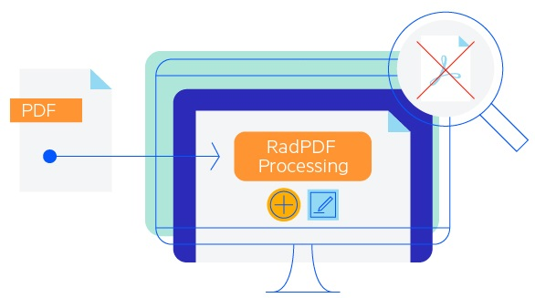

# RadPdfProcessing Overview

**RadPdfProcessing** is the Telerik Document Processing library for creating, importing, editing, and exporting PDF documents in .NET applications. You can use it to generate PDF files from code, work with existing documents, add forms, tables, annotations, digital signatures, accessibility metadata, and more without relying on Adobe Acrobat or other third-party desktop software.

This overview explains what RadPdfProcessing is designed for, which editors and features it provides, and where to continue next based on the task you need to complete.

>note
>
> If you still need to install **Telerik Document Processing**, see [First Steps in Using Telerik Document Processing]() for the available package options.

If you want a first working example, continue to [Getting Started with RadPdfProcessing]().

## Key Features

Use RadPdfProcessing for these common tasks:

* Generate PDF documents from code.
* Import existing PDF files and update selected content.
* Add text, images, shapes, tables, lists, forms, annotations, and bookmarks.
* Merge, split, and append PDF content.
* Sign documents digitally and validate signatures.
* Export PDF content to PDF or plain text.
* Create accessible PDF output and control viewer preferences.
* Extract insights from documents with GenAI-powered Document Insights.

The following table summarizes the capabilities that most users need first:

| Feature | Description |
|---|---|
| Create and edit PDF documents | Generate documents from scratch, edit existing content, or append new content while preserving the original PDF structure where supported. |
| Automatic and fixed layout | Build flowing content by using [blocks](), [tables](), and [lists](), or draw content directly on the page. |
| Interactive forms | Create, fill, extract, flatten, and sign PDF forms by using [interactive forms](). |
| Digital signatures | Sign and validate PDF documents, use [timestamp servers](), support [external signing](), and apply multiple signatures. |
| Merge and export workflows | Merge documents, split content, and optimize large-output scenarios by using [PdfStreamWriter](). |
| Accessibility and AI scenarios | Create [accessible PDF documents]() and use [GenAI-powered Document Insights](). |

## Choose an Editor

RadPdfProcessing provides two editors that serve different document-generation styles:

| Editor | Best for | 
|---|---|
| [RadFixedDocumentEditor]() | Flow-like editing where content is inserted in a more automatic layout sequence. |
| [FixedContentEditor]() | Precise drawing and positioning when you need detailed control over the page. | 

Choose `RadFixedDocumentEditor` when you want a higher-level editing flow. Choose `FixedContentEditor` when you need lower-level control over exact PDF page content.

## Document Model Overview

The document model includes the following major areas:

| Area | Description |
|---|---|
| [Pages]() | Add, remove, and modify pages, including page size and rotation. |
| [Images]() | Work with encoded image data, control image quality, and use SVG form sources starting with **Q3 2024**. |
| [Geometries]() | Define 2D shapes and path geometry. |
| [Form XObjects]() | Reuse composite content for better rendering performance and smaller file sizes. |
| [Annotations]() and [destinations](#destination) | Associate content with locations and define document views. |
| [Bookmarks]() | Add and manage outlines for document navigation. |
| [Clipping]() | Define clipping outlines for images and paths. |
| [Fonts]() and [colors]() | Control typography and color spaces for document content. |
| [Text and graphic properties]() | Customize visual appearance across document elements. |
| [Viewer preferences]() | Control how the document behaves in PDF viewers. |
| [Embedded file streams]() | Attach external files to the document. |
| [Password protection](#import-settings) | Import documents encrypted with supported RC4, AES-128, and AES-256 algorithms. |
| [JavaScript actions and trigger events]() | Import and export JavaScript actions associated with pages and form fields. |

## Typical Next Steps

Most users continue with one of these paths:

1. Start with [Getting Started with RadPdfProcessing]() for a first working sample.
2. Review [Using PdfFormatProvider]() if you need import and export details.
3. Explore [RadFixedDocumentEditor]() or [FixedContentEditor]() to choose an editing approach.
4. Review [Digital Signature]() or [Interactive Forms]() for specialized PDF workflows.

## Online Demos

Review these demos to see common RadPdfProcessing scenarios in action:

| Demo | Description |
|----|----|
| [PdfProcessing Basic Usage](https://demos.telerik.com/document-processing/pdfprocessing) | Create a document with images, text, and shapes and export it to PDF. |
| [PdfProcessing Bar Chart Export](https://demos.telerik.com/document-processing/pdfprocessing/bar_chart_export) | Create a PDF document that contains a bar chart and a data table. |
| [PdfProcessing Form Fields Reading and Writing](https://demos.telerik.com/document-processing/pdfprocessing/read_write_form_fields) | Read an existing PDF, update form fields, and export the result. |
| [PdfProcessing Content Merging, Splitting, and Adding](https://demos.telerik.com/document-processing/pdfprocessing/merge_split_add_content) | Merge, split, or append PDF content. |
| [PdfProcessing Embedding File Streams](https://demos.telerik.com/document-processing/pdfprocessing/embed_file_streams) | Embed a file or a ZUGFeRD electronic invoice in a PDF document. |
| [PdfProcessing Optical Character Recognition (OCR)](https://demos.telerik.com/document-processing/pdfprocessing/optical_character_recognition) | Import an image, recognize text, and export searchable PDF content. |
| [PdfProcessing Annotations](https://demos.telerik.com/document-processing/pdfprocessing/annotations) | Create a PDF document and insert annotations. |
| [PdfProcessing Digitally Sign Document](https://demos.telerik.com/document-processing/pdfprocessing/digitally_sign_document) | Apply a digital signature to a PDF document. |
| [PdfProcessing Validate Digital Signature](https://demos.telerik.com/document-processing/pdfprocessing/validate_digital_signature) | Validate an existing digital signature in a PDF file. |
| [PdfProcessing Multiple Digital Signatures](https://demos.telerik.com/document-processing/pdfprocessing/multiple_digital_signatures) | Apply a new digital signature without invalidating existing signatures. |
| [PdfProcessing Accessibility](https://demos.telerik.com/document-processing/pdfprocessing/accessibility) | Create accessible PDF documents that support PDF/UA-oriented structure and metadata. |
| [PdfProcessing GenAI Document Insights](https://demos.telerik.com/document-processing/pdfprocessing/genai_document_insights) | Use GenAI-powered Document Insights to extract meaningful information from PDF documents. |
| [PdfProcessing Add Digital Signature External](https://demos.telerik.com/document-processing/pdfprocessing/external_digitally_sign_document) | Sign a PDF document with external signing support and optional timestamp server usage. |

## See Also

- [Installing on Your Computer]()
- [First Steps in Using Telerik Document Processing]()
- [Getting Started with RadPdfProcessing]()
- [Using PdfFormatProvider]()
- [Accessibility Support]()