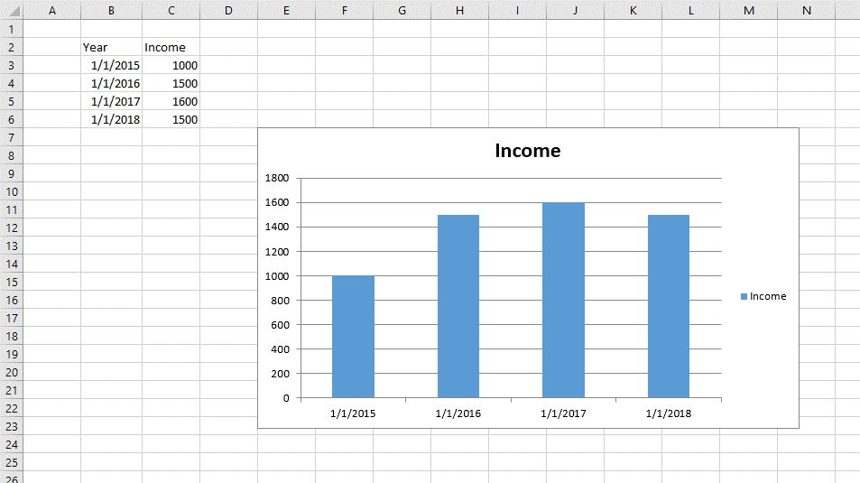
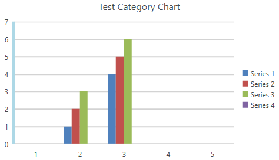

# Working with Axes

## Axis Object and Their Properties

The axes of the chart are contained in two objects of type **AxisGroup**. The two collections can be accessed by the **PrimaryAxes** and **SecondaryAxes** properties of the **DocumentChart** object. Each of the collections contains two axes, contained in the **CategoryAxis** and **ValueAxis** properties. The **PrimaryAxes** property is populated on creation when the constructor of **FloatingChartShape** or the **Add()** method of the **ChartCollection** are used  and can be replaced or edited as desired.

If the **SeriesGroup** object implements the **ISupportAxes** interface, it can indicate whether it is associated with the **Primary** or **Secondary** couple of axes. For example, the bar and line chart groups implement the interface, while the pie group does not. The **ISupportAxes** interface defines one property: **AxisGroupName**, of type **AxisGroupName**. The AxisGroupName enum has two members: **Primary** and **Secondary**. 


Refer to the scenario from **Figure 1**. The chart shown there has two axes: a date (horizontal, category) axis and a value (vertical, value) axis. The respective objects can be found in the **PrimaryAxes** property of the chart.  The **BarSeriesGroup** object **AxisGroupName** property has value *AxisGroupName.Primary*. The properties of the axes are listed in **Example 1**.

#### Figure 1: Sample data


#### Example 1: Axes properties
```csharp

	DocumentChart chart = new FloatingChartShape(worksheet, new CellIndex(0,0), new CellRange(1, 1, 5, 2), ChartType.Column).Chart;
	
	DateAxis dateAxis = chart.PrimaryAxes.CategoryAxis as DateAxis;
	ValueAxis valAxis = chart.PrimaryAxes.ValueAxis as ValueAxis;
	
	ISupportAxes chartComponentWithAxes = chart.SeriesGroups.First() as ISupportAxes;
	AxisGroupName axisGroup = chartComponentWithAxes.AxisGroupName; // Primary
	
	bool dateIsVisible = dateAxis.IsVisible; // true
	bool valIsVisible = valAxis.IsVisible; // true
	
	double? dateMin = dateAxis.Min; // 1
	double? dateMax = dateAxis.Max; // 4
	
	double? valMin = valAxis.Min; // 0
	double? valMax = valAxis.Max; // 1800

```

## Changing the Axis of a Chart

RadSpreadProcessing allows you to replace the axis of a chart with a new object. This is achieved through the **PrimaryAxes** and **SecondaryAxes** properties of **DocumentChart**.

#### Example 2: Replace axis 
```csharp
	
	DocumentChart chart = new FloatingChartShape(worksheet, new CellIndex(0, 0), new CellRange(1, 1, 5, 2), ChartType.Column).Chart;
	chart.PrimaryAxes.CategoryAxis = new DateAxis();
```


## Changing the Appearance of the Axes

You can customize the way the axes in the chart look like. The API of SpreadProcessing enables you to change the fill and width of the outline of an axis and its major gridlines.

#### Example 3: Customize the major gridlines and outline of an axis
```csharp

    FloatingChartShape chartShape = new FloatingChartShape(workbook.ActiveWorksheet, new CellIndex(2, 7), new CellRange(0, 0, 4, 3), ChartType.Column)
    {
        Width = 480,
        Height = 288,
    };
    chartShape.Chart.PrimaryAxes.ValueAxis.Outline.Fill = new SolidFill(new ThemableColor(Colors.LightBlue));
    chartShape.Chart.PrimaryAxes.ValueAxis.Outline.Width = 5;

    chartShape.Chart.PrimaryAxes.ValueAxis.MajorGridlines.Outline.Fill = new SolidFill(new ThemableColor(Colors.LightGray));
    chartShape.Chart.PrimaryAxes.ValueAxis.MajorGridlines.Outline.Width = 2;
```

#### Figure 2: Custom appearance
