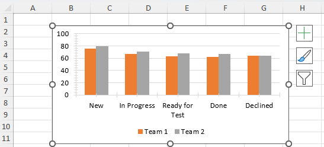

# Chart Data

The chart needs to have a source for its data, for the categories and values of the series and for its title. The chart data is represented by objects inheriting from the **IChartData** interface. There can be three types of data  **Numeric**, **String** and **Formula**. The different types are represented by the **ChartDataType** enum. The Numeric and String types contain a collection of, respectively, doubles and Strings, while the Formula type contains a string which represents a formula, whose result is the data itself.

The **FormulaChartData** type is abstract and it is implemented by the **WorkbookFormulaChartData** class. This class combines the formula with its actual data source, that is the Worksheet object. It contains the following public constructors, properties and methods, other than the **Formula** property, inherited from **FormulaChartData**:

- **WorkbookFormulaChartData**(Worksheet worksheet, params CellRange[] ranges)

- **WorkbookFormulaChartData**(Workbook workbook, string formula)

- IEnumerable&lt;CellRange&gt; **EnumerateCellRanges**(out Worksheet worksheet): Enumerates the cell ranges that contain the actual chart data.

- bool **TryEnumerateCellRanges**(out IEnumerable<CellRange> resultCellRanges, out Worksheet worksheet): Enumerates the cell ranges that contain the actual chart data. Returns a value indicating whether the enumeration was successful.

- IChartData **Clone**(): Creates a deep copy of the object.

- Workbook **Workbook**: Gets the workbook that the formula refers to get the chart data.

#### [C#] Example 1: Using IChartData

{{region radspreadprocessing-features-charts-chart-data_0}}

            FloatingChartShape chartShape = new FloatingChartShape(worksheet, new CellIndex(1, 1), new CellRange(1, 1, 1, 1), ChartType.Column)
            {
                Width = 460,
                Height = 250
            };

            DocumentChart chart = new DocumentChart();
            BarSeriesGroup barSeriesGroup = new BarSeriesGroup();
            barSeriesGroup.BarDirection = BarDirection.Column;

            StringChartData barCategoryData = new StringChartData(new List<string> { "New", "In Progress", "Ready for Test", "Done", "Declined" });
            NumericChartData barValueScore1Data = new NumericChartData(new List<double> { 75.31, 66.3, 62.78, 61.72, 63.9 });
            NumericChartData barValueScore2Data = new NumericChartData(new List<double> { 78.56, 70.7, 67.63, 66.71, 63.9 });         
            barSeriesGroup.Series.Add(barCategoryData, barValueScore1Data);
            barSeriesGroup.Series.Add(barCategoryData, barValueScore2Data);
            chart.SeriesGroups.Add(barSeriesGroup);
            ValueAxis valueAxis = new ValueAxis();
            valueAxis.Outline.Fill = new SolidFill(new ThemableColor(ThemeColorType.Text1, 0.85));
            valueAxis.Outline.Width = 0.75;

            CategoryAxis categoryAxis = new CategoryAxis();
            categoryAxis.Outline.Fill = new SolidFill(new ThemableColor(ThemeColorType.Text1, 0.85));
            categoryAxis.Outline.Width = 0.75;

            chart.PrimaryAxes = new AxisGroup(categoryAxis, valueAxis);
            worksheet.Charts.Add(chartShape);

            worksheet.Charts[0].Chart.SeriesGroups.First().Series.First().Title = new TextTitle("Team 1");
            worksheet.Charts[0].Chart.SeriesGroups.First().Series.Last().Title = new TextTitle("Team 2");
            chartShape.Chart = chart;

{{endregion}} 

>caption Using Chart Data in RadSpreadProcessing

    

