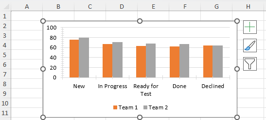

# Chart Data

The chart needs to have a source for its data, for the categories and values of the series and for its title. The chart data is represented by objects inheriting from the **IChartData** interface. There can be three types of data  **Numeric**, **String** and **Formula**. The different types are represented by the **ChartDataType** enum. The Numeric and String types contain a collection of, respectively, doubles and Strings, while the Formula type contains a string which represents a formula, whose result is the data itself.

The **FormulaChartData** type is abstract and it is implemented by the **WorkbookFormulaChartData** class. This class combines the formula with its actual data source, that is the Worksheet object. It contains the following public constructors, properties and methods, other than the **Formula** property, inherited from **FormulaChartData**:

- **WorkbookFormulaChartData**(Worksheet worksheet, params CellRange[] ranges)

- **WorkbookFormulaChartData**(Workbook workbook, string formula)

- IEnumerable&lt;CellRange&gt; **EnumerateCellRanges**(out Worksheet worksheet): Enumerates the cell ranges that contain the actual chart data.

- bool **TryEnumerateCellRanges**(out IEnumerable&lt;CellRange&gt; resultCellRanges, out Worksheet worksheet): Enumerates the cell ranges that contain the actual chart data. Returns a value indicating whether the enumeration was successful.

- IChartData **Clone**(): Creates a deep copy of the object.

- Workbook **Workbook**: Gets the workbook that the formula refers to get the chart data.

#### Example 1: Using IChartData

<snippet id='codeblock-clk'/> 

>caption Using Chart Data in RadSpreadProcessing

    

