# Charts

The charts enable you to summarize the data in your spreadsheet document and make it easily readable and understandable. With RadSpreadProcessing you can add, remove and manipulate chart objects in your spreadsheet documents.

## Supported Chart Types

### Column Charts

Column/bar charts are used to display values as sets of vertical columns, grouped by category. The length of the bars is proportional to the values that they represent. With this type of charts you can easily compare values in different categories. 

| Clustered column        | Stacked column | 100% stacked column |
| ----------------------- |:--------------:| -------------------:|
| 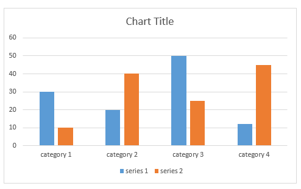 | 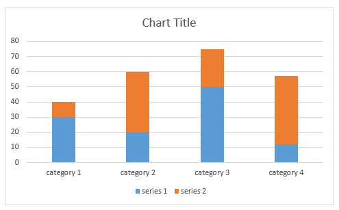 | 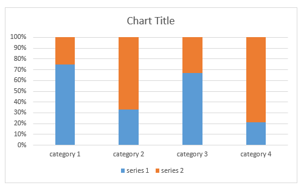|

### Bar Charts

Bar charts are analogical to the column charts, except the orientation of the bars. These charts use horizontal bars instead of vertical columns to display the values and their categories.

| Clustered bar           | Stacked bar    | 100% stacked bar    |
| ----------------------- |:--------------:| -------------------:|
| 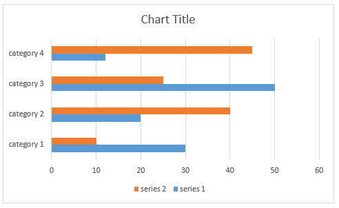 | 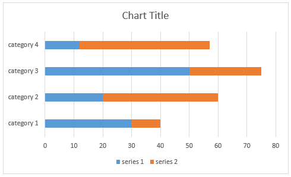 | |

### Line Charts

The line chart shows the category data distributed on the horizontal axis and all the values are distributed along the vertical axis. With this type of charts you can visualize continuous data over time on an evenly scaled axis. It is pretty helpful when you need to show trends in data at equal intervals, like months, years, or other periods.

| Clustered line          | Stacked line   | 100% stacked line   |
| ----------------------- |:--------------:| -------------------:|
| 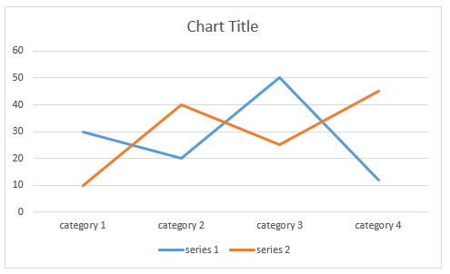 | 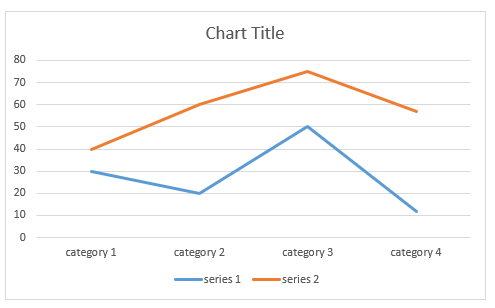 | 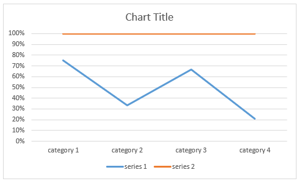|

### Scatter and Bubble Charts

Scatter and bubble charts provide you with a convenient way to display a lot of related data in a single chart. In scatter charts, the x-axis displays one numeric field and the y-axis displays another. This type of plotting the data makes it easy to see the relationship between the two values for all the items in the chart.

In a bubble chart, a third numeric field determines the size of the data points represented as bubbles.

| Scatter     | Bubble    | 
| ----------- |:----------| 
| 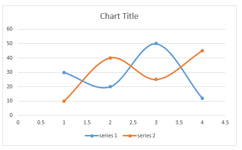 | 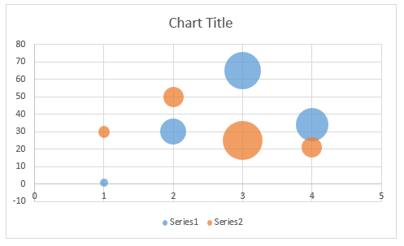 |

### Pie and Doughnut Charts
	
Pie charts are useful for comparing the values of different points in a single series. The data points in a pie chart are shown as a percentage of the whole pie. The doughnut chart is identical to the pie. However, it can contain more than a single series and can be visualized with a hole in the middle of the shape.

| Pie         | Doughnut  | 
| ----------- |:----------| 
| 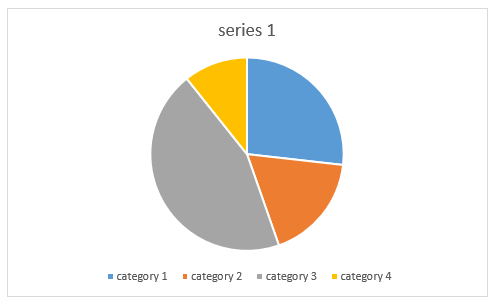 | 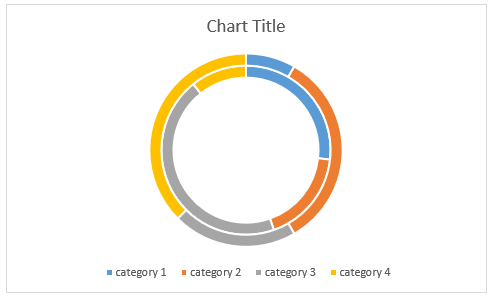 |

### Area Charts

Area charts can be used to plot change over time and draw attention to the total value across a trend. Since the area chart shows the sum of the plotted values as well, it visualized how the different parts contribute to the end result of the data.

| Clustered area          | Stacked area   | 100% stacked area   |
| ----------------------- |:--------------:| -------------------:|
| 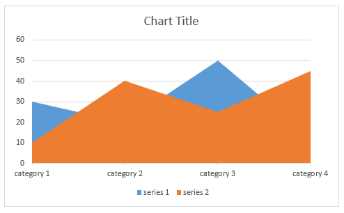 |  | 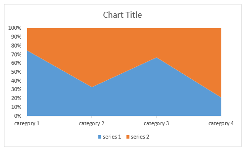|

### Combo Charts

Combo charts combine two or more chart types to make the data easy to understand. The secondary axis makes the reading of the data even easier. 

| Clustered column and Line| Line and Area  |Doughnut and line    |
| ------------------------ |:--------------:| -------------------:|
| 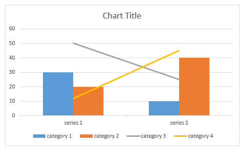 | 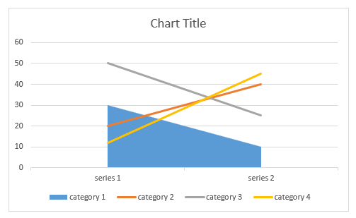 | 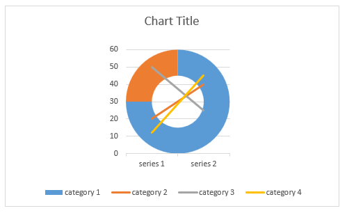|

>note For more details on the implementation of the charts and the properties you can use with them, check the [Using Charts]() topic.

## See Also

* [Generating Stacked Line Charts and Configuring Axes in Excel Using FloatingChartShape]()
* [SpreadProcessing Chart Generation Demo](https://demos.telerik.com/document-processing/spreadprocessing/charts)

