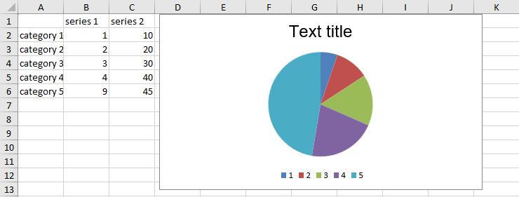
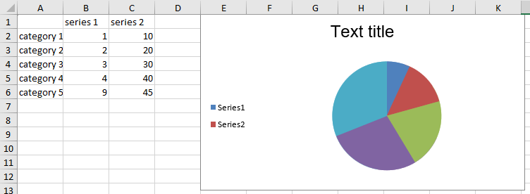

# Chart Title and Legend

You can manipulate the legend and the title of a chart.

## Title

You can access and set the **Title** property of the **DocumentChart** object, which is of type **Title**. The Title property is exposed in both, DocumentChart and SeriesBase classes. Similar to the series of the chart, the title can be a simple *string* value or a reference to data. The reference is not to a CellIndex, but to a CellRange and if the CellRange contains more than one cell, the values of the cells are concatenated.

#### [C#] Example 1: Setting the title of a chart to a string

{{region radspreadprocessing-features-charts-title-and-legend_0}}
	
	FloatingChartShape chartShape = new FloatingChartShape(worksheet, new CellIndex(0, 4), new CellRange(1, 1, 5, 2), ChartType.Pie)
	{
		Width = 460,
		Height = 250
	};
	DocumentChart chart = chartShape.Chart;

	chart.Title = new TextTitle("Text title");
{{endregion}}

#### [C#] Example 1: Setting the title of a series to a CellRange

{{region radspreadprocessing-features-charts-title-and-legend_1}}
	
	BarSeriesGroup columnGroup = chart.SeriesGroups.First() as BarSeriesGroup;
	SeriesBase firstSeries = columnGroup.Series.First();

	firstSeries.Title = new FormulaTitle(new WorkbookFormulaChartData(worksheet, new CellRange(0, 0, 0, 1)));
{{endregion}}

#### Figure 1: Chart title

## Legend

The charts use a legend to help users to understand the data plotted on the chart. 

The legend of the chart can be added or edited through the **Legend** property of the **DocumentChart** object. The property is of type **Legend**. The **Legend** type contains one property: **LegendPosition** of type **LegendPosition**, which is an enumeration with four members: **Top**, **Bottom**, **Left** and **Right**. The actual entries of the legend are constructed by the titles of the series.

#### [C#] Example 3: Adding a chart legend
{{region radspreadprocessing-features-charts-title-and-legend_2}}

	chart.Legend = new Legend();
	chart.Legend.Position = LegendPosition.Left;
{{endregion}}

#### Figure 2: Chart legend
