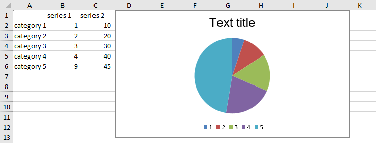
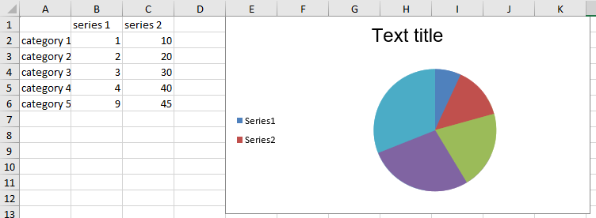

# Title and Legend

You can manipulate the legend and the title of a chart.

## Title

You can access and set the `Title` property of the `DocumentChart` object, which is of type `Title`. The `Title` property is exposed in both the `DocumentChart` and `SeriesBase` classes. Similar to the series of the chart, the title can be a simple string value or a reference to data. The reference is not to a `CellIndex`, but to a `CellRange`. If the `CellRange` contains more than one cell, the values of the cells are concatenated.

**Example 1: Setting the Title of a Chart to a String**

<snippet id='codeblock-clv'/>

**Example 2: Setting the Title of a Series to a CellRange**

<snippet id='codeblock-clw'/>

**Figure 1: Chart Title**

## Legend

The charts use a legend to help users understand the data plotted on the chart.

You can add or edit the legend of the chart through the `Legend` property of the `DocumentChart` object. The property is of type `Legend`. The `Legend` type contains one property: `LegendPosition` of type `LegendPosition`, which is an enumeration with four members: `Top`, `Bottom`, `Left`, and `Right`. The actual entries of the legend are constructed by the titles of the series.

**Example 3: Adding a Chart Legend**

<snippet id='codeblock-clx'/>

**Figure 2: Chart Legend**

