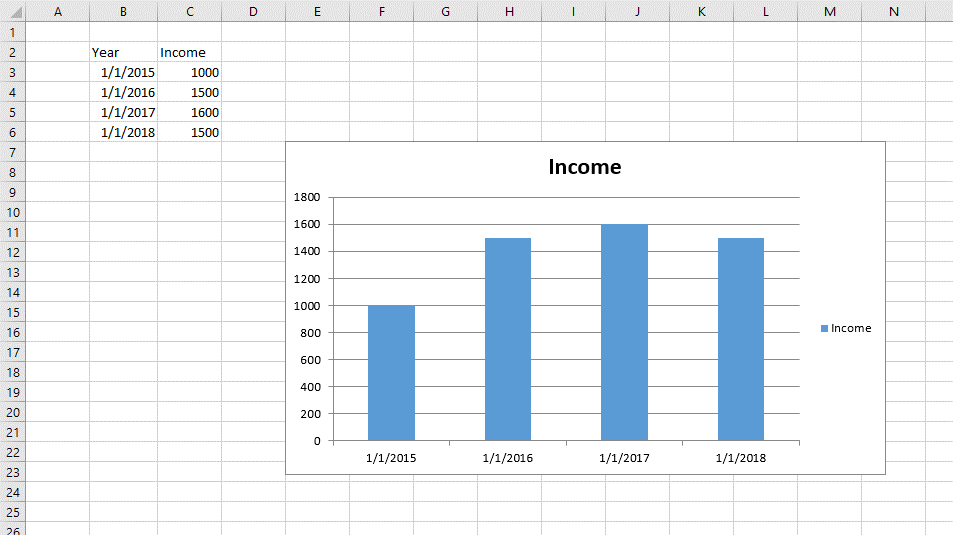
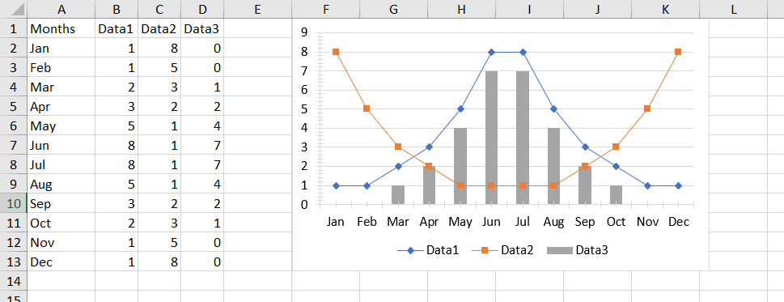
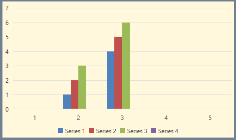

# Using Charts

RadSpreadProcessing allows you to add and manipulate charts in your spreadsheet document. This article describes the available API for inserting and modifying different types of charts.

The chart objects are preserved in the Shapes collection of the worksheet and are represented by the FloatingChartShape class. The FloatingChartShape object exposes a property called Chart, which is of type DocumentChart.

## FloatingChartShape

The charts are wrapped in shapes. The FloatingChartShape class derives from FloatingShapeBase and represents the link between the two object or, in other words, is the wrapper allowing you to add chart to a document. 

The FloatingChartShape class exposes the following constructors, which parse the data in the *chartDataRange* parameter and create a chart with all data already filled. 

* **FloatingChartShape(Worksheet worksheet, CellIndex cellIndex, CellRange chartDataRange, params ChartType[] chartTypes)**

* **FloatingChartShape(Worksheet worksheet, CellIndex cellIndex, CellRange chartDataRange, SeriesRangesOrientation seriesRangesOrientation, params ChartType[] chartTypes)**

	The parameters accepted by the constructors are as follows:
	* *worksheet*: The worksheet that the shape is associated with.
	* *cellIndex*: The cell index where the top left corner of the shape is positioned.
	* *chartDataRange*: The range containing the chart data.
	* *seriesRangesOrientation*: A value indicating whether the series of the chart will refer to vertical or horizontal ranges or the direction will be determined automatically.
	* *chartTypes*: The types of chart that will be created. **Passing more than one type will create a combo chart.**

	>The number of chartTypes must be no more than the number of columns inside the chartDataRange minus one (the first column is used to populate the X axis), otherwise you will get an exception of type **System.NullReferenceException**.

Once you have created a FloatingChartShape, you can insert it in the document through the Add() method of worksheet's Shapes property.

>Make sure that you have set the size of the FloatingChartShape object. Otherwise, it will be inserted in the worksheet with zero size and will be invisible.

#### [C#] Example 1: Create a chart through FloatingChartShape and add it to a worksheet

{{region radspreadprocessing-features-charts-using-charts_0}}
	
	FloatingChartShape chartShape = new FloatingChartShape(worksheet, new CellIndex(6, 4), new CellRange(1, 1, 5, 2), ChartType.Column)
	{
	    Width = 460,
	    Height = 250
	};
	
	worksheet.Shapes.Add(chartShape);
	
	SeriesGroup seriesGroup = chartShape.Chart.SeriesGroups.First(); // type BarChart
	int seriesCount = seriesGroup.Series.Count(); // 1
	SeriesBase series = seriesGroup.Series.First(); // type BarSeries

{{endregion}}

The result of executing the code in **Example 1** would look like in **Figure 1**.

#### Figure 1: 

The Chart property of FloatingChartShape holds an object of type [DocumentChart](#documentchart).

#### [C#] Example 2: Create a combo (Column and Line) chart through FloatingChartShape and add it to a worksheet

{{region radspreadprocessing-features-charts-using-charts_5}}
	
	FloatingChartShape chartShape = new FloatingChartShape(worksheet, new CellIndex(0, 5), new CellRange(0, 0, 12, 3), new[] { ChartType.Line, ChartType.Line, ChartType.Column })
        {
	    Width = 400,
	    Height = 250
	};
	
	worksheet.Shapes.Add(chartShape);

{{endregion}}

The result of executing the code in **Example 2** would look like in **Figure 2**.

#### Figure 2: 

### Changing the Appearance of FloatingChartShape

The FloatingChartShape class exposes properties allowing you to customize how the shape looks like. You can control the outline of the shape as well as its fill.

#### [C#] Example 3: Customize the fill and outline of FloatingChartShape
{{region radspreadprocessing-features-charts-using-charts_1}}

    FloatingChartShape chartShape = new FloatingChartShape(workbook.ActiveWorksheet, new CellIndex(2, 7), new CellRange(0, 0, 4, 3), ChartType.Column)
    {
        Width = 480,
        Height = 288,
    };

    chartShape.Outline.Fill = new SolidFill(new ThemableColor(Colors.SlateGray));
    chartShape.Outline.Width = 5;
    chartShape.Fill = new SolidFill(new ThemableColor(Colors.Cornsilk));
{{endregion}}

The result of executing the code in **Example 3** over a cell range containing sample data would look like in **Figure 3**.

#### Figure 3: 

>note The series are styled using the colors defined in the [Document Theme]().

## DocumentChart 

This is the object representing the chart itself and contains the following properties:

* **SeriesGroup**: Represents a collection of the groups in which the series of the chart are organized.

* **PrimaryAxes**: Represents the primary group of axes of the chart.

* **SecondaryAxes**: Represents the secondary group of axes of the chart. It is used when there is more than one group of series (combo chart).

* **Title**: Represents the title of the chart.

* **Legend**: Represents the legend of the chart.

Also, a **Clone()** method is exposed, which creates a deep copy of the object.

You can create a simple DocumentChart object, which is empty and then set the desired values manually.

#### [C#] Example 4: Creating an empty chart and setting its values manually

{{region radspreadprocessing-features-charts-using-charts_2}}

	DocumentChart chart = new DocumentChart();
	// Fill the chart with data
	SeriesGroup seriesGroup = new BarSeriesGroup();
	chart.SeriesGroups.Add(seriesGroup);
	
	WorkbookFormulaChartData seriesValuesData = new WorkbookFormulaChartData(worksheet, new CellRange(2, 2, 5, 2));
	WorkbookFormulaChartData seriesCategoriesData = new WorkbookFormulaChartData(worksheet, new CellRange(2, 1, 5, 1));
	seriesGroup.Series.Add(seriesCategoriesData, seriesValuesData);

	chart.PrimaryAxes.CategoryAxis = new DateAxis();
	chart.PrimaryAxes.ValueAxis = new ValueAxis();
	
	(seriesGroup as ISupportAxes).AxisGroupName = AxisGroupName.Primary;

{{endregion}}

The chart can then be used to replace the chart in an existing **FloatingChartShape**.

#### [C#] Example 5: Add the DocumentChart to a worksheet

{{region radspreadprocessing-features-charts-using-charts_3}}

	chartShape.Chart = chart;
	
	worksheet.Shapes.Add(chartShape);
{{endregion}}

>noteFor more on Series, the [Series]() help topic. Refer to [Working with Axes]() for description of the axes objects of the chart.

The initial data and the resulting chart are shown in **Figure 1**.

## Creating a chart using the AddChart methods of the ShapeCollection

The ShapeCollection (Shapes property of Worksheet) exposes two overloads which can add a chart to a worksheet. Internally, they use the same logic as the FloatingChartShape constructor. They create a FloatingChartShape object using the data passed as a parameter and return the object as a result from the execution.

* FloatingChartShape **AddChart**(CellIndex cellIndex, CellRange chartDataRange, params ChartType[] chartTypes)
* FloatingChartShape **AddChart**(CellIndex cellIndex, CellRange chartDataRange, SeriesRangesOrientation seriesRangesOrientation, params ChartType[] chartTypes)

##	Iterating the charts of a worksheet

You can access the Charts collection of the Shape collection of the Worksheet instance and enumerate the Charts.

#### [C#] Example 6: Iterate all the charts in a worksheet

{{region radspreadprocessing-features-charts-using-charts_4}}

	foreach (FloatingChartShape chartShape in worksheet.Shapes.Charts)
	{
	    DocumentChart chart = chartShape.Chart;
	    SeriesGroup group = chart.SeriesGroups.First();
	    SeriesBase series = group.Series.First();
	}
{{endregion}}
