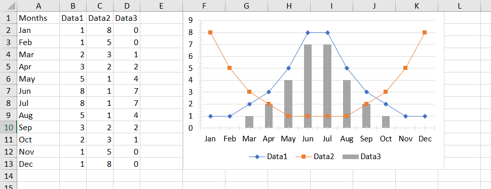
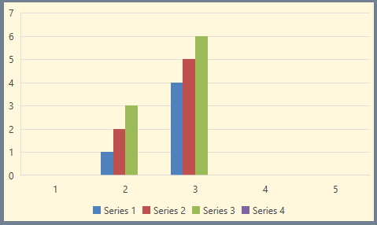

# Using Charts

RadSpreadProcessing allows you to add and manipulate charts in your spreadsheet documents. The available API enables you to insert and modify different types of charts.

The chart objects are stored in the `Charts` collection of the worksheet and are represented by the `FloatingChartShape` class. The `FloatingChartShape` object exposes a `Chart` property of type `DocumentChart`.

## FloatingChartShape

The charts are wrapped in shapes. The `FloatingChartShape` class derives from `FloatingShapeBase` and represents the wrapper that allows you to add a chart to a document.

The `FloatingChartShape` class exposes the following constructors, which parse the data in the *chartDataRange* parameter and create a chart with all data already filled:

* `FloatingChartShape(Worksheet worksheet, CellIndex cellIndex, CellRange chartDataRange, params ChartType[] chartTypes)`

* `FloatingChartShape(Worksheet worksheet, CellIndex cellIndex, CellRange chartDataRange, SeriesRangesOrientation seriesRangesOrientation, params ChartType[] chartTypes)`

	The parameters accepted by the constructors are as follows:

	| Parameter | Description |
	|---|---|
	| `worksheet` | The worksheet that the shape is associated with. |
	| `cellIndex` | The cell index where the top left corner of the shape is positioned. |
	| `chartDataRange` | The range containing the chart data. |
	| `seriesRangesOrientation` | A value indicating whether the series of the chart refer to vertical or horizontal ranges, or if the direction is determined automatically. |
	| `chartTypes` | The types of chart to create. **Passing more than one type creates a combo chart.** |

	>The number of `chartTypes` must be no more than the number of columns inside the `chartDataRange` minus one (the first column populates the X axis). Otherwise, a `System.NullReferenceException` is thrown.

Once you have created a `FloatingChartShape`, you can insert it in the document through the `Add()` method of the worksheet `Charts` property.

>Ensure that you have set the size of the `FloatingChartShape` object. Otherwise, it is inserted in the worksheet with zero size and is invisible.

**Example 1: Create a chart through FloatingChartShape and add it to a worksheet**

<snippet id='codeblock-cly'/>

The result of executing the code in **Example 1** looks like **Figure 1**.

**Figure 1: Column chart added to a worksheet from year and income data**

The `Chart` property of `FloatingChartShape` holds an object of type [DocumentChart](#documentchart).

**Example 2: Create a combo column and line chart through FloatingChartShape**

<snippet id='codeblock-clz'/>

The result of executing the code in **Example 2** looks like **Figure 2**.

**Figure 2: Combo chart with line and column series added to a worksheet**

### Changing the Appearance of FloatingChartShape

The `FloatingChartShape` class exposes properties that allow you to customize the shape appearance. You can control the outline of the shape and its fill.

**Example 3: Customize the fill and outline of FloatingChartShape**

<snippet id='codeblock-cma'/>

The result of executing the code in **Example 3** over a cell range containing sample data looks like **Figure 3**.

**Figure 3: Chart shape with customized background fill and outline styling**

>note The series are styled using the colors defined in the [Document Theme]().

## DocumentChart

The `DocumentChart` object represents the chart itself and contains the following properties:

| Property | Description |
|---|---|
| `SeriesGroup` | Represents a collection of the groups in which the series of the chart are organized. |
| `PrimaryAxes` | Represents the primary group of axes of the chart. |
| `SecondaryAxes` | Represents the secondary group of axes of the chart. Used when there is more than one group of series (combo chart). |
| `Title` | Represents the title of the chart. |
| `Legend` | Represents the legend of the chart. |

The class also exposes a `Clone()` method, which creates a deep copy of the object.

You can create an empty `DocumentChart` object and then set the desired values manually.

**Example 4: Create an empty DocumentChart and set its values manually**

<snippet id='codeblock-cmb'/>

You can then use the chart to replace the chart in an existing `FloatingChartShape`.

**Example 5: Add the DocumentChart to a worksheet**

<snippet id='codeblock-cmc'/>

>note For more information about series, see the [Series]() article. For a description of the axes objects, see [Working with Axes]().

The initial data and the resulting chart are shown in **Figure 1**.

## Iterating the Charts of a Worksheet

You can access the `Charts` collection of the `Shapes` collection of the `Worksheet` instance and enumerate the charts.

**Example 6: Iterate all charts in a worksheet**

<snippet id='codeblock-cmd'/>
