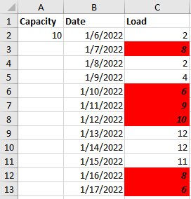
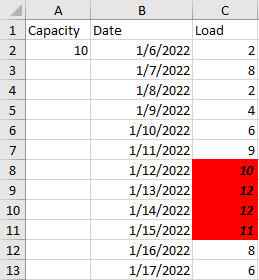
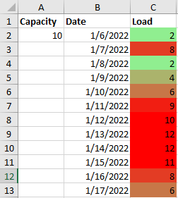
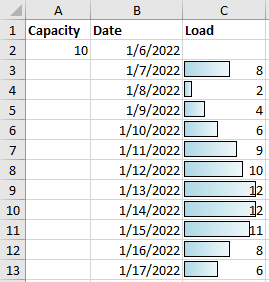
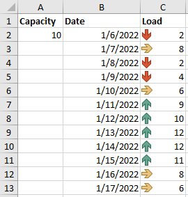

# Conditional Formatting

The conditional formatting in spreadsheet documents helps you visualize the data inside in a user-friendly manner, making it easy to analyze data, find critical issues, patterns and trends.

A conditional format changes the appearance of cells based on conditions that you specify. If the conditions are true, the cell range is formatted; if the conditions are false, the cell range is not formatted. There are many built-in conditions, and you can also create your own (including by using a formula that evaluates to True or False).

This article describes the supported formatting rules, how to create and how to use them.

## Rules

SpreadProcessing supports many different types of formatting rules. Each rule implements the base `ConditionalFormattingRule` class. All of them are listed in **Table 1**.

#### Table 1: Supported formatting rules

| Rule | Description |
|---|---|
| **ColorScaleRule** | Specificies a gradient range of colors that is used to give additional meaning to data by assigning certain values to colors in the gradient spectrum. |
| **DataBarRule** | A graphical representation of the cells’ content. |
| **IconSetRule** | Specifies a collection of icons that can be used to comment and classify data into categories. |
| **BetweenRule** | This conditional formatting rule determines whether a cell value is inside a specified range. |
| **NotBetweenRule** | This conditional formatting rule determines whether a cell value is outside a specified range. |
| **EqualToRule** | Determines whether a cell value matches a specified value. |
| **NotEqualToRule** | Determines whether a cell value doesn't match a specified value. |
| **GreaterThanOrEqualToRule** | Determines whether a cell value matches specified value or it is greater. |
| **GreaterThanRule** | Determines whether a cell value is greater than the specified value. |
| **LessThanOrEqualToRule** | Determines whether a cell value matches specified value or it is smaller. |
| **LessThanRule** | Determines whether a cell value is smaller than the specified value. |
| **HasErrorRule** | Matches cell values that contain errors. |
| **HasNoErrorRule** | Matches cell values that do not contain errors. |
| **BeginsWithRule** | Matches cells whose values begin with a specified string. |
| **EndsWith** | Matches cells whose values end with a specified string. |
| **ContainsBlanksRule** | Matches blank cells. |
| **NotContainsBlanksRule** | Matches non-empty cells. |
| **ContainsRule** | This conditional formatting rule highlights cells containing given text. |
| **NotContainsRule** | This conditional formatting rule highlights cells that do not contain given text. |
| **TopRule** | This conditional formatting rule highlights cells whose values fall in the top N bracket. It can also work for N % instead of N items. It has two Boolean configuration properties: Items and Percent, which act like switches for these behaviors. |
| **BottomRule** | This conditional formatting rule highlights cells whose values fall in the bottom N bracket. It can also work for N % instead of N items. It has two Boolean configuration properties: Items and Percent, which act like switches for these behaviors. |
| **DuplicateValuesRule** | Matches values that are duplicate inside a specified range. |
| **UniqueValuesRule** | Matches values that are unique inside a specified range. |
| **ValueDistributionRule** | This conditional formatting rule highlights cells that are above or below the average for all values in the range. It has four Boolean configuration properties – `AboveAverage`, `AboveOrEqualToAverage`, `BelowAverage`, `BelowOrEqualToAverage`. |

## Create Formatting for a Rule

The **ConditionalFormattingDxfRule** class is a base class for all rules that support formatting. All of its inheritors, expose the `Formatting` property. This property is of type `DifferentialFormatting` and holds the formatting that will be applied to all cells inside the range that fit the rule requirement. You can set the following properties:

- Font size
- Font family
- Fore color
- Bold
- Italic
- Underline
- Fill
- LeftBorder
- RightBorder
- TopBorder
- BottomBorder
- DiagonalUpBorder
- DiagonalDownBorder
- CellValueFormat: Allows you to set the number format string for the cell value. For more information, check the [Number Formatting]() topic.

The Formatting property can be used for all rules listed in **Table 1** except **ColorScaleRule**, **IconSetRule**, and **DataBarRule**. Due to their specificity, these three rules inherit directly from `ConditionalFormattingRule` and **do not** expose the `Formatting` property. Their styling options are directly inside the rule class. 

#### [C#] Example 1: Create formatting

{{region radspreadprocessing-features-conditional-formatting_5}}

    DifferentialFormatting formatting = new DifferentialFormatting();
    formatting.FontSize = 22;
    formatting.FontFamily = new ThemableFontFamily("Times New Roman");
    formatting.ForeColor = new ThemableColor(Colors.Red);
    formatting.IsBold = true;
    formatting.IsItalic = true;
    formatting.Fill = new PatternFill(PatternType.Solid, Color.FromArgb(255, 46, 204, 113), Colors.Transparent);
    formatting.CellValueFormat = new CellValueFormat("@");
        
    CellBorder cellBorder = new CellBorder(CellBorderStyle.Thin, ThemableColor.FromColor(Colors.Red));
    formatting.TopBorder = cellBorder;
    formatting.BottomBorder = cellBorder;
    formatting.LeftBorder = cellBorder;
    formatting.RightBorder = cellBorder;
{{endregion}}

## Create and Apply Conditional Formatting Rule

Each of the classes listed in **Table 1** above expose constructors enabling you to instantiate the specific rule. The constructors of these classes take a `string` parameter allowing you to specify the values and conditions the rule must work with. You can pass any cell value for the parameter, inlcuding formulas.

#### [C#] Example 2: Create Between rule

{{region radspreadprocessing-features-conditional-formatting_0}}

    // Get a value from the worksheet
    string capacityValue = worksheet.Cells[1, 0].GetValue().Value.GetValueAsString(CellValueFormat.GeneralFormat);
    double maxValue = double.Parse(capacityValue);
    
    // Create the rule by passing the two values the rule should match between
    BetweenRule rule = new BetweenRule((maxValue / 2).ToString(), capacityValue);
    
    // Create the desired formatting and apply it to the rule
    DifferentialFormatting formatting = new DifferentialFormatting();
    formatting.IsBold = true;
    formatting.IsItalic = true;
    formatting.Fill = new PatternFill(PatternType.Solid, Colors.Red, Colors.Transparent);
    rule.Formatting = formatting;
    
    // Create conditional formatting and add it to the desired range of cells
    ConditionalFormatting conditionalFormatting = new ConditionalFormatting(rule);
    worksheet.Cells[1, 2, 12, 2].AddConditionalFormatting(conditionalFormatting);;
{{endregion}}

#### Between rule applied on a range of values

#### [C#] Example 3: Create GreaterThanOrEqualTo rule

{{region radspreadprocessing-features-conditional-formatting_1}}

    GreaterThanOrEqualToRule rule = new GreaterThanOrEqualToRule("=$A$2");
    
    DifferentialFormatting formatting = new DifferentialFormatting();
    formatting.IsBold = true;
    formatting.IsItalic = true;
    formatting.Fill = new PatternFill(PatternType.Solid, Colors.Red, Colors.Transparent);
    rule.Formatting = formatting;
    
    ConditionalFormatting conditionalFormatting = new ConditionalFormatting(rule);
    worksheet.Cells[1, 2, 11, 2].AddConditionalFormatting(conditionalFormatting);
{{endregion}}

#### GreaterThanOrEqualTo rule applied on a range of values

#### [C#] Example 4: Create ColorScale rule

{{region radspreadprocessing-features-conditional-formatting_2}}

    // Get a value from an existing worksheet
    string capacityValue = worksheet.Cells[1, 0].GetValue().Value.GetValueAsString(CellValueFormat.GeneralFormat);
    double maxValue = double.Parse(capacityValue);
    
    // Create the desired context and set its properties
    TwoColorScaleValueContext twoColorsContext = new TwoColorScaleValueContext();
    
    twoColorsContext.MaximumValue = new NumericValue(maxValue);
    twoColorsContext.MaximumColor = new ThemableColor(Colors.Red);
    
    twoColorsContext.MinimumValue = new MinimumValue();
    twoColorsContext.MinimumColor = new ThemableColor(Colors.LightGreen);
    
    // Create the rule
    ColorScaleRule rule = new ColorScaleRule(twoColorsContext);
    
    // Create the conditional formatting and apply it
    ConditionalFormatting conditionalFormatting = new ConditionalFormatting(rule);
    worksheet.Cells[1, 2, 12, 2].AddConditionalFormatting(conditionalFormatting);

{{endregion}}

>note Depending on the exact number of colors you would like to apply for the ColorScaleRule, you can choose between **TwoColorScaleValueContext** and **ThreeColorScaleValueContext** classes.

#### ColorScale rule applied on a range of values

#### [C#] Example 5: Create DataBar rule

{{region radspreadprocessing-features-conditional-formatting_3}}

    // Create the context for the rule
    DataBarValueContext dataBarValueContext = new DataBarValueContext();
    dataBarValueContext.MaximumValue = new MaximumValue();
    dataBarValueContext.MinimumValue = new MinimumValue();

    // Create the rule and set the desired formatting
    DataBarRule rule = new DataBarRule(dataBarValueContext);
    rule.FillColor = new ThemableColor(Colors.LightBlue);

    ConditionalFormatting conditionalFormatting = new ConditionalFormatting(rule);
    worksheet.Cells[1, 2, 12, 2].AddConditionalFormatting(conditionalFormatting);

{{endregion}}

#### DataBar rule applied on a range of values

#### [C#] Example 6: Create IconSet rule

{{region radspreadprocessing-features-conditional-formatting_4}}

    // Create the rule using a predefined set of icons
    IconSetRule rule = new IconSetRule(PresetIconSet.ThreeArrowsColored);         
    
    ConditionalFormatting conditionalFormatting = new ConditionalFormatting(rule);
    worksheet.Cells[1, 2, 12, 2].AddConditionalFormatting(conditionalFormatting);

{{endregion}}

#### IconSet rule applied on a range of values

The `PresetIconSet` enum exposes multiple definitions for predefined sets of icons. You can also use custom icons through the other construcor of IconSetRule. This overload accepts object of type IconSetValueContextBase whose implementations allow you to register three, four or five icons: `ThreeIconSetValueContext`, `FourIconSetValueContext`, `FiveIconSetValueContext`.

### Working With IRangeValue

Some of the rules enable you to set values for their ranges. Examples for similar rules are **DataBar** and **ColorScale**. Their contexts accept `IRangeValue` objects that define the type for the minimum, middle (if present) and maximum values. These values could be numbers, percentages, or automatically calculated values for the specific range.

The following list shows all implementations of `IRangeValue` that you can use:

- **AutomaticMaximumValue**: A value that is automatically determined depending on the current context.
- **AutomaticMinimumValue**: A value that is automatically determined depending on the current context.
- **MaximumValue**: The highest value in the applied range.
- **MinimumValue**: The lowest value in the applied range.
- **NumericValue**: A simple numeric value.
- **FormulaValue**: A formula whose result is used as a range value.
- **PercentValue**: A percentage numeric value.
- **PercentileValue**: A numeric value that takes values up to a certain percentile of the range.

## Get the Conditional Formatting from a CellRange

Any previously applied formatting can be obtained through the GetConditionalFormattings method of CellSelection. This method returns a collection of **ConditionalFormattingRange** object representing the formattings applied to the selection and the CellRange each formatting is applied on.

#### [C#] Example 7: Get the conditional formatting

{{region radspreadprocessing-features-conditional-formatting_6}}

    IEnumerable<ConditionalFormattingRange> formattingRanges = worksheet.Cells[0, 0, 10, 10].GetConditionalFormattings();
{{endregion}}

## Remove Conditional Formatting

Through the CellSelection, you can also remove the formatting from the selected cells.

#### [C#] Example 8: Remove the conditional formatting

{{region radspreadprocessing-features-conditional-formatting_7}}

    IEnumerable<ConditionalFormattingRange> formattingRanges = worksheet.Cells[0, 0, 10, 10].GetConditionalFormattings();
    
    foreach (ConditionalFormattingRange range in formattingRanges)
    {
        foreach (ConditionalFormatting format in range.Formattings)
        {
            worksheet.Cells[range.CellRange].RemoveConditionalFormatting(format);
        }
    }
{{endregion}}

## Resolve Conditional Formatting

Each of the formatting rule classes gives you the ability to evaluate the rule and obtain its result through the `Resolve` method.

For the rules that apply on all the values in the range, the return value is **between 0 and 1**, depending on where that value is positioned in the range of all values. Such rules are `ColorScaleRule`, `DataBarRule` and `IconSetRule`. For all other rules, the result of `Resolve` is **0 or 1**, depending on whether the specific cell value meets the rule requirements.

#### [C#] Example 9: Resolve conditional formatting rule

{{region radspreadprocessing-features-conditional-formatting_8}}

    CellIndex cellIndex = new CellIndex(0, 0);
    ConditionalFormatting formatting = worksheet.Cells[cellIndex].GetConditionalFormattings().First().Formattings.First();
    bool isFormattingApplied = formatting.Resolve(cellIndex) > 0;
{{endregion}}

## Update the Rule for a Formatting

In case you would like to change the rule used by a ConditionalFormatting object, you can do so using the UpdateRule() method.

#### [C#] Example 10: Change the rule for existing conditional formatting

{{region radspreadprocessing-features-conditional-formatting_9}}

    ConditionalFormattingRange formattingRange = worksheet.Cells[0, 0, 10, 10].GetConditionalFormattings().First();
    formattingRange.Formattings.First().UpdateRule(new ContainsRule("test"));
{{endregion}}

## Update the Cell Range of Existing Formatting

The CellSelection class exposes the UpdateConditionalFormattingCellRanges method to help you change the conditional formatting element's cell range, applying it to the currently selected ranges. When invoked, the UpdateConditionalFormattingCellRanges method removes the conditional formatting from the ranges it is associated with and applies it to the selection.

## Control the Priority of Rules

Each ConditionalFormattingRule has a specific priority used to evaluate which formatting should be applied when several rules are used on the same range of cells. If you would like to change that priority, you can use the SwapPriority() method of the rule. It takes a ConditionalFormattingRule object and swaps its priority with the rule the method is invoked for.
