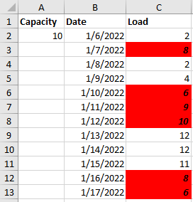
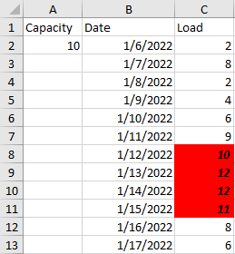
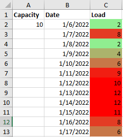
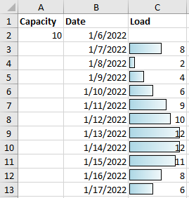
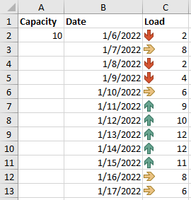

# Conditional Formatting

Conditional formatting in spreadsheet documents helps you visualize data in a user-friendly manner, making it easy to analyze data, find critical issues, patterns, and trends.

A conditional format changes the appearance of cells based on conditions that you specify. If the conditions are true, the cell range is formatted. If the conditions are false, the cell range is not formatted. There are many built-in conditions, and you can also create your own (including by using a formula that evaluates to True or False).

The following sections describe the supported formatting rules and how to create and use them.

## Rules

SpreadProcessing supports many different types of formatting rules. Each rule implements the base `ConditionalFormattingRule` class. All of them are listed in **Table 1**.

**Table 1: Supported Formatting Rules**

| Rule | Description |
|---|---|
| `ColorScaleRule` | Specifies a gradient range of colors that gives additional meaning to data by assigning certain values to colors in the gradient spectrum. |
| `DataBarRule` | A graphical representation of the cells' content. |
| `IconSetRule` | Specifies a collection of icons that can be used to comment and classify data into categories. |
| `BetweenRule` | Determines whether a cell value is inside a specified range. |
| `NotBetweenRule` | Determines whether a cell value is outside a specified range. |
| `EqualToRule` | Determines whether a cell value matches a specified value. |
| `NotEqualToRule` | Determines whether a cell value does not match a specified value. |
| `GreaterThanOrEqualToRule` | Determines whether a cell value matches a specified value or is greater. |
| `GreaterThanRule` | Determines whether a cell value is greater than the specified value. |
| `LessThanOrEqualToRule` | Determines whether a cell value matches a specified value or is smaller. |
| `LessThanRule` | Determines whether a cell value is smaller than the specified value. |
| `HasErrorRule` | Matches cell values that contain errors. |
| `HasNoErrorRule` | Matches cell values that do not contain errors. |
| `BeginsWithRule` | Matches cells whose values begin with a specified string. |
| `EndsWith` | Matches cells whose values end with a specified string. |
| `ContainsBlanksRule` | Matches blank cells. |
| `NotContainsBlanksRule` | Matches non-empty cells. |
| `ContainsRule` | Highlights cells containing given text. |
| `NotContainsRule` | Highlights cells that do not contain given text. |
| `TopRule` | Highlights cells whose values fall in the top N bracket. It can also work for N % instead of N items. It has two Boolean configuration properties: Items and Percent, which act as switches for these behaviors. |
| `BottomRule` | Highlights cells whose values fall in the bottom N bracket. It can also work for N % instead of N items. It has two Boolean configuration properties: Items and Percent, which act as switches for these behaviors. |
| `DuplicateValuesRule` | Matches values that are duplicate inside a specified range. |
| `UniqueValuesRule` | Matches values that are unique inside a specified range. |
| `ValueDistributionRule` | Highlights cells that are above or below the average for all values in the range. It has four Boolean configuration properties: `AboveAverage`, `AboveOrEqualToAverage`, `BelowAverage`, `BelowOrEqualToAverage`. |
| `FormulaRule` | Allows you to enter any valid formula as a rule argument that returns a number. |

## Create Formatting for a Rule

The `ConditionalFormattingDxfRule` class is a base class for all rules that support formatting. All of its inheritors expose the `Formatting` property. This property is of type `DifferentialFormatting` and holds the formatting applied to all cells inside the range that fit the rule requirement. You can set the following properties:

* `FontSize`
* `FontFamily`
* `ForeColor`
* `Bold`
* `Italic`
* `Underline`
* `Fill`
* `LeftBorder`
* `RightBorder`
* `TopBorder`
* `BottomBorder`
* `DiagonalUpBorder`
* `DiagonalDownBorder`
* `CellValueFormat` — allows you to set the number format string for the cell value. For more information, check the [Number Formatting]() topic.

The `Formatting` property can be used for all rules listed in **Table 1** except `ColorScaleRule`, `IconSetRule`, and `DataBarRule`. Due to their specificity, these three rules inherit directly from `ConditionalFormattingRule` and **do not** expose the `Formatting` property. Their styling options are directly inside the rule class. 

**Example 1: Create Formatting**

<snippet id='codeblock-cgr'/>

## Create and Apply Conditional Formatting Rule

Each of the classes listed in **Table 1** exposes constructors that enable you to instantiate the specific rule. The constructors of these classes take a `string` parameter that allows you to specify the values and conditions the rule must work with. You can pass any cell value for the parameter, including formulas.

**Example 2: Create a Between Rule**

<snippet id='codeblock-cgs'/>

#### Between rule applied on a range of values

**Example 3: Create a GreaterThanOrEqualTo Rule**

<snippet id='codeblock-cgt'/>

#### GreaterThanOrEqualTo rule applied on a range of values

**Example 4: Create a ColorScale Rule**

<snippet id='codeblock-cgu'/>

>note Depending on the exact number of colors you want to apply for the `ColorScaleRule`, you can choose between `TwoColorScaleValueContext` and `ThreeColorScaleValueContext` classes.

#### ColorScale rule applied on a range of values

**Example 5: Create a DataBar Rule**

<snippet id='codeblock-cgv'/>

#### DataBar rule applied on a range of values

**Example 6: Create an IconSet Rule**

<snippet id='codeblock-cgw'/>

#### IconSet rule applied on a range of values

The `PresetIconSet` enum exposes multiple definitions for predefined sets of icons. You can also use custom icons through the other constructor of `IconSetRule`. This overload accepts an object of type `IconSetValueContextBase` whose implementations allow you to register three, four, or five icons: `ThreeIconSetValueContext`, `FourIconSetValueContext`, `FiveIconSetValueContext`.

### Working with IRangeValue

Some of the rules enable you to set values for their ranges. Examples for similar rules are `DataBarRule` and `ColorScaleRule`. Their contexts accept `IRangeValue` objects that define the type for the minimum, middle (if present), and maximum values. These values can be numbers, percentages, or automatically calculated values for the specific range.

The following list shows all implementations of `IRangeValue` that you can use:

| Name | Description |
|---|---|
| `AutomaticMaximumValue` | A value that is automatically determined depending on the current context. |
| `AutomaticMinimumValue` | A value that is automatically determined depending on the current context. |
| `MaximumValue` | The highest value in the applied range. |
| `MinimumValue` | The lowest value in the applied range. |
| `NumericValue` | A numeric value. |
| `FormulaValue` | A formula whose result is used as a range value. |
| `PercentValue` | A percentage numeric value. |
| `PercentileValue` | A numeric value that takes values up to a certain percentile of the range. |

## Get the Conditional Formatting from a CellRange

Any previously applied formatting can be obtained through the `GetConditionalFormattings` method of `CellSelection`. This method returns a collection of `ConditionalFormattingRange` objects representing the formattings applied to the selection and the `CellRange` each formatting applies to.

**Example 7: Get the Conditional Formatting**

<snippet id='codeblock-cgx'/>

## Remove Conditional Formatting

Through the `CellSelection`, you can also remove the formatting from the selected cells.

**Example 8: Remove the Conditional Formatting**

<snippet id='codeblock-cgy'/>

## Resolve Conditional Formatting

Each of the formatting rule classes gives you the ability to evaluate the rule and obtain its result through the `Resolve` method.

For the rules that apply on all the values in the range, the return value is **between 0 and 1**, depending on where that value is positioned in the range of all values. Such rules are `ColorScaleRule`, `DataBarRule`, and `IconSetRule`. For all other rules, the result of `Resolve` is **0 or 1**, depending on whether the specific cell value meets the rule requirements.

**Example 9: Resolve a Conditional Formatting Rule**

<snippet id='codeblock-cgz'/>

## Update the Rule for a Formatting

If you want to change the rule used by a `ConditionalFormatting` object, use the `UpdateRule()` method.

**Example 10: Change the Rule for Existing Conditional Formatting**

<snippet id='codeblock-cha'/>

## Update the Cell Range of Existing Formatting

The `CellSelection` class exposes the `UpdateConditionalFormattingCellRanges` method to help you change the conditional formatting element's cell range, applying it to the currently selected ranges. When invoked, the `UpdateConditionalFormattingCellRanges` method removes the conditional formatting from the ranges it is associated with and applies it to the selection.

## Control the Priority of Rules

Each `ConditionalFormattingRule` has a specific priority used to evaluate which formatting to apply when several rules target the same range of cells. If you want to change that priority, use the `SwapPriority()` method of the rule. It takes a `ConditionalFormattingRule` object and swaps its priority with the rule the method is invoked for.
