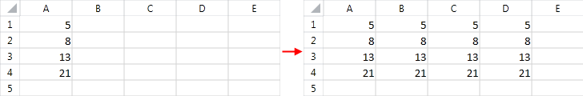
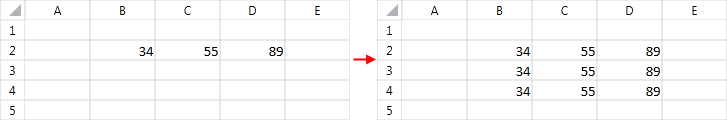

# Repeat Values

The document model allows you to automatically repeat data that has already been entered in your worksheet. The auto fill feature is very useful when you would like to copy the contents of a row or a column into its adjacent rows or columns respectively. Thus, you can easily spread the values into a specified range instead of populating the cells manually.
      

## 

To repeat the values, first you need to create a [CellSelection]() for the range of cells that you want to populate. Note that the range should include the values that you would like to repeat. Then, you need to invoke the __FillData()__ method of the __CellSelection__ instance and pass appropriate __FillDirection__ as an argument. There are four __FillDirection__ values:
        

* __Left__: The values in the rightmost column are copied to the rest of the columns in the range.
            

* __Up__: The values in the bottom row are copied to the rest of the rows in the range.
            

* __Right__: The values in the leftmost column are copied to the rest of the columns in the range.
            

* __Down__: The values in the top row are copied to the rest of the rows in the range.
            

__Example 1__ illustrates how the contents of column *A* can be copied to the rest of the columns in the range *A1:D4*. The code creates a new worksheet and populates the cells *A1*, *A2*, *A3* and *A4* with the values 5, 8, 13 and 21 respectively. Further, it invokes the __FillData()__ method for the specified range with __FillDirection Right__.
        

#### __Example 1: Fill right__

<snippet id='codeblock-cme'/>

__Figure 1__ demonstrates the result of __Example 1__.
        

#### Figure 1: Data filled right

Similarly, you can automatically copy the values of a row to its adjacent rows.
        

__Example 2__ invokes the __FillData()__ method with __FillDirection Down__ for the range *B2:D4*. The sample code creates an empty worksheet and enters values in the range *B2:D2*. These values are propagated to the rest of the rows in the specified region.
        

#### __Example 2: Fill down__

<snippet id='codeblock-cmf'/>

__Figure 2__ demonstrates the result of __Example 2__.
        

#### Figure 2: Data filled down

## See Also

 * [Accessing Cells of a Worksheet]()
 * [Series]()
