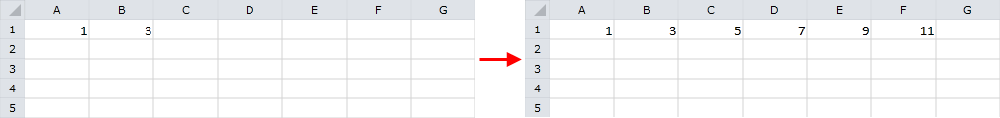
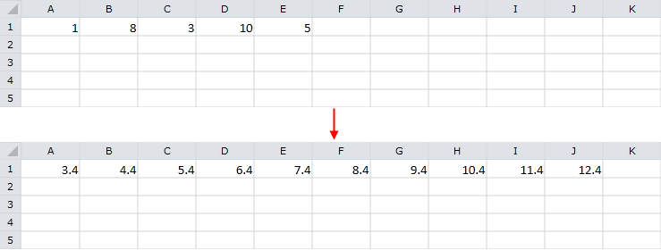
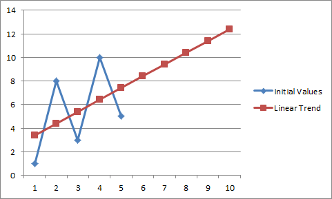
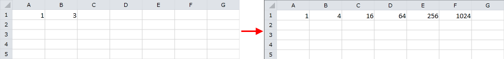
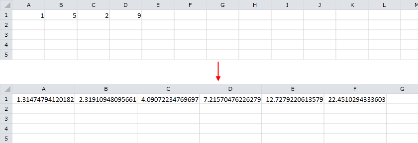
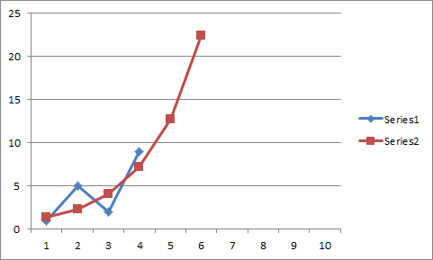
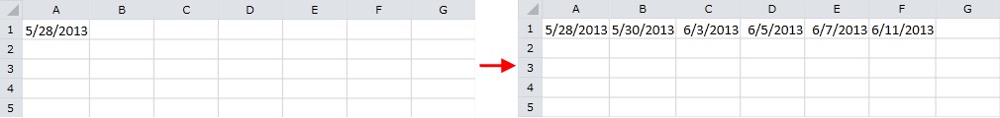
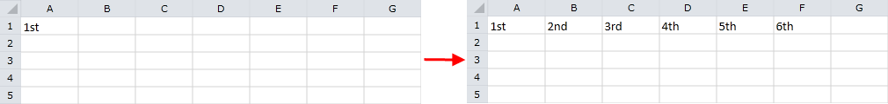
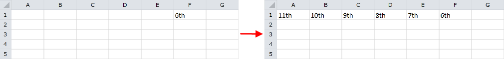

# Series

The document model can automatically construct series of data using a specified pattern or data that is already in the worksheet. The Auto Fill feature can continue series of numbers, dates, time periods, or number and text combinations based on start and step values. The automatic fill supports the following series: linear, growth, date, and auto fill.

To use the auto fill feature, first create a [CellSelection]() for the range of cells that you want to populate. Note that the range must include the starting values of the series. The `CellSelection` offers the following methods for series construction:

* [FillDataSeriesLinear](#linear-series): Calculates the value of each cell after the initial values by adding a specific `Step` value to the value of the previous cell.

* [FillDataSeriesLinearTrend](#linear-trend-series): Calculates the values of the series using a linear fitting algorithm for finding the best line for the initial values.

* [FillDataSeriesExponential](#exponential-series): Calculates the values of each cell after the initial values by multiplying the value of the previous cell by a specific `Step` value.

* [FillDataSeriesExponentialTrend](#exponential-trend-series): Calculates the values of the series using an exponential fitting algorithm for finding the best exponential curve for your initial values.

* [FillDataSeriesDate](#date-series): Fills date values incrementally using a specific `Step` value that can represent the number of days, weekdays, months, or years.

* [FillDataSeriesAuto](#auto-fill-series): Automatically continues complex patterns of numbers, number and text combinations, dates, or time periods. Typically, it uses a linear fitting algorithm to find the next value of the series.

The following sections contain detailed information and examples for each of these methods.

## Linear Series

The `FillDataSeriesLinear()` method of the `CellSelection` class constructs linear series of data. The method has two required and one optional parameters. The first parameter is of type `CellOrientation` and indicates whether the series are oriented horizontally or vertically. The second parameter determines the step value added to each cell to continue the series. The optional parameter stops the series at a certain value. If this parameter is set and the series reaches the specified stop value, all subsequent cells are left empty.

**Example 1** creates a new worksheet that has the value *1* in cell *A1* and *3* in *B1*. The `FillDataSeriesLinear()` method is invoked for the cell region *A1:F1*. The values *1, 3, 5, 7, 9, and 11* appear in the range *A1:F1*.

#### __Example 1: Fill Linear Series__

<snippet id='codeblock-cmg'/>

**Figure 1** demonstrates the result of **Example 1**.

#### Figure 1: Linear series

## Linear Trend Series

The `FillDataSeriesLinearTrend()` method produces series using a linear fitting algorithm for finding the best line for the initial values pattern. The method requires a single argument of type `CellOrientation` that determines if the series are oriented horizontally or vertically.

**Example 2** shows how to use `FillDataSeriesLinearTrend()` to continue series values *1, 5* from the range *A1:B1*. The result is the series *1, 5, 9, 13, 17, 21* in the range *A1:F1*.

#### __Example 2: Fill Linear Trend Series__

<snippet id='codeblock-cmh'/>

**Figure 2** demonstrates the result of **Example 2**.

#### Figure 2: Linear trend series

**Figure 3** illustrates the difference between the initial values and the result. Note that the result values construct the best fit line for the initial data.

#### Figure 3: Differences Between Initial Values and Linear Trend

## Exponential Series

The `FillDataSeriesExponential()` method calculates the values of each cell after the initial value by multiplying the contents of the previous cell by a specified step value. Like `FillDataSeriesLinear()`, the method has two required and one optional parameters. The first is of type `CellOrientation` and determines whether the orientation of the series is horizontal or vertical. The second argument is a double value that indicates the step between each two consecutive values of the series. The optional parameter specifies the stop value of the series and stops the series when a certain value is reached.

**Example 3** shows how to use the `FillDataSeriesExponential()` method to continue series with initial values *1 and 3* that appear in cells *A1 and B1* respectively. After the method is invoked, the region *A1:F1* contains the following values: *1, 4, 16, 64, 256, and 1024*.

#### __Example 3: Fill Exponential Series__

<snippet id='codeblock-cmi'/>

**Figure 4** demonstrates the result of **Example 3**.

#### Figure 4: Exponential series

## Exponential Trend Series

The `FillDataSeriesExponentialTrend()` method calculates the values of the series using an exponential fitting algorithm for finding the best exponential curve for the initial values. It requires a single argument of type `CellOrientation` that indicates if the series are horizontal or vertical.

**Example 4** shows how to use the `FillDataSeriesExponentialTrend()` method to continue series with initial values *1 and 5* that appear in cells *A1 and B1* respectively. After the exponential trend is applied, the range *A1:F1* holds the following values: *1, 5, 25, 125, 625, and 3125*.

#### __Example 4: Exponential Trend Series__

<snippet id='codeblock-cmj'/>

**Figure 5** demonstrates the result of **Example 4**.

#### Figure 5: Exponential trend series

**Figure 6** plots two series that contain the initial and result values respectively. Note that the result values form the best fit exponential curve for the initial data.

#### Figure 6: Differences Between Initial Values and Exponential Trend

## Date Series

The `FillDataSeriesDate()` method fills date values incrementally using a specific `Step` that represents the number of days, weekdays, months, or years added to each consecutive value. The method has three required and one optional parameters. The first required argument is of type `CellOrientation` and indicates if the series are horizontal or vertical. The second argument is of type `DateUnitType` and determines the type of the step value – day, weekday, month, or year. The third required parameter specifies the step added to each consecutive value. The fourth argument is optional and specifies the stop value of the series. If this parameter is set and the series reaches the specified stop value, all subsequent cells are left empty.

**Example 5** shows how to construct series that use *5/28/2013* as a starting point and add two weekdays for each consecutive value.

#### __Example 5: Fill Date Series__

<snippet id='codeblock-cmk'/>

**Figure 7** demonstrates the result of **Example 5**.

#### Figure 7: Date series

A closer look at the result shows that 5/28/2013 is *Tuesday*, 5/30/2013 is *Thursday*, 6/3/2013 is *Monday*, 6/5/2013 is *Wednesday*, 6/7/2013 is *Friday*, and 6/11/2013 is *Tuesday*. All of the result dates are weekdays and the step between them is exactly two workdays.

## Auto Fill Series

The `FillDataSeriesAuto()` method automatically constructs complex patterns of numbers, number and text combinations, dates, or time periods. For most cases it uses a linear fitting algorithm to find the next value of the series. The method can fill different types of data automatically. For example, if you input *1, 2, and 3* in consecutive cells and use AutoFill, the result is *4, 5, 6, and 7*. The following table lists supported data for auto fill:

<table><tr><th>

Initial Selection</th><th>

Extended Series</th></tr>

<tr><td>

1, 2, 3</td><td>

4, 5, 6…</td></tr><tr><td>

9:00</td><td>

10:00, 11:00, 12:00…</td></tr><tr><td>

Mon</td><td>

Tue, Wed, Thu…</td></tr><tr><td>

Monday</td><td>

Tuesday, Wednesday, Thursday…</td></tr><tr><td>

Jan</td><td>

Feb, Mar, Apr…</td></tr><tr><td>

Jan, Apr</td><td>

Jul, Oct, Jan…</td></tr><tr><td>

15-Jan, 15-Apr</td><td>

15-Jul, 15-Oct…</td></tr><tr><td>

2007, 2008</td><td>

2009, 2010, 2011…</td></tr><tr><td>

Q3</td><td>

Q4, Q1, Q2…</td></tr><tr><td>

Quarter3</td><td>

Quarter4, Quarter1, Quarter2…</td></tr><tr><td>

text1, textA</td><td>

text2, textA, text3, textA…</td></tr><tr><td>

Product 1</td><td>

Product 2, Product 3…</td></tr></table>

>tip If you invoke `FillDataSeriesAuto()` for data that does not appear in the table, the method repeats its initial values.

Similarly to the other auto fill methods, `FillDataSeriesAuto()` takes three arguments. The first parameter is called seriesOrientation and is of type `CellOrientation`. It determines if the series are oriented horizontally or vertically. The second argument specifies the direction of the fill. For example, you can select values from cell *A1 to F1* or from cell *F1 to A1*. The third parameter is optional and defines the number of initial values of the series to use for generating the entire series.

**Example 6** shows how to use the `FillDataSeriesAuto()` method for the initial value *1st* set in cell *A1*. The resulting series filled in the range *A1:F1* are: *1st, 2nd, 3rd, 4th, 5th, and 6th*.

#### __Example 6: Auto Fill__

<snippet id='codeblock-cml'/>

**Figure 8** demonstrates the result of **Example 6**.

#### Figure 8: Auto fill

**Example 7** demonstrates the behavior of the `FillDataSeriesAuto()` method. This time, the initial value *6th* appears in cell *F1* and the applied auto fill is with reversed direction. Note that the constructed `CellRange` is *F1:A1*, instead of *A1:F1*. The resulting series are: *11th, 12th, 9th, 8th, 7th, and 6th*.

#### __Example 7: Auto Fill Reversed Direction__

<snippet id='codeblock-cmm'/>

**Figure 9** demonstrates the result of **Example 7**.

#### Figure 9: Auto fill reversed direction

## See Also

* [Accessing Cells of a Worksheet]()
* [Repeat Values]()
