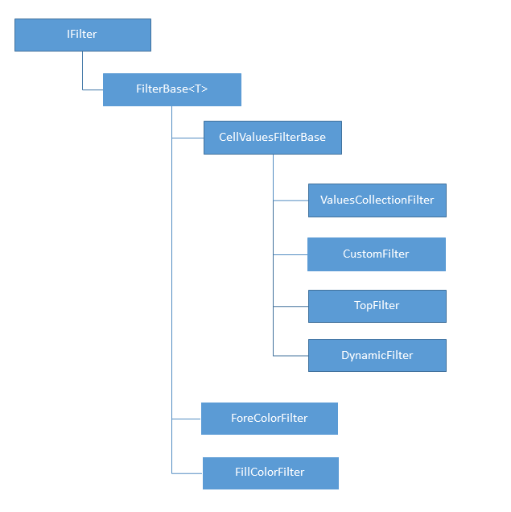
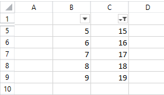

# Filtering

Filtering allows you to hide and show certain rows of a range, based on different criteria. It provides a way to work with the relevant set of data.

The information about the filtering applied to a worksheet is contained in the [Worksheet]() `Filter` property, which is of type `AutoFilter`. Through it, you can set and modify the filtered range and add and remove filters to its columns. Each column can have only one filter applied to it. The interface implemented by all filters is `IFilter`.

## AutoFilter

The `AutoFilter` class exposes the following public members:

* `FilterRange`: Property of type `CellRange`. Represents the range to which a filter is applied. The worksheet can have only one range filtered at a time. If filtering is not applied, the filtered range is `null`.

* `void SetFilters(IEnumerable<IFilter> filters)`: Sets multiple filters on the filtered range and applies them.

* `void SetFilter(IFilter filter)`: Sets a single filter on the filtered range and applies it.

* `IFilter GetFilter(int relativeColumnIndex)`: Retrieves the filter applied on the column with the specified index.

* `bool RemoveFilter(IFilter filter)`: Removes the specified filter and shows all rows that were hidden by it.

* `bool RemoveFilter(int relativeColumnIndex)`: Removes the filter applied on the column with the specified index and shows all rows that were hidden by it.

* `void ClearFilters()`: Removes all filters and shows all rows of the filtered range.

* `void ReapplyFilter(IFilter filter)`: Reapplies the specified filter.

* `void ReapplyFilter(int relativeColumnIndex)`: Reapplies the filter applied to the column with the specified index.

>The column indices used to work with the filters are zero-based and relative to the filtered range.

## IFilter

All the filters that can be applied to the filter range implement the `IFilter` interface. The interface exposes the following members:

* `RelativeColumnIndex`: Gets the index of the column to which the filter is applied. The index is relative to the beginning of the filter range.

* `object GetValue(Cells cells, int rowIndex, int columnIndex)`: Gets the value of the cell at the specified index. This value determines whether the row is hidden by the filter.

* `bool ShouldShowValue(object value)`: Determines whether the row that contains the specified value is shown.

The `GetValue()` method provides the value that the `ShouldShowValue()` method uses to evaluate whether the row is hidden or shown.

The diagram in **Figure 1** shows the different types of filters that inherit the `IFilter` interface and the classes that implement them:

#### Figure 1: Filter types

## ValuesCollectionFilter

The values collection filter holds a collection of strings and date group items. If the filter encounters a date in the column it filters, it compares the date to the date group items in its collection. If no date group item matches, the row is hidden. If the value is not a date, the filter compares the formatted string representation of the cell value with the collection of string values. If the value is present in the collection, the row is shown. Otherwise the row is hidden. If the cell is empty, the filter uses the value of the Boolean property `Blank` to determine whether the row is shown or hidden.

In addition to the members of the `IFilter` interface, the `ValuesCollectionFilter` class exposes the following members:

* `StringValues`: The collection of string values.

* `DateItems`: The collection of date group items.

* `Blank`: The value indicating whether blank cells are shown.

**Example 1** shows how to create a `ValuesCollectionFilter`.

#### __Example 1: Create ValuesCollectionFilter__

<snippet id='codeblock-chm'/>

The filter created in **Example 1** hides all rows that contain dates not within the year 2013 or within March 2014. It also hides the rows where the formatted string value of the cell does not correspond to any of the strings in the stringItems list. Blank items are shown.

## CustomFilter

The custom filter contains one or two criteria used to filter the column to which the filter is assigned. If the value of the cell does not satisfy the criteria, the respective row is hidden by the filter.

In addition to the members of the `IFilter` interface, the `CustomFilter` class exposes the following members:

* `Criteria1`: Property of type `CustomFilterCriteria` specifying the first criteria.

* `Criteria2`: Property of type `CustomFilterCriteria` specifying the second criteria. The second criteria can be null.

* `LogicalOperator`: The logical operator that determines the logical relationship between the criteria. It can have two values:

	* And

	* Or

The criteria is represented by the `CustomFilterCriteria` class. Each criteria contains the following:

* `FilterValue`: The value to which the cell value is compared.

* `ComparisonOperator`: The operator that indicates how the cell value compares to the `FilterValue`. The comparison operator can be:

	* EqualsTo

	* GreaterThan

	* GreaterThanOrEqualsTo

	* LessThan

	* LessThanOrEqualsTo

	* NotEqualsTo

**Example 2** shows how to create a custom filter.

#### __Example 2: Create CustomFilter__

<snippet id='codeblock-chn'/>

Note that even though the `FilterValue` is of type string, internally the filter attempts to parse it. This is the opposite behavior to the `ValuesCollectionFilter`, which compares only the string representations of the values. In this case, the filter displays all rows that contain a number value greater than -5 or a text value equal to "Test string".

## TopFilter

The top filter displays a given number or percent of the total values in the column it filters, taking the first top or bottom values. It hides all other rows.

In addition to the members of the `IFilter` interface, the `TopFilter` class exposes the following members:

* `TopFilterType`: The value indicating whether the filter displays the top or bottom values, and whether the number of values is indicated as a number of items or as a percent of the total number of items. The top filter type can be:

	* TopNumber

	* BottomNumber

	* TopPercent

	* BottomPercent

* `Value`: The number of items or the percent of the total number of items displayed by the filter.

**Example 3** shows how to create a top filter.

#### __Example 3: Create TopFilter__

<snippet id='codeblock-cho'/>

The filter shows the top 30 percent of all values in the filtered column. Note that the filter includes only number values both in its estimate of how many values to show and which values to show. If the filtered column includes a text value, it is hidden, even if the filter shows the top 100 percent of values.

## DynamicFilter

The dynamic filter shows or hides the rows in the column it filters based on a condition chosen from a set of predetermined conditions.

In addition to the members of the `IFilter` interface, the `DynamicFilter` class exposes only one property:

* `DynamicFilterType`: The type of the dynamic filter, which determines what condition the filter uses to filter the column. The dynamic filter type can be used from the values of the [DynamicFilterType enumeration](https://docs.telerik.com/devtools/document-processing/api/Telerik.Windows.Documents.Spreadsheet.Model.Filtering.DynamicFilterType.html).

**Example 4** demonstrates how to create a dynamic filter.

#### __Example 4: Create DynamicFilter__

<snippet id='codeblock-chp'/>

The filter shows only dates that fall within the week prior to the application of the filter.

## ForeColorFilter

The fore color filter hides or displays the cells in the column it filters based on the color of the text.

In addition to the members of the `IFilter` interface, the `ForeColorFilter` class exposes only one property:

* `Color`: A `ThemableColor` object representing the color that must be set on the text of the cell for it to be displayed. All other cells of the column are hidden.

**Example 5** demonstrates how to create a fore color filter.

#### __Example 5: Create ForeColorFilter__

<snippet id='codeblock-chq'/>

This filter hides all cells whose text color is not red.

## FillColorFilter

The fill color filter hides or displays the cells in the column it filters based on their fill.

In addition to the members of the `IFilter` interface, the `FillColorFilter` class exposes only one property:

* `Fill`: The fill the cell needs to have for it to be displayed. All other cells of the column are hidden.

**Example 6** shows how to create a fill color filter.

#### __Example 6: Create FillColorFilter__

<snippet id='codeblock-chr'/>

This filter hides all cells whose fill is not solid red.

## Setting a Filter

To set a filter on a range, follow these steps:

* Set the filter range.
	 									           
	
	#### __Example 7: Set FilterRange__
	
	<snippet id='codeblock-chs'/>

* Create a filter.
            
	
	#### __Example 8: Create DynamicFilter__
	
	<snippet id='codeblock-cht'/>
	
	The relative index specified in the constructor is 1, which means that the filter is set on the second column of the range (column C).
            

* Set the filter on the necessary column.
            

	#### __Example 9: Set Filter__
	
	<snippet id='codeblock-chu'/>
	
	
	**Figure 2** demonstrates the result of the filtering when applied on the values 1–9 in column B and 11–19 in column C.
	
    #### Figure 2: Result of the filtering
    
	
	
	Alternatively, you can set the filter through the cell selection as in **Example 10**. This approach automatically sets the filter range anew.
        

	#### __Example 10: Set Filter Through Selection__
	
	<snippet id='codeblock-chv'/>

>The first row of the `FilterRange` is reserved for column headers and is not included in the actual filtering.

>tip The filter cannot be set before the range. Attempting to do so causes an exception.

## Reapplying a Filter

When a filter is set, it is automatically applied. The application of a filter happens only once. If the values or properties of the filtered column change afterwards, the filter needs to be reapplied. Use the overloads of the `ReapplyFilter()` method. The first overload reapplies a filter by the relative index of the column it applies to. The second overload reapplies by an `IFilter` instance.

#### __Example 11: Reapply a Filter__

<snippet id='codeblock-chw'/>

>tip Attempting to reapply a filter on a column that is not filtered causes an exception.

## Removing and Clearing Filters

Remove and clear filters using the following methods exposed by the `AutoFilter` class:

* `RemoveFilter(IFilter filter)`: Removes the specified filter and shows all rows that were hidden by it. Returns true if successful.

* `RemoveFilter(int relativeColumnIndex)`: Removes the filter applied on the column with the specified index and shows all rows that were hidden by it. Returns true if successful.

* `ClearFilters()`: Removes all filters and shows all rows of the filtered range.

As with the `ReapplyFilter()` method, you can remove a filter by instance and by relative index of the column it applies to.

#### __Example 12: Remove Filter__

<snippet id='codeblock-chx'/>

To remove all applied filters at once, use the `ClearFilters()` method. `ClearFilters()` displays all rows that were hidden by filtering on the worksheet. It does not remove the filtering itself. To do this, set the `FilteredRange` property to `null`.

Setting the `FilteredRange` property to null without removing the filters beforehand automatically removes them.

## See Also

* [Sorting]()
* [What is a Worksheet?]()
* [Document Themes]()
* [Grouping]()
