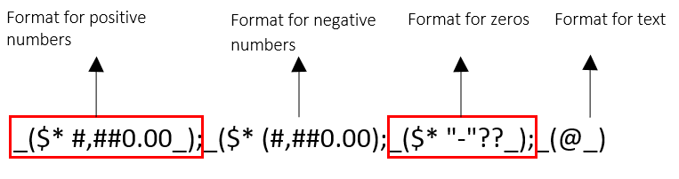

# Format Codes

**RadSpreadProcessing** allows you to control the appearance of number values through Number Formats. A variety of predefined formats exist, and you can define a custom format if they do not suit your scenario. The following sections explain how to use format codes to create your own number format or modify one of the predefined types. For more information about the predefined types, see the [Number Formatting]() article.

## Overview

A number format can contain up to four sections. Each section defines a format for different values as shown in **Figure 1**.

**Figure 1: Number format sections**

These sections are not required and can be omitted. If only one section is specified, its code is used for all numbers. If two sections are specified, the first one is used for positive numbers and zeros and the second one for negative numbers.

> If a number format is not explicitly set, the default format is General. It represents an empty string, which provides default behavior for the different types of values.

## Format with Text Values

You can display a combination of text and numbers in a cell by enclosing the text in the format string in double quotation marks. If it is a single character, you can precede it with a backslash ('\').  The '@' sign is useful when you need to include text typed by the user in the cell.

**Table 1**
<table>
<tr>
	<th>Number Format Code</th>
	<th>Value</th>
	<th>Result</th>
</tr>

<tr>
	<td>$ 0.00" Salary"</td>
	<td>345</td>
	<td>$ 345.00 Salary</td>
</tr>

<tr>
	<td>$ –0.00" Monthly expenses"</td>
	<td>50</td>
	<td>$ -50 Monthly expenses</td>
</tr>

<tr>
	<td>"Invoice for "@</td>
	<td>electricity</td>
	<td>Invoice for electricity</td>
</tr>
</table>

> If the format code consists only of an ‘@’ sign, the value in the cell will be visualized as it is typed.

Some characters like the percentage sign (%) do not require quotation marks when you include them in a format code. The following table lists them.

**Table 2**
<table>
	<tr>
		<td>$</td>
		<td>+</td>
		<td>- (Minus sign)</td>
		<td>/</td>
		<td>(</td>
		<td>)</td>
		<td>:</td>
		<td>!</td>
		<td>^</td>
	</tr>
	<tr>
		<td>&</td>
		<td>`</td>
		<td>~</td>
		<td>{</td>
		<td>}</td>
		<td><</td>
		<td>></td>
		<td>=</td>
		<td> (Space character)</td>
	</tr>
</table>

## Decimal Places and Spaces

With the number sign (#) you can display only the significant digits in a number. To display non-significant zeros when a number consists of fewer digits than specified in the format code, use the numerical character for zero (0).

**Table 3**
<table border=1 frame=void rules=rows>
	<tr>
		<th>Number Format Code</th>
		<th>Value</th>
		<th>Result</th>
	</tr>
	<tr>
		<td>####.#</td>
		<td>124.49</td>
		<td>124.5</td>
	</tr>
	<tr>
		<td>#.000</td>
		<td>1.2</td>
		<td>1.200</td>
	</tr>
	<tr>
		<td>0.#</td>
		<td>.321</td>
		<td>0.3</td>
	</tr>
	<tr>
		<td rowspan=2>#.0#</td>
		<td>11</td>
		<td>11.0</td>
	</tr>
	<tr>
		<td>123.456</td>
		<td>123.46</td>
	</tr>
	<tr>
		<td rowspan=2># ???/???</td>
		<td>1.25</td>
		<td>1 1/4</td>
	</tr>	
	<tr>
		<td>2.5</td>
		<td>2 1/2</td>
	</tr>	
	<tr>
		<td>#,###</td>
		<td>12000</td>
		<td>12,000</td>
	</tr>	
	<tr>
		<td>#,</td>
		<td>12000</td>
		<td>12</td>
	</tr>
	<tr>
		<td rowspan=2>00000</td>
		<td>12</td>
		<td>00012</td>
	</tr>	
	<tr>
		<td>1234</td>
		<td>01234</td>
	</tr>	
	<tr>
		<td rowspan=2>"000"#</td>
		<td>12</td>
		<td>00012</td>
	</tr>
	<tr>
		<td>1234</td>
		<td>0001234</td>
	</tr>
</table>

## Colors and Conditions

### Colors

With the number format codes you can specify the color of a section in the format code. There are eight colors available:

* Black

* Blue

* Cyan

* Green

* Magenta

* Red

* White

* Yellow

The name of the color must be defined as the first item in a section and enclosed in square brackets. 

### Conditions

The number formats can be applied according to conditions. Each condition is enclosed in square brackets and consists of a comparison operator and a value. For example, the following number format displays numbers less than or equal to 50 in a red font and numbers greater than 50 in a blue font.

<table>
<tr><td>
	[Red][<=50];[Blue][>50]
</tr></td>
</table>

## Currency, Percentages, and Scientific Notation

Adding a currency symbol to a number format displays numbers as monetary values.

**Table 4: Currencies**
<table>
	<tr>
		<th>Number Format Code</th>
		<th>Value</th>
		<th>Result</th>
	</tr>
	<tr>
		<td>$#,##0</td>
		<td>1234</td>
		<td>$1,234</td>
	</tr>
	<tr>
		<td>#,##0 лв.</td>
		<td>1234</td>
		<td>1,234 лв.</td>
	</tr>
</table>

> The Currency format is influenced by your OS regional settings. For more information, go to [Localization](#localization).

Adding a percent sign (%) in the number format displays numbers as a percentage of 100.

**Table 5: Percentage**
<table>
	<tr>
		<th>Number Format Code</th>
		<th>Value</th>
		<th>Result</th>
	</tr>
	<tr>
		<td>0%</td>
		<td>0.05</td>
		<td>5%</td>
	</tr>
	<tr>
		<td colspan="3" style="text-align: center;">Format negative percentage</td>
	</tr>
	<tr>
		<td>0.00%;[Red]-0.00%</td>
		<td>-0.123</td>
		<td style="color: red">-12.30%</td>
	</tr>
</table>

Using one of the exponent codes (E–, E+, e–, or e+) in the number format code displays numbers in scientific notation.

**Table 6: Scientific**
<table>
	<tr>
		<th>Number Format Code</th>
		<th>Value</th>
		<th>Result</th>
	</tr>
	<tr>
		<td rowspan="3">0.00E+00</td>
		<td>123456789</td>
		<td>1.23E+08</td>
	</tr>
	<tr>
		<td>-1234.56789</td>
		<td>-1.23E+03</td>
	</tr>
	<tr>
		<td>0.123456789</td>
		<td>1.23E-1</td>
	</tr>
	<tr>
		<td rowspan="3">0.00e-00</td>
		<td>123456789</td>
		<td>1.23E08</td>
	</tr>
</table>

## Date and Time Formatting

The following table lists the format codes for date and time:

**Table 7**
<table>
	<tr>
		<th>Number Format Code</th>
		<th>Value</th>
		<th>Result</th>
	</tr>
	<tr>
		<td>yy</td>
		<td>Years</td>
		<td>00-99</td>
	</tr>	
	<tr>
		<td>yyyy</td>
		<td>Years</td>
		<td>1900-9999</td>
	</tr>	
	<tr>
		<td>m</td>
		<td>Months</td>
		<td>1-12</td>
	</tr>
	<tr>
		<td>mm</td>
		<td>Months</td>
		<td>01-12</td>
	</tr>	
	<tr>
		<td>mmm</td>
		<td>Months</td>
		<td>Jan-Dec</td>
	</tr>
	<tr>
		<td>mmmm</td>
		<td>Months</td>
		<td>January-December</td>
	</tr>
	<tr>
		<td>mmmmm</td>
		<td>Months</td>
		<td>J-D</td>
	</tr>	
	<tr>
		<td>d</td>
		<td>Days</td>
		<td>1-31</td>
	</tr>	
	<tr>
		<td>dd</td>
		<td>Days</td>
		<td>01-31</td>
	</tr>
	<tr>
		<td>ddd</td>
		<td>Days</td>
		<td>Sun-Sat</td>
	</tr>	
	<tr>
		<td>dddd</td>
		<td>Days</td>
		<td>Sunday-Saturday</td>
	</tr>
	<tr>
		<td>h</td>
		<td>Hours</td>
		<td>0-23</td>
	</tr>
	<tr>
		<td>hh</td>
		<td>Hours</td>
		<td>00-23</td>
	</tr>
	<tr>
		<td>m</td>
		<td>Minutes</td>
		<td>0-59</td>
	</tr>
	<tr>
		<td>mm</td>
		<td>Minutes</td>
		<td>00-59</td>
	</tr>
	<tr>
		<td>s</td>
		<td>Seconds</td>
		<td>0-59</td>
	</tr>
	<tr>
		<td>ss</td>
		<td>Seconds</td>
		<td>00-59</td>
	</tr>
	<tr>
		<td>h AM/PM</td>
		<td>Time</td>
		<td>6 AM</td>
	</tr>
	<tr>
		<td>h:mm AM/PM</td>
		<td>Time</td>
		<td>6:15 PM</td>
	</tr>
</table>

> The Date and Time formats are influenced by your OS regional settings. For more information, go to [Localization](#localization).

## Localization

Your regional settings influence how date/time and currency data types appear when you apply formatting options. You can control these settings from Region & language settings (for Windows) or Language & Region (for Mac).

The regional currency settings determine the position of the currency symbol relative to the number, the decimal symbol, and the thousands separator. The regional settings also determine the appearance of the date/time data types.

**Table 8: Examples**
<table>
	<tr>
		<th>Region</th>
		<th>Format</th>
		<th>Result</th>
	</tr>
	<tr>
		<td rowspan="2">English (US)</td>
		<td>Long date format:</td>
		<td>dddd, MMMM d, yyyy</td>
	</tr>
	<tr>
		<td>Long time:</td>
		<td>h:mm:ss tt</td>
	</tr>
	<tr>
		<td rowspan="2">English(UK)</td>
		<td>Long date format:</td>
		<td>dd MMMM yyyy</td>
	</tr>
	<tr>
		<td>Long time:</td>
		<td>HH:mm:ss</td>
	</tr>
</table>

## See Also

* [Number Formatting]()
* [Changing Date Format of Exported Excel File from UI Grid components]()
* [Preventing Undesired Format Conversion in CellValueFormat]()
