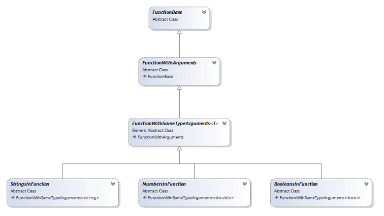

# Custom Functions

The following sections describe the possible approaches for creating a custom function:

* [Inheriting FunctionBase Abstract Class](#inheriting-functionbase-abstract-class)

* [Functions Inheritance Tree](#functions-inheritance-tree)

* [ArgumentConversionRules](#argumentconversionrules)

* [FunctionInfo](#functioninfo)

* [Custom Function Examples](#custom-function-examples)

## Inheriting FunctionBase Abstract Class

The document model provides a powerful API for creating custom functions. All functions must inherit from the abstract `FunctionBase` class, which provides basic methods and properties for each function instance.

The following are the basic `FunctionBase` members:

* `Name`: Property of type `String` that defines the name of the function. The property is used for registering the function, so the name must be unique (case insensitive). If a function with a repeating name is registered, it overrides the previous function registered with this name.

* `FunctionInfo`: Property of type `FunctionInfo` that provides a description of the function and its arguments. For more information, see [FunctionInfo](#functioninfo).

* `ArgumentConversionRules`: Property describing how different argument types are interpreted. The functions API works with five argument types (Logical, Number, Text, Reference, and Array) and each function may interpret each of these argument types differently. For more information, see [ArgumentConversionRules](#argumentconversionrules).

* `Evaluate` and `EvaluateOverride` methods: The methods where the function calculations take place. To define a custom function, override the `EvaluateOverride` method so that you can later obtain the function calculation value through the `Evaluate` method.

Additionally, each custom function needs to be registered through the `FunctionManager` class. Pass an instance of the function class to the static `Register()` method.

**Example 1** shows how to register a function class `ArgumentsFunction`, an inheritor of `FunctionBase`.

**Example 1: Register Custom Function**

<snippet id='codeblock-cms'/>

## Functions Inheritance Tree

The document model provides an inheritance tree of classes that offer ready-to-use features for different function types, depending on the function arguments and the desired result.

**Figure 1** shows the base abstract function classes.

**Figure 1: Functions Inheritance**

* `FunctionBase`: Provides the base function properties (`Name`, `FunctionInfo`, `ArgumentConversionRules`). Also provides the logic of the `IsArgumentNumberValid()` method which handles the scenario when an invalid arguments count is passed by the user. By inheriting `FunctionBase` you must override the `EvaluateOverride(RadExpression[] arguments)` method, so you need to handle the full logic of converting `RadExpression` arguments to function arguments.

* `FunctionWithArguments`: Handles the basic logic of converting a `RadExpression` value to another value type corresponding to the `ArgumentType` defined in the `FunctionInfo` property. By inheriting from this class, you need to override the `EvaluateOverride(object[] arguments)` method and handle an array of already converted function argument values.

* `FunctionWithSameTypeArguments<T>`: By inheriting this class, you need to override the `EvaluateOverride(T[] arguments)` method and handle an array of arguments with the same type T.

* `StringInFunctions`, `NumbersInFunction`, `BooleansInFunction`: These classes inherit directly from `FunctionWithSameTypeArguments<String>`, `FunctionWithSameTypeArguments<double>`, and `FunctionWithSameTypeArguments<bool>`. Use them when the function requires the respective argument type (String, double, or Boolean).
            

## ArgumentConversionRules

The `ArgumentConversionRules` class provides properties that describe how different function argument types are interpreted. The functions API works with five argument types (Logical, Number, Text, Reference, and Array) and each function may interpret each of these argument types differently. Additionally, RadSpreadProcessing differentiates between **direct arguments** (values passed directly into the formula) and **indirect arguments** (values that depend on some other cells referencing).

`ArgumentConversionRules` has the following properties:

* `EmptyDirectArgument`: The `ArgumentInterpretation` of an Empty cell value, passed as a direct argument.

* `NumberDirectArgument`: The `ArgumentInterpretation` of a Number cell value, passed as a direct argument.

* `BoolDirectArgument`: The `ArgumentInterpretation` of a Boolean cell value, passed as a direct argument.

* `TextNumberDirectArgument`: The `ArgumentInterpretation` of a String cell value that can be parsed to a number, passed as a direct argument.

* `NonTextNumberDirectArgument`: The `ArgumentInterpretation` of a String cell value that cannot be parsed to a number, passed as a direct argument.

* `EmptyIndirectArgument`: The `ArgumentInterpretation` of an Empty cell value, passed as an indirect argument.

* `NumberIndirectArgument`: The `ArgumentInterpretation` of a Number cell value, passed as an indirect argument.

* `BoolIndirectArgument`: The `ArgumentInterpretation` of a Boolean cell value, passed as an indirect argument.

* `TextNumberIndirectArgument`: The `ArgumentInterpretation` of a String cell value that can be parsed to a number, passed as an indirect argument.

* `NonTextNumberIndirectArgument`: The `ArgumentInterpretation` of a String cell value that cannot be parsed to a number, passed as an indirect argument.

* `ArrayArgument`: The `ArrayArgumentInterpretation`.

The values of these properties come from the [ArgumentInterpretation](https://docs.telerik.com/devtools/document-processing/api/Telerik.Windows.Documents.Spreadsheet.Expressions.Functions.ArgumentInterpretation.html) and [ArrayArgumentInterpretation](https://docs.telerik.com/devtools/document-processing/api/Telerik.Windows.Documents.Spreadsheet.Expressions.Functions.ArrayArgumentInterpretation.html) enumerations and are set through the constructor of `ArgumentConversionRules`. The default values of these interpretations in the constructor are `ArgumentInterpretation.UseAsIs` and `ArrayArgumentInterpretation.UseFirstElement`.

**Example 2** creates an instance of `ArgumentConversionRules`:

**Example 2: Create ArgumentConversionRules**

<snippet id='codeblock-cmt'/>

## FunctionInfo

The `FunctionInfo` class provides properties that describe the purpose of the function and each of its arguments.

`FunctionInfo` has the following properties:

* `Category`: The `FunctionCategory` to which the function belongs.

* `Description`: Description of the function as a string value.

* `RequiredArgumentsCount`: Returns the number of required arguments of the function. If the user passes fewer arguments than the `RequiredArgumentsCount`, an error is raised.

* `OptionalArgumentsCount`: Returns the count of the optional arguments group.

* `OptionalArgumentsRepetitionCount`: Returns the number of repetitions of the optional group. The valid count of all arguments depends on this value by satisfying the following conditions:

* When `OptionalArgumentsRepetitionCount <= 1`:

* `ValidArgumentsCount >= RequiredArgumentsCount`

* `ValidArgumentsCount <= RequiredArgumentsCount + OptionalArgumentsCount`

* When `OptionalArgumentsRepetitionsCount > 1`:

* `ValidArgumentsCount = RequiredArgumentsCount + i * OptionalArgumentsCount`

* `i >= 0`

* `i <= OptionalArgumentsRepetitionsCount`

* `i is integer number`

* `IsDefaultValueFunction`: Returns a Boolean value that indicates whether the function is a default value function.

* When `true`: The function returns some default value when all passed values have `ArgumentInterpretation.Ignore` in `ArgumentConversionRules` of the function.

* When `false`: The function returns `ErrorExpressions.ValueError` when all passed values are not valid, even if they have `ArgumentInterpretation.Ignore` in `ArgumentConversionRules` of the function.

* `Format`: Returns the `CellValueFormat` of the function result, if the result needs specific formatting (for example, DateTime or Currency).

**Example 3** shows how to create an instance of the `FunctionInfo` class.

**Example 3: Create FunctionInfo**

<snippet id='codeblock-cmu'/>

## Custom Function Examples

The following example defines a custom function named "ARGUMENTS" that inherits from the `FunctionBase` class. In the `FunctionInfo` definition, the function has three required arguments and three optional arguments with `optionalArgumentsRepeatsCount` equal to 3.

The result of the function calculations is the number of arguments passed to the function, as shown in the `EvaluateOverride()` method.

**Example 4** shows how to create the "ARGUMENTS" function.

**Example 4: Create ARGUMENTS Function**

<snippet id='codeblock-cmv'/>

The following example defines a custom function named "E" that inherits from the `FunctionBase` class. The function takes no arguments and always returns the Napier constant.

**Example 5** shows how to create the "E" function.

**Example 5: Create E Function**

<snippet id='codeblock-cmw'/>

>tip You can download a runnable project with the previous and several other custom function examples from the [SDK repository on GitHub](https://github.com/telerik/xaml-sdk/tree/master/Spreadsheet/WPF/CustomFunctions).
          

## See Also

* [Cell Value Types]()
* [ArgumentInterpretation](https://docs.telerik.com/devtools/document-processing/api/Telerik.Windows.Documents.Spreadsheet.Expressions.Functions.ArgumentInterpretation.html)
* [ArrayArgumentInterpretation](https://docs.telerik.com/devtools/document-processing/api/Telerik.Windows.Documents.Spreadsheet.Expressions.Functions.ArrayArgumentInterpretation.html)
* [CustomFunctions SDK](https://github.com/telerik/xaml-sdk/tree/master/Spreadsheet/WPF/CustomFunctions)
* [Implementing SUMPRODUCT Function in SpreadProcessing]()
* [Implementing TRANSPOSE(cells range) Function in SpreadProcessing]()
* [Implementing Custom Functions with a Cells Range as an Argument in SpreadProcessing]()
