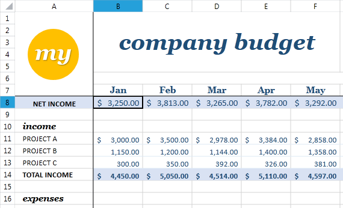
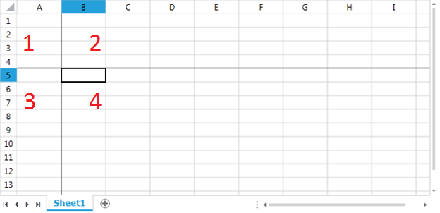
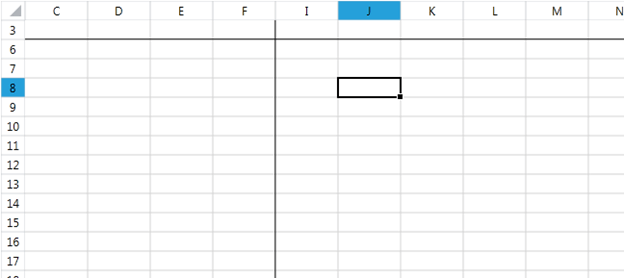
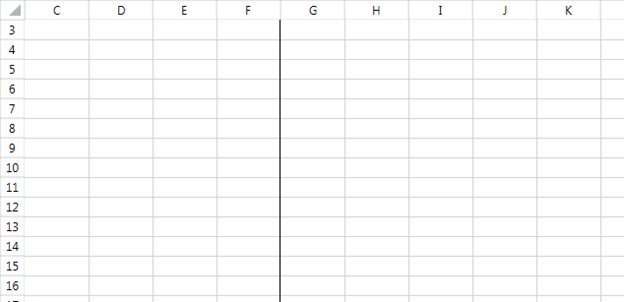

# Freeze Panes

## What Are Frozen Panes?

Frozen panes are a method to keep part of the worksheet visible at all times when scrolling. 
   
**Figure 1: A document with frozen top rows and first left column**

## Types of Panes

Panes have the following properties:
        

There are four types of panes, as marked on the following image:

1.	Fixed
2.	Horizontal scrollable
3.	Vertical scrollable
4.	Scrollable

**Figure 2: Types of panes**

When the panes are split only horizontally the panes present are horizontal scrollable and scrollable. When the panes are split vertically, the two panes are vertical scrollable and scrollable.

## What Defines the Panes Positioning?

To fully describe the state of the frozen panes, you need to specify the following:

* **Top left cell index of the fixed pane**: This property determines the position to which the viewport is scrolled. When this is different from A1, any areas above and to the left of the index become unreachable. In **Figure 3** this is C3.

* **Frozen rows count**: The number of visible rows contained by the horizontal scrollable pane. In **Figure 3** this value is 1.

* **Frozen columns count**: The number of visible columns contained by the vertical scrollable pane. In **Figure 3** this value is 4.

* **Top left cell index of the scrollable pane**: This property determines the scroll position of the scrollable pane. In **Figure 3** this is I6. This index is different from the topmost and leftmost point of the scrollable pane.

**Figure 3: Panes positioning**

## Freezing Panes

### FreezePanes Methods

You can freeze panes through the [ViewState]() property of the `Worksheet`. It is of type `WorksheetViewState` and exposes the following overloads of the `FreezePanes` method:

* `void FreezePanes(int frozenRowsCount, int frozenColumnsCount)`
* `void FreezePanes(CellIndex fixedPaneTopLeftCellIndex, int frozenRowsCount, int frozenColumnsCount)`
* `void FreezePanes(CellIndex fixedPaneTopLeftCellIndex, int frozenRowsCount, int frozenColumnsCount, CellIndex scrollableTopLeftCellIndex)`

If the top left cell indices of the fixed pane and of the scrollable pane are not specified, the method assumes that the top left index of the fixed pane is the current top left index of the viewport and that the scrollable pane is not scrolled.

The result illustrated in **Figure 3** can be achieved with the code from **Example 1**.

**Example 1: Freezing Panes**

<snippet id='libraries-spread-features-freeze-panes-1'/>

### Horizontal and Vertical Split

If you want to create a vertical or horizontal split, set either the row count or the column count to zero.

**Example 2: Vertical Split**

<snippet id='libraries-spread-features-freeze-panes-2'/>

The result from **Example 2** is shown in **Figure 4**.

**Figure 4: Vertical split**

Because the two panes present are only vertical scrollable and scrollable, columns A and B remain unreachable. However, you can scroll to the first two rows. Even though there are two rows from the start of the document at the time of freezing, the document is not split horizontally.

### The Pane Class

Another option to freeze the panes in a worksheet is to use the `Pane` property of type `Pane` of the `WorksheetViewState`. The functionality you can achieve is almost identical to the `FreezePanes()` methods. The `Pane` class has the following properties:

* `TopLeftCellIndex`: The top left cell index of the scrollable pane.

* `XSplit`: The number of visible columns contained by the vertical scrollable pane.

* `YSplit`: The number of visible rows contained by the horizontal scrollable pane.

* `ActivePane`: The current active pane.

* `State`: The state of the frozen panes. Currently, only the Frozen state is supported.

The state from **Figure 3** can be achieved with the code from **Example 3**.

**Example 3: Freeze Panes Through the Pane Class**

<snippet id='libraries-spread-features-freeze-panes-3'/>

> Regardless of the method used to freeze the panes of a worksheet, do not place the top left index of the frozen pane after or to the right of the index determined by the frozen row count and the frozen column count. Doing so may result in an invalid document and unexpected behavior.

## Unfreezing Panes

To unfreeze the panes of the worksheet, use the same methods described previously but specify zero for the number of frozen rows and columns.

**Example 4: Unfreezing Panes**

<snippet id='libraries-spread-features-freeze-panes-4'/>

Another option is to set the `Pane` property of the `ViewState` to `null`.

**Example 5: Unfreezing Panes Through the Pane Class**

<snippet id='libraries-spread-features-freeze-panes-5'/>

## See Also

* [What Is a Worksheet?]()