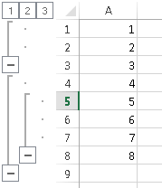
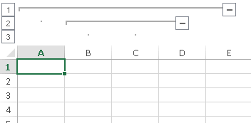
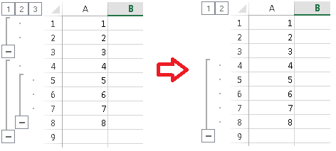
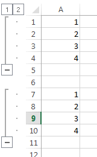
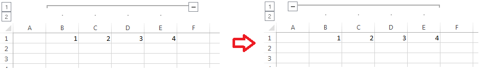

# Grouping


The purpose of this article is to describe what is grouping and how to work with it through the __RadSpreadProcessing__ model. It contains the following sections:

* [What is grouping?](#what-is-grouping)

* [Grouping rows or columns](#grouping-rows-or-columns)

* [Ungrouping Rows or Columns](#ungrouping-rows-or-columns)

* [Getting the Outline Level](#getting-the-outline-level)


## What is Grouping?

Grouping is a mechanism to organize data in sections, in order to be able to show and hide the relevant chunks. 

Each row or column which is part of a group is assigned an outline level, which determines the level of grouping and from there which rows or columns it is grouped with. 

#### Figure 1: Grouping


In __Figure 1__, the rows 1, 2, 4 and 8 have outline level value of 1. Rows 5, 6, and 7 have outline level 2. Rows 3 and 9 do not participate in the grouping and have the default value of 0.

The maximum outline level is 7.


## Grouping Rows or Columns

There are two available options when grouping. The first option is to simply assign the outline level property of the rows or columns:

#### __Example 1: Grouping columns using outline level__

```csharp
	Workbook workbook = new Workbook();
	Worksheet worksheet = workbook.Worksheets.Add();
	
	worksheet.Columns[0].SetOutlineLevel(1);
	worksheet.Columns[1, 2].SetOutlineLevel(2);
	worksheet.Columns[3].SetOutlineLevel(1);
```


#### __Example 1: Grouping columns using outline level__

```csharp
	Dim workbook = New Workbook()
	Dim worksheet = workbook.Worksheets.Add()
	
	worksheet.Columns(0).SetOutlineLevel(1)
	worksheet.Columns(1, 2).SetOutlineLevel(2)
	worksheet.Columns(3).SetOutlineLevel(1)
```

The other option is to use the Group method exposed by the row/column selection classes.

#### __Example 2: Grouping columns using the group method__

```csharp
	Workbook workbook = new Workbook();
	Worksheet worksheet = workbook.Worksheets.Add();
	
	worksheet.Columns[0, 3].Group();
	worksheet.Columns[1, 2].Group();
```


#### __Example 2: Grouping columns using the group method__

```csharp
	Dim workbook = New Workbook()
	Dim worksheet = workbook.Worksheets.Add()
	
	worksheet.Columns(0, 3).Group()
	worksheet.Columns(1, 2).Group()
```

__Figure 2__ shows the result of both approaches.

#### Figure 2: Result from grouping


## Ungrouping Rows or Columns

As with grouping, ungrouping can be done both through setting the outline level property of the row or column selection, or by using the Ungroup method exposed by the same classes.

The following code snippets exemplify the two approaches to make these changes in a file.

#### Figure 3: Ungrouping result 



#### __Example 3: Ungrouping columns using the ungroup method__

```csharp
	worksheet.Rows[0, 1].Ungroup();
	worksheet.Rows[4, 6].Ungroup();
```

#### __Example 3: Ungrouping columns using the ungroup method__

```csharp
	worksheet.Rows(0, 1).Ungroup()
	worksheet.Rows(4, 6).Ungroup()
```

You can achieve the same result with the code in __Example 4__.

#### __Example 4: Ungrouping columns using outline level__

```csharp
	worksheet.Rows[0, 1].ClearOutlineLevel();
	worksheet.Rows[4, 6].SetOutlineLevel(1);
```

#### __Example 4: Ungrouping columns using outline level__

```csharp
	worksheet.Rows(0, 1).ClearOutlineLevel()
	worksheet.Rows(4, 6).SetOutlineLevel(1)
```

## Getting the Outline Level

You can get the outline level of a row/column or a group of rows/columns using the code in __Example 5__:


#### __Example 5: Getting the OutlineLevel__

```csharp
	RangePropertyValue<int> outlineLevelRangeValue = worksheet.Rows[0, 1].GetOutlineLevel();
	int outLineLevel = outlineLevelRangeValue.Value;
```

#### __Example 5: Getting the OutlineLevel__

```csharp
	Dim outlineLevelRangeValue As RangePropertyValue(Of Integer) = worksheet.Rows(0, 1).GetOutlineLevel()
	Dim outLineLevel As Integer = outlineLevelRangeValue.Value
```

## Setting the Position of the Summary Row or Column

When a selection of rows is grouped, the row immediately below them is automatically designated to be a summary row for this group. In the context of the grouping feature, this means that the plus/minus outline symbol will be aligned with this row. The same is applied to columns, whose summary column is automatically placed to the right of the group.

#### Figure 4: Summary row


In Figure 4, the summary row for the group of rows 1 to 4 is row 5 and for rows 7 to 10 it is row 11.

If you would like to change the placement of the summary row or column, this can be done through the GroupingProperties class, which exposes the following two boolean properties:

* __SummaryRowIsBelow__

* __SummaryColumnIsToRight__

Both properties have a default value of true. The following snippet shows how to set the value of the __SummaryColumnIsToRight__ and what result to expect in the produced file.

#### __Example 6: Setting the position of the summary column to left__

```csharp
	worksheet.GroupingProperties.SummaryColumnIsToRight = false;
```

#### __Example 6: Setting the position of the summary column to left__

```csharp

	worksheet.GroupingProperties.SummaryColumnIsToRight = False

```

#### Figure 5: Left summary column


## See Also

* [Filtering]()
* [Sorting]()
* [Grouping Data Example Using RadSpreadProcessing]()

