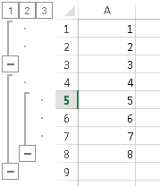
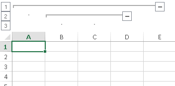
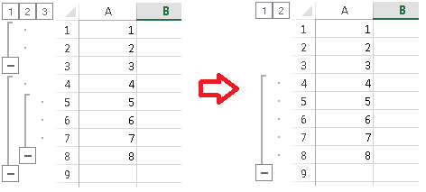
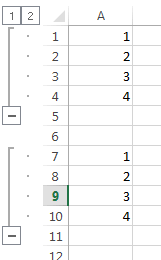
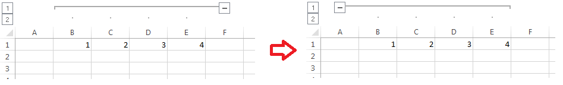

# Grouping

Grouping organizes data in sections to show and hide relevant chunks. The following sections explain how to work with grouping through the **RadSpreadProcessing** model:

* [What is Grouping?](#what-is-grouping)

* [Grouping Rows or Columns](#grouping-rows-or-columns)

* [Ungrouping Rows or Columns](#ungrouping-rows-or-columns)

* [Getting the Outline Level](#getting-the-outline-level)

## What Is Grouping?

Grouping is a mechanism to organize data in sections, to show and hide the relevant chunks. 

Each row or column which is part of a group is assigned an outline level, which determines the level of grouping and which rows or columns it is grouped with. 

**Figure 1: Grouping**

In **Figure 1**, the rows 1, 2, 4, and 8 have outline level value of 1. Rows 5, 6, and 7 have outline level 2. Rows 3 and 9 do not participate in the grouping and have the default value of 0.

The maximum outline level is 7.

## Grouping Rows or Columns

There are two available options when grouping. The first option is to assign the outline level property of the rows or columns:

**Example 1: Grouping Columns Using Outline Level**

<snippet id='libraries-spread-features-grouping-1'/>

The other option is to use the `Group` method exposed by the row/column selection classes.

**Example 2: Grouping Columns Using the Group Method**

<snippet id='libraries-spread-features-grouping-2'/>

**Figure 2** shows the result of both approaches.

**Figure 2: Result from Grouping**

## Ungrouping Rows or Columns

As with grouping, you can ungroup both through setting the outline level property of the row or column selection, or by using the `Ungroup` method exposed by the same classes.

The following code snippets show the two approaches to make these changes in a file.

**Figure 3: Ungrouping Result**

**Example 3: Ungrouping Columns Using the Ungroup Method**

<snippet id='libraries-spread-features-grouping-3'/>

You can achieve the same result with the code in **Example 4**.

**Example 4: Ungrouping Columns Using Outline Level**

<snippet id='libraries-spread-features-grouping-4'/>

## Getting the Outline Level

You can get the outline level of a row/column or a group of rows/columns using the code in **Example 5**:

**Example 5: Getting the OutlineLevel**

<snippet id='libraries-spread-features-grouping-5'/>

## Setting the Position of the Summary Row or Column

When you group a selection of rows, the row immediately below them is automatically designated to be a summary row for this group. In the context of the grouping feature, this means that the plus/minus outline symbol aligns with this row. The same applies to columns, whose summary column is automatically placed to the right of the group.

**Figure 4: Summary Row**

In **Figure 4**, the summary row for the group of rows 1 to 4 is row 5 and for rows 7 to 10 it is row 11.

If you want to change the placement of the summary row or column, use the `GroupingProperties` class, which exposes the following two Boolean properties:

* `SummaryRowIsBelow`

* `SummaryColumnIsToRight`

Both properties have a default value of `true`. The following snippet shows how to set the value of the `SummaryColumnIsToRight` property and what result to expect in the produced file.

**Example 6: Setting the Position of the Summary Column to Left**

<snippet id='libraries-spread-features-grouping-6'/>

**Figure 5: Left Summary Column**

## See Also

* [Filtering]()
* [Sorting]()
* [Grouping Data Example Using RadSpreadProcessing]()

