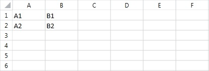
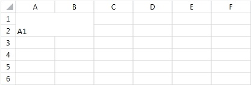
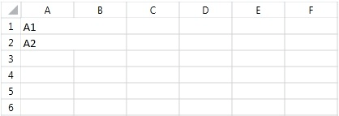
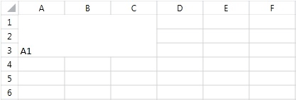
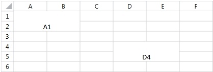
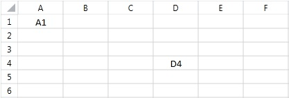

# Merge and Unmerge Cells

You can merge two or more adjacent cells into a single cell that spans over multiple rows and columns. The content of the top-left cell is displayed in the newly created merged cell. The content of the rest of the cells in the merged region is cleared. Once merged, a cell can be unmerged back to its compound cells.
      

## Merge Cells

To merge cells, create a `CellSelection` object which determines the region of cells that will be merged. The `CellSelection` class offers two methods that perform different types of merge: `Merge()` and `MergeAcross()`. The former method joins all cells to create one big cell, while the latter combines all cells that appear in the same row, thus creating a merged cell for every row in the selected region.
        

The following examples show how the two methods for merging change a worksheet.
        

**Example 1** constructs a worksheet that is used as a starting point in the next few examples.
        

**Example 1: Construct a worksheet with sample cell values**

<snippet id='codeblock-cjk'/>

**Figure 1** shows the result of the snippet in **Example 1**.
        

**Figure 1: Worksheet with sample values prepared for merge operations**

**Example 2** illustrates how to perform a merge operation on the cell region *A1:B2*.
        

**Example 2: Merge the selected cell range into one cell**

<snippet id='codeblock-cjl'/>

As a result of the merge, the four cells appear as one. The content of the newly created cell is equal to the top left cell of the merged region, that is *A1*. At this point, the values of the rest of the cells in the merged region are cleared, so now cells *A2, B1 and B2* have no values.
        

**Figure 2** demonstrates the result of **Example 2** executed over the worksheet created in **Example 1**.
        

**Figure 2: Merged cell range created from cells A1 through B2**

The following example shows how the `MergeAcross()` method changes the same region in the original worksheet.
        

**Example 3** illustrates how to perform a merge operation on the cell region *A1:B2*.
        

**Example 3: Merge cells across each row in the selection**

<snippet id='codeblock-cjm'/>

Unlike `Merge()`, the `MergeAcross()` method creates a new cell for every row. Each newly created cell contains the value of the leftmost cell that is in the same row and in the merged region. The value of the rest of the merged cells is cleared, so cells *B1* and *B2* have an empty value.
        

**Figure 3** demonstrates the result of **Example 3** executed over the worksheet created in **Example 1**.
        

**Figure 3: MergeAcross result with one merged cell per row**

If you now try to merge a cell range that intersects with another merged cell range, a third merged cell range is produced out of the top-left and bottom-right cells of the two ranges.
        

**Example 4** merges across the region *A1:B2* and then performs another merge on the cells in the region *B2:C3*:
        

**Example 4: Merge a range that intersects an existing merged range**

<snippet id='codeblock-cjn'/>

The result is a merged cell that ranges from *A1* to *C3*.
        

**Figure 4** demonstrates the result of **Example 4** executed over the worksheet created in **Example 1**.
        

**Figure 4: Intersecting merged ranges expanded into one larger merged cell**

## Get Merged Cell Ranges

In some scenarios you may want to know if a particular cell is part of a merged region. In others, you may need to retrieve all merged ranges. This section outlines the possible approaches for getting the merged regions.
        

### How to Check if a Cell Is Merged?

The `Cells` class exposes a `GetIsMerged()` method that allows you to determine if a cell belongs to a merged cell. The method takes a single parameter of type `CellIndex` which designates a cell you want to inspect and returns a Boolean value that indicates whether the cell is contained in a merged cell.
            

**Example 5** checks if cell A1 is in a merged region.
            

**Example 5: Check whether a cell belongs to a merged range**

<snippet id='codeblock-cjo'/>

### How to Get the Containing Merged Cell Range, if the Cell Is Merged?

Another way to check if a cell belongs to a merged range is to use the `TryGetContainingMergedRange()` method of the `Cells` class. Similarly to the `GetIsMerged()` method, this method returns a Boolean value which indicates if the cell actually is contained in a merged cell. It requires a `CellIndex` parameter that points the cell to be checked. The method also has one additional out parameter of type `CellRange` that holds the merged range of the cell, if the cell belongs to such.
            

**Example 6** shows how to use the `TryGetContainingMergedRange()` method.
            

**Example 6: Get the merged range containing a cell**

<snippet id='codeblock-cjp'/>

### How to Get All Merged Cell Ranges Contained in a Given Cell Range?

Use the `GetContainingMergedRanges()` method of the `Cells` class to retrieve all merged cells in a specified range. The method takes a single argument of type `CellRange` that determines the range of the search and returns an enumerable that contains all merged cell ranges.
            

**Example 7** shows how to use the `GetContainingMergedRanges()` method.
            

**Example 7: Get merged ranges contained in a selected range**

<snippet id='codeblock-cjq'/>

### How to Get All Merged Ranges?

The `GetMergedCellRanges()` method of the `Cells` class returns an enumeration holding all merged cell ranges in the worksheet.
            

**Example 8** shows how to get all merged ranges in a worksheet.
            

**Example 8: Get all merged ranges in the worksheet**

<snippet id='codeblock-cjr'/>

## Unmerge Cells

Once a cell is merged, the API offers an easy way to split it back to its composing cells. Use the `Unmerge()` method of the `CellSelection` class. When this method is invoked it unmerges all merged cell ranges that intersect with the selected cell range. For example, consider the worksheet in **Figure 5** that has the regions *A1:B2* and *D4:E5* merged.
        

**Figure 5: Worksheet with two merged regions before unmerge**

**Example 9** invokes the `Unmerge()` method for the region *B2:D4* of the worksheet from **Figure 5**, which intersects with the two merged ranges.
        

**Example 9: Unmerge intersecting merged cell ranges**

<snippet id='codeblock-cjs'/>

**Figure 6** shows that as a result, the two ranges are unmerged.
        

**Figure 6: Worksheet after unmerging the previously merged ranges**

## See Also

* [How to Read the Values of Merged Cells in a Worksheet]()