# Number Formatting

Applying different formats to a number changes the appearance of the number. It is important to note, however, that a format does not change the value it is applied to. It only changes the way the value appears in the cell. This article explains the how to use the predefined number formats.

>note More information of how to create your own number format or modify one of the predefined types you can find in [Format Codes]() help article.


## Available Number Formats

The document model exposes the following categories of predefined formats:

* __General format__: The default number format applied to a number. Typically, numbers formatted with this format are displayed exactly as they are typed. If the number is 12 or more digits, however, the General number format applies scientific notation.

* __Number format__: Used for the general display of numbers. The format specifies the number of decimal places and indicates whether a thousands separator is used. Additionally, the Number format specifies how negative numbers are displayed.       

* __Currency format__: Used for general monetary values. Numbers in this format are displayed with the default currency symbol. The format specifies the number of decimal places and indicates whether a thousands separator is used. Additionally, the Currency format specifies how negative numbers are displayed.

* __Accounting format__: Used for monetary values. Unlike the Currency format, it aligns the currency symbols and the values in a column. The format specifies the number of decimal places used.

* __Date format__: Treats a number as date and time serial number and displays it as a date value. 

* __Time format__: Treats a number as date and time serial number and displays it as a time value.

* __Percentage format__: Displays the cell value multiplied by 100 and followed by a percent (%) symbol. The format specifies the number of decimal places used.

* __Fraction format__: Displays a cell value as a fraction.

* __Scientific format__: Displays a number in scientific notation. The number is transformed into a real number followed by E+n, where E (which stands for Exponent) multiplies the real number by 10 to the nth power. For example, a 2-decimal scientific format displays 12345678901 as 1.23E+10, which is 1.23 times 10 to the 10th power. The format specifies the number of decimal places used.

* __Text format__: Treats the content of a cell as text and displays the content exactly as it is typed.

* __Special format__: Designed to display numbers as postal codes (ZIP Code), phone numbers, or Social Security numbers.

* __Custom format__: Allows modifying any of the predefined formats. The format also allows creating a new custom number format that is added to the list of number format codes. For more information check the [Format Codes]() help article.

> The Date, Time and Currency formats are influenced by your OS regional settings. For more information, go to [Localization](http://docs.telerik.com/devtools/document-processing/libraries/radspreadprocessing/features/format-codes.html#localization).

## Applying a Number Format

The number format is represented by the **CellValueFormat** class. You can set it to a given **CellSelection** object using its **SetFormat()** method.

> When working with CellValueFormat you need to keep in mind that its constructor accepts culture-dependent format and converts them to culture-independent using the current thread format settings (e.g. in Bulgarian culture format passed as 0,00 will be converted to 0.00).

The following examples demonstrate how to apply a predefined format to a **CellSelection**:

#### **Example 1: Apply general format**
```csharp

	CellValueFormat generalFormat = new CellValueFormat("General");

	CellSelection cellSelectionA1 = worksheet.Cells[new CellIndex(0, 0)];
	cellSelectionA1.SetValue(1234.56789);
	cellSelectionA1.SetFormat(generalFormat);
```

**Example 1** produces the following result:	
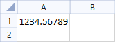

#### **Example 2: Apply number format**
```csharp

	CellValueFormat numberFormat = new CellValueFormat("0.00");

	CellSelection cellSelectionA1 = worksheet.Cells[new CellIndex(0, 0)];
	cellSelectionA1.SetValue(1234.56789);
	cellSelectionA1.SetFormat(numberFormat);
```

**Example 2** produces the following result:	
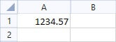

#### **Example 3: Apply currency format**

```csharp

	CellValueFormat currencyFormat = new CellValueFormat("$#,##0.00");

	CellSelection cellSelectionA1 = worksheet.Cells[new CellIndex(0, 0)];
	cellSelectionA1.SetValue(1234.56789);
	cellSelectionA1.SetFormat(currencyFormat);
```

**Example 3** produces the following result:	
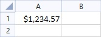

#### **Example 4: Apply accounting format**

```csharp

	CellValueFormat accountingFormat = new CellValueFormat("_($* #,##0.00_);_($* (#,##0.00);_($* \" - \"??_);_(@_)");

	CellSelection cellSelectionA1 = worksheet.Cells[new CellIndex(0, 0)];
	cellSelectionA1.SetValue(1234.56789);
	cellSelectionA1.SetFormat(accountingFormat);
```

**Example 4** produces the following result:	
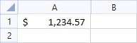

#### **Example 5: Apply date format**

```csharp

	CellValueFormat dateFormat = new CellValueFormat("m/d/yyyy");

	CellSelection cellSelectionA1 = worksheet.Cells[new CellIndex(0, 0)];
	cellSelectionA1.SetValue(1234.56789); // OR cellSelectionA1.SetValue(new DateTime(1903, 5, 18, 13, 37, 46));
	cellSelectionA1.SetFormat(dateFormat);
```

**Example 5** produces the following result:	
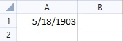

In order to show **milliseconds** in **Date Format** the predefined format could be modified like: _"m/d/yyyy HH:mm:ss.SSS"_. More information of how to create your own number format or modify one of the predefined types you can find in [Format Codes]() help article.

#### **Example 6: Apply time format**

```csharp

	CellValueFormat timeFormat = new CellValueFormat("h:mm:ss AM/PM");

	CellSelection cellSelectionA1 = worksheet.Cells[new CellIndex(0, 0)];
	cellSelectionA1.SetValue(1234.56789); // OR cellSelectionA1.SetValue(new DateTime(1903, 5, 18, 13, 37, 46));
	cellSelectionA1.SetFormat(timeFormat);
```

**Example 6** produces the following result:	
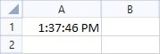

In order to show **milliseconds** in **Time Format** the predefined format could be modified like: _"HH:mm:ss.SSS"_. More information of how to create your own number format or modify one of the predefined types you can find in [Format Codes]() help article.

#### **Example 7: Apply percentage format**

```csharp

	CellValueFormat percentageFormat = new CellValueFormat("0.00%");

	CellSelection cellSelectionA1 = worksheet.Cells[new CellIndex(0, 0)];
	cellSelectionA1.SetValue(1234.56789);
	cellSelectionA1.SetFormat(percentageFormat);
```

**Example 7** produces the following result:	
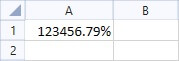

#### **Example 8: Apply fraction format**

```csharp

	CellValueFormat fractionFormat = new CellValueFormat("# ?/?");

	CellSelection cellSelectionA1 = worksheet.Cells[new CellIndex(0, 0)];
	cellSelectionA1.SetValue(1234.56789);
	cellSelectionA1.SetFormat(fractionFormat);
```

**Example 8** produces the following result:	
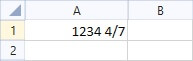

#### **Example 9: Apply scientific format**

```csharp

	CellValueFormat scientificFormat = new CellValueFormat("0.00E+00");

	CellSelection cellSelectionA1 = worksheet.Cells[new CellIndex(0, 0)];
	cellSelectionA1.SetValue(1234.56789);
	cellSelectionA1.SetFormat(scientificFormat);
```

**Example 9** produces the following result:	
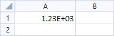

#### **Example 10: Apply text format**

```csharp

	CellValueFormat textFormat = new CellValueFormat("@");

	CellSelection cellSelectionA1 = worksheet.Cells[new CellIndex(0, 0)];
	cellSelectionA1.SetValue(1234.56789);
	cellSelectionA1.SetFormat(textFormat);
```

**Example 10** produces the following result:	
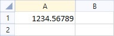

#### **Example 11: Apply special format**

```csharp

	CellValueFormat specialFormat = new CellValueFormat("00000-0000");

	CellSelection cellSelectionA1 = worksheet.Cells[new CellIndex(0, 0)];
	cellSelectionA1.SetValue(1234.56789);
	cellSelectionA1.SetFormat(specialFormat);
```

**Example 11** produces the following result:	
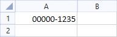

#### **Example 12: Apply custom format**

```csharp

	CellValueFormat specialFormat = new CellValueFormat("[Green]$#,##0_);[Red]$(#,##0);\"zero\";[Blue]\"Text: \" @");

	CellSelection cellSelectionA1 = worksheet.Cells[new CellIndex(0, 0)];
	cellSelectionA1.SetValue(123456789);
	cellSelectionA1.SetFormat(specialFormat);

	CellSelection cellSelectionB1 = worksheet.Cells[new CellIndex(0, 1)];
	cellSelectionB1.SetValueAsText("Progress");
	cellSelectionB1.SetFormat(specialFormat);

	CellSelection cellSelectionA2 = worksheet.Cells[new CellIndex(1, 0)];
	cellSelectionA2.SetValue(0);
	cellSelectionA2.SetFormat(specialFormat);

	CellSelection cellSelectionB2 = worksheet.Cells[new CellIndex(1, 1)];
	cellSelectionB2.SetValue(-1234.56789);
	cellSelectionB2.SetFormat(specialFormat);
```

**Example 12** produces the following result:	


More information of how to create your own number format or modify one of the predefined types you can find in [Format Codes]() help article.

## Retrieving a Number Format

You can retrieve the number format of any cell selection using the __GetFormat()__ method of __CellSelection__ class. The method returns an object of type __RangePropertyValue&lt;CellValueFormat&gt;__, which exposes two properties:


* __IsIndeterminate__: Determines if the __CellValueFormat__ is consistent among all cells in the specified __CellSelection__. If the __CellValueFormat__ is one and the same for all cells, __IsIndeterminate__ is set to false. However, if the __CellValueFormat__ varies throughout the cells in the __CellSelection__, the __IsIndetermine__ property is set to true and the __Value__ property of the __RangePropertyValue&gt;T&gt;__ object is set to its default value.
            

* __Value__: Holds the __CellValueFormat__ for the cells. If the __IsIndeterminate__ property is set to false, __Value__ contains __CellValueFormat__ of the whole __CellSelection__ region. If the __IsIndeterminate__ property is set to true, this indicates that the __CellValueFormat__ is not the same for all cells in the __CellSelection__ and the __Value__ property is set to the default __CellValueFormat__.
            

__Example 13__ demonstrates how to get the __Number__ format of cell *A1*:
        

#### __Example 13: Get number format__

```csharp
	
	CellSelection cellSelectionA1 = worksheet.Cells[new CellIndex(0, 0)];

	CellValueFormat cellSelectioA1Format = cellSelectionA1.GetFormat().Value;
```


