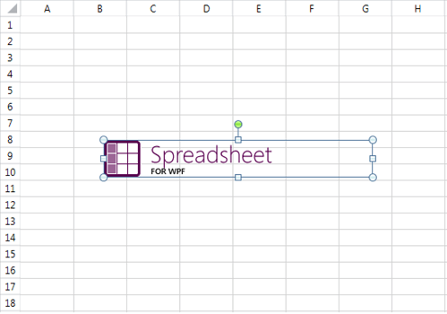
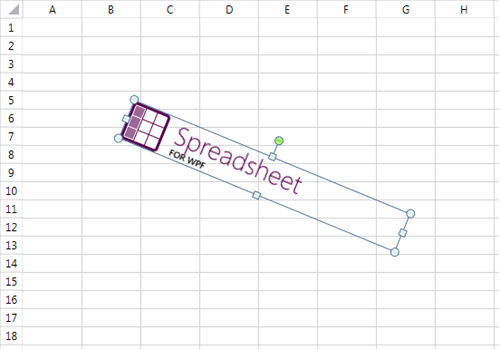
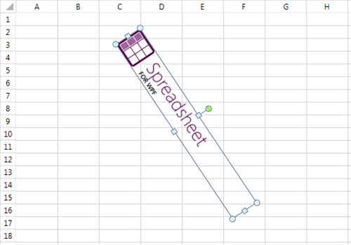
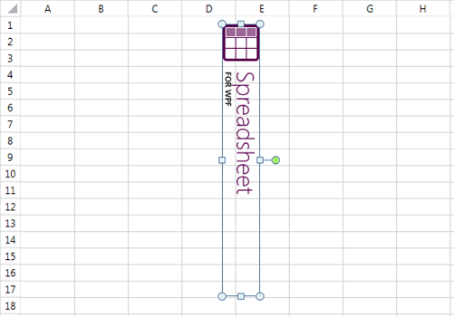

# Shapes and Images

The following sections describe shapes and images, and how to create and work with them:

* [What Are Shapes and Images?](#what-are-shapes-and-images?)

* [Properties of Shapes and Images](#properties-of-shapes-and-images)

* [Creating and Inserting an Image](#creating-and-inserting-an-image)

* [Deleting a Shape](#deleting-a-shape)

* [Changing the Position and Size of a Shape](#changing-the-shape's-position-and-size)

* [Relationship Between the Cell Index of the Shape and Its Rotation Angle](#relationship-between-the-cell-index-of-the-shape-and-its-rotation-angle)

## What Are Shapes and Images?

Shapes are objects that represent a visual illustration that you can insert into a worksheet. In the document model, the abstract class `FloatingShapeBase` represents them.

An image is a kind of shape that has an image source. The `FloatingImage` class represents images and inherits `FloatingShapeBase`.

## Supported Formats

The supported formats are:

* **JPG**
* **JPEG**
* **PNG**
* **BMP**
* **TIFF**
* **TIF**
* **GIF**
* **ICON**
* **WMF**
* **EMF**
* **BIN**
* **SVG** (*introduced in 2024 Q3*)

## Properties of Shapes and Images

Shapes have the following properties:

|Property|Description|
|----|----|
|`CellIndex`| The cell index where the top left corner of the shape is located when the shape is not rotated.|
|`OffsetX`| The offset between the left side of the shape and the left side of the cell index.|
|`OffsetY`| The offset between the top of the shape and the top of the cell index.|
|`Width`| The width of the shape.|
|`Height`| The height of the shape.|
|`RotationAngle`| The angle (in degrees) by which the shape is rotated about its center.|
|`IsHorizontallyFlipped`| Indicates whether the shape has been flipped across the y-axis.|
|`IsVerticallyFlipped`| Indicates whether the shape has been flipped across the x-axis.|
|`Name`| The name of the shape.|
|`LockAspectRatio`| Determines whether the aspect ratio between the width and the height of the image is preserved.|
|`Id`| A unique number assigned to the image after it has been added to a worksheet.|
|`Worksheet`| The worksheet in which the shape is or will be inserted.|
|`Description`| Gets or sets the description of the shape. (*introduced in 2024 Q2*)|
            

Images have one additional property:

* `ImageSource`: Represents the source of the image.

## Creating and Inserting an Image

To insert an image into a worksheet, do the following:

1. Create a `FloatingImage` instance as in **Example 1**.

1. Configure its properties as in **Example 2**.

1. Insert the image into the worksheet as shown in **Example 3**.

To create an instance of `FloatingImage`, you need the worksheet in which you want to insert the image, the cell index, and the offset.

**Example 1: Create a FloatingImage instance**

<snippet id='codeblock-ckm'/>

The next step is to configure the other properties of the image as needed.

**Example 2: Configure image properties**

<snippet id='codeblock-ckn'/>

Insert the image into the collection of shapes of the worksheet. The worksheet must be the same as the one passed in the `FloatingImage` constructor. Otherwise, an exception is thrown.

>important When using the **.NET Standard** version of the RadSpreadProcessing packages, to **export to PDF** format documents containing images different than Jpeg and Jpeg2000 or ImageQuality different than High, the **JpegImageConverter** property inside the **FixedExtensibilityManager** has to be set. For more information check the FixedExtensibilityManager in the [PdfProcessing Cross-Platform Support]()

**Example 3: Add the image to the worksheet**

<snippet id='codeblock-cko'/>

## Deleting a Shape

To delete a shape from a worksheet, you need the instance of the shape. The collection of shapes of the worksheet exposes a `Remove()` method with two overloads which you can use.

**Example 4** demonstrates how you can remove the image added in **Example 3**.

**Example 4: Delete a shape from the worksheet**

<snippet id='codeblock-ckp'/>

## Changing the Position and Size of a Shape

After the initial values of the properties of the shapes have been assigned, you can always change them to reposition, resize, and rotate the shape. You can change the following characteristics of the shapes:

* Repositioning the shape

	**Example 5: Move an image in the worksheet**

	<snippet id='codeblock-ckq'/>

* Changing the width and height of the shape

	**Example 6: Change the image width and height**

	<snippet id='codeblock-ckr'/>

	The `Width` and `Height` properties do not take the `LockAspectRatio` property into account. If you want more control on whether the aspect ratio of the shape is observed, you can also use the following methods:

	* void SetWidth(bool respectLockAspectRatio, double width, bool adjustCellIndex = false)

	* void SetHeight(bool respectLockAspectRatio, double height, bool adjustCellIndex = false)

	**Example 7: Set the width while respecting LockAspectRatio**

	<snippet id='codeblock-cks'/>

	The following section explains these two methods in more detail.

* Rotating the shape

	**Example 8: Rotate an image**

	<snippet id='codeblock-ckt'/>

	The rotation angle of the shape can affect the `CellIndex` property and the offset. The following section describes the relationship between these properties in more detail.

* Flipping the shape

	**Example 9: Flip an image horizontally or vertically**

	<snippet id='codeblock-cku'/>

## Relationship Between the Cell Index of the Shape and Its Rotation Angle

The `CellIndex` of the shape and the cell index where the top left corner of the shape is visually located do not necessarily coincide when rotation is applied. Consider the following image which has `CellIndex` B8.

**Image positioned in worksheet cells before rotation**

If you increase the rotation angle of the image, it is visualized differently.

**Image rotated to a larger angle while its underlying CellIndex remains unchanged**

It appears that the top left cell index is B5. However, the `CellIndex` property of the image remains unchanged at B8, as does the offset.

This setup is convenient as it allows more intuitive rotation of the shapes. However, when the rotation angle increases substantially, the underlying `CellIndex` of the shape might become too distant to be useful. To avoid this, once the rotation angle becomes 45 degrees or more, the `CellIndex` switches to where the top left corner would be at 90 degree rotation.

The following images illustrate this:

**Image rotated so the top-left visual corner shifts to a new worksheet area**

At this point, the `CellIndex` property of the shape is D1 and the offset is also recalculated accordingly.

**Image rotated to a vertical orientation with recalculated CellIndex and offset**

As rotation increases, the `CellIndex` of the shape switches between B8 and D1, depending on what is closer to the visual top left corner of the shape. The result is the following:

* 0–45 degrees (excluded): **B8**

* 45 degrees (included)–135 degrees (excluded): **D1**

* 135 degrees (included)–225 degrees (excluded): **B8**

* 225 degrees (included)–315 degrees (excluded): **D1**

* 315 degrees (included)–360 degrees: **B8**

Another occasion when adjustments to the top left cell index and offset of a shape might be necessary is when the size of a rotated image changes. You may need to change the top left position of the image if you want the visual top left corner of the shape to remain unmoved.

Additionally, if the size and the rotation angle of the image result in a top left position outside of the worksheet, the position is automatically adjusted to fit inside it.

To provide more flexibility, the model gives the option to have these changes of the top left position of the shape automatically performed or not. The properties `RotationAngle`, `Width`, and `Height` do not make any adjustments to the position of the shape. If you want to enable the adjustments, use the following methods:

* void SetWidth(bool respectLockAspectRatio, double width, bool adjustCellIndex = false)

* void SetHeight(bool respectLockAspectRatio, double height, bool adjustCellIndex = false)

* void SetRotationAngle(double rotationAngle, bool adjustCellIndex = false)

## See Also

* [Inserting an Image in a Specified Worksheet Cell Range With SpreadProcessing While Preserving Aspect Ratio]()