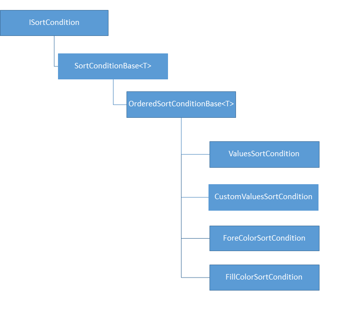
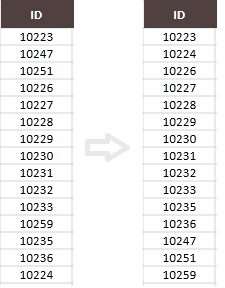
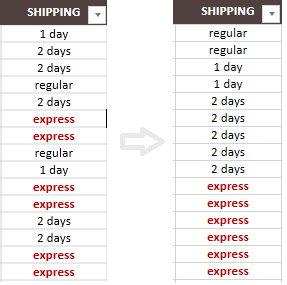
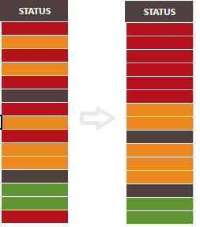
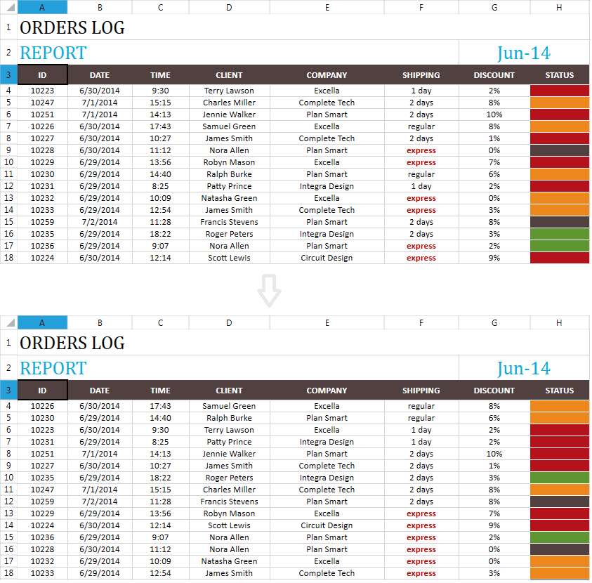

# Sorting

The following sections describe sorting and how to work with it through the document model:

* [What Is Sorting?](#what-is-sorting?)

* [SortState](#SortState )

* [ISortCondition](#isortcondition)

* [OrderedSortCondition](#orderedsortcondition)

* [ValuesSortCondition](#valuessortcondition)

* [CustomValuesSortCondition](#customvaluessortcondition)

* [ForeColorSortCondition](#forecolorsortcondition)

* [FillColorSortCondition](#fillcolorsortcondition)

* [Setting Sorting Conditions](#setting-sorting-conditions)

* [Clearing the Sorting](#clearing-the-sorting)

## What Is Sorting?

The sorting feature allows arranging the data according to one or more sorting conditions.

The information about the sorting applied to a worksheet is contained in the worksheet property `SortState` which is of type `SortState`. Through it, you can set and modify the worksheet sorting conditions. The interface implemented by all sort conditions is `ISortCondition`.

## SortState

The `SortState` class exposes the following public members:

* `Count`: The number of sorting conditions currently applied.

* `SortConditions`: The sorting conditions currently applied.

* `SortRange`: Property of type `CellRange` representing the sorting range to which the sorting conditions are applied. The worksheet can have only one range sorted at a time. If no sorting is applied, the sort range is null.

* `void Set(CellRange sortRange, params ISortCondition[] sortConditions)`: Sets the specified sorting conditions to the specified range.

* `void Clear()`: Removes all the sorting from the worksheet.

## ISortCondition

All sorting conditions which can be applied to the sorted range implement the `ISortCondition` interface. The interface exposes the following members:

* `SortIndex`: Gets the index of the column to which the sort condition is applied. The index is relative to the beginning of the sorted range.

* `IComparer<SortValue> Comparer`: Determines the order of the sorted values.

* `object GetValue(Cells cells, int rowIndex, int columnIndex)`: Gets the value of the cell at the specified index. This value is used to determine how the cell containing the value is ordered during the sorting.

The diagram in **Figure 1** shows the different types of conditions, which inherit the `ISortCondition` interface, and the classes which implement them.

#### Figure 1: Types of Conditions

## OrderedSortCondition

The ordered sort condition is a type of condition which sorts the values in an ordered manner, in ascending or descending order. The abstract class `OrderedSortConditionBase<T>` represents it.

This class has one additional member, other than the members of the `ISortCondition` interface:

* `SortOrder`: The sort order. It can have one of these values:

	* Ascending

	* Descending

## ValuesSortCondition

The values sort condition is a condition which uses the values of the cells to sort them.

**Example 1** shows how to create a `ValuesSortCondition`.

**Example 1: Create ValuesSortCondition**

<snippet id='codeblock-ckv'/>

This condition uses a predefined comparer to sort the values of the cells in the selected range in an intuitive ascending order. The result is visible in **Figure 2**.

#### Figure 2: Values Sort Result

## CustomValuesSortCondition

Sometimes the behavior of the predefined comparers is not sufficient. In this case you may want to use a custom values sort condition. With it, you can specify the order in which you want the values to appear.

**Example 2** shows how to create a `CustomValuesSortCondition`.

**Example 2: Create CustomValuesSortCondition**

<snippet id='codeblock-ckw'/>

#### Figure 3: Custom Value Sort Result

## ForeColorSortCondition

A fore color sort condition orders the cells according to the color of the text in them. Each condition can have one color which it sets on the top or on the bottom of the sorted order.

**Example 3** demonstrates how to create a `ForeColorSortCondition`. This condition sorts the range by putting all cells with a red fore color on the top.

**Example 3: Create ForeColorSortCondition**

<snippet id='codeblock-ckx'/>

## FillColorSortCondition

A fill color sort condition orders the cells according to their fill color. Each condition can have one fill which it sets on the top or on the bottom of the sorted order.

**Example 4** shows how to create a `FillColorSortCondition`.

**Example 4: Create FillColorSortCondition**

<snippet id='codeblock-cky'/>

**Figure 4** shows that this condition sorts the range by putting all cells with a red color on the top.

#### Figure 4: Fill Color Sort Result

## Setting Sorting Conditions

There are two ways to sort a range on a worksheet: through the `SortState` property of the worksheet, or through the cell selection. In both cases you need to create a sort condition and then apply it.

Unlike the case with [Filtering](), you can apply more than one sort condition on one column. In fact, this is what you need to do if you want to sort by more than one color.

**Example 5** shows how to create three sorting conditions.

**Example 5: Create Conditions**

<snippet id='codeblock-ckz'/>

**Example 6** shows how to apply the sorting conditions through the `SortState` property.

**Example 6: Set Conditions Through SortState**

<snippet id='codeblock-cla'/>

Alternatively, **Example 7** shows how to apply the sorting conditions through the cell selection property.

**Example 7: Set Conditions Through Selection**

<snippet id='codeblock-clb'/>

Whichever option you choose, the result is the same. The conditions are applied in the order you set them. In **Figure 5** you can see that in this example the rows are rearranged first by the custom list given for column F. After that the red color is placed on top and the green color is placed after it in each section formed by the rows with same values in column F.

#### Figure 5: Set Conditions Result

## Clearing the Sorting

To clear the sorting, use the `Clear()` method of the `SortState` property. There is no need to clear the old sort conditions if you want to set new ones. They are cleared internally.

**Example 8** shows how to clear the sorting.

**Example 8: Clear Sorting**

<snippet id='codeblock-clc'/>

## See Also

* [Filtering]()
