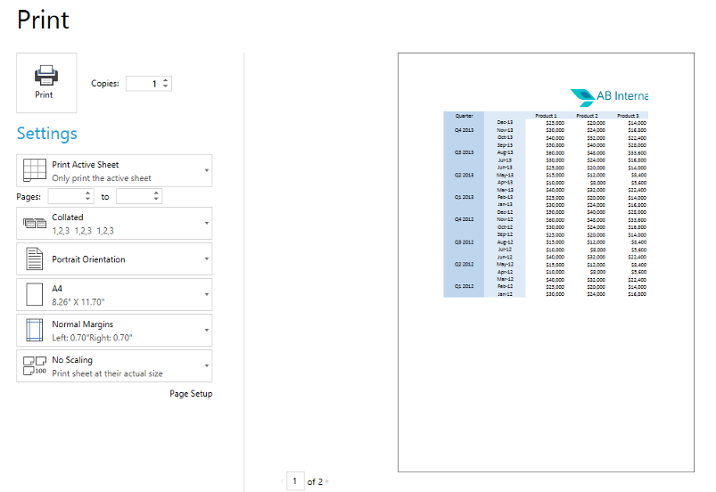
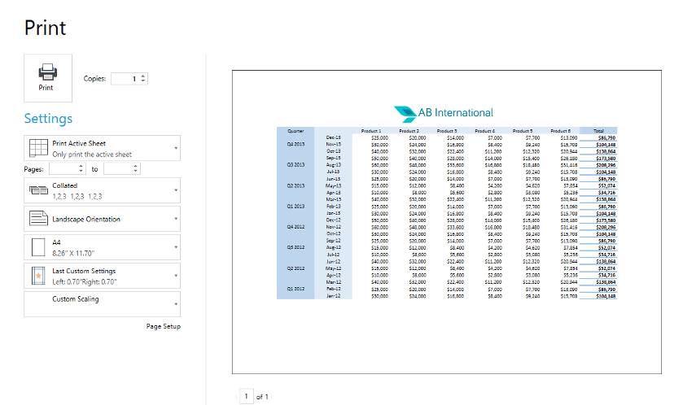
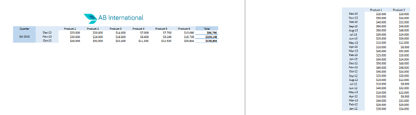
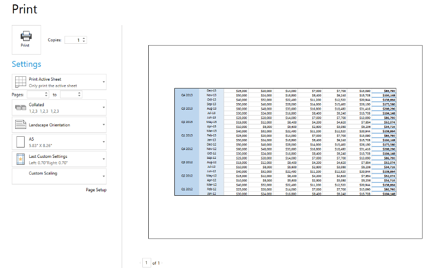
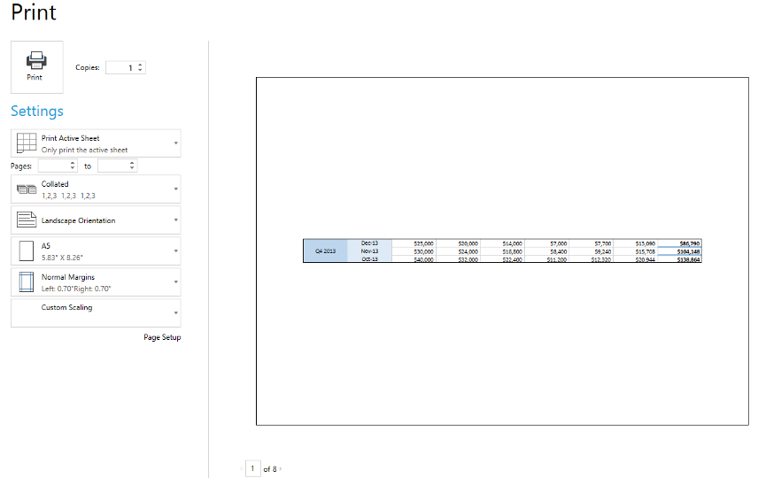

# Worksheet Page Setup

When you need to present the `Worksheet` content on a set of pages, such as in printing or exporting scenarios, the `WorksheetPageSetup` class provides the needed properties for controlling how the content is split and presented into pages.

## WorksheetPageSetup Properties

Through the `Worksheet` `WorksheetPageSetup` property you can change the following page setup properties:

* `PaperType`: Specify paper type using the [PaperTypes enumeration](https://docs.telerik.com/devtools/document-processing/api/Telerik.Windows.Documents.Model.PaperTypes.html).

* `PageOrientation`: Specify whether the page orientation is Portrait or Landscape.

* `Margins`: Specify the sizes of the page margins.

* `HeaderFooterSettings`: Allows you to specify a header or a footer for a worksheet. For more information on how to achieve this, check the [Headers and Footers topic]().

* `PageOrder`: Specify whether the page order is "Down, then over" or "Over, then down".

* `CenterHorizontally`: Specify whether the print content is centered horizontally within the area between the page margins.

* `CenterVertically`: Specify whether the print content is centered vertically within the area between the page margins.

* `ScaleFactor`: Specify the scale factor to print with value in the range from 50% to 400%.

	 If you need to calculate the custom scale factor for the worksheet to fit in a specific number of pages when printed, you can use the methods provided by the `PageScaleFactorCalculator` static class:

	* `CalculateScaleAccordingToFitToPages(Worksheet worksheet)`: Calculates the maximum scale factor that can be set to a worksheet for it to fit into the number of pages specified in the `FitToPagesWide` and `FitToPagesTall` properties.

	* `CalculateScaleAccordingToFitToPages(Worksheet worksheet, IEnumerable<CellRange> includedRanges)`: Calculates the maximum scale factor that can be set to a worksheet for the **specified ranges** to fit into the number of pages specified in the `FitToPagesWide` and `FitToPagesTall` properties.

* `FitToPagesTall`: Specify the number of pages tall the worksheet will be scaled to when printed. The default value is 1.

* `FitToPagesWide`: Specify the number of pages wide the worksheet will be scaled to when printed. The default value is 1.

* `FitToPages`: Allows you to specify whether the worksheet will be scaled according to a number of pages. If the value of this property is *true*, the worksheet is scaled according to the `FitToPagesWide` and `FitToPagesTall` values. Otherwise, it is scaled according to the `ScaleFactor` value. Additionally, if `FitToPagesTall` is 0, the worksheet fits to width only, and if `FitToPagesWide` has a value of 0, it fits to height only.

* `PrintOptions`: Specify print options such as whether to print gridlines or row and column headings.

* `PrintArea`: Change the print area in the selected worksheet.

* `PageBreaks`: Change the page breaks collection in the selected worksheet.

* `PrintTitles`: Enables you to specify rows or columns that are repeated on each page for the worksheet.

**Figures 1 and 2** show an example of the worksheet page setup usage. In the example, the spreadsheet data has bigger width than height. Previewing the print pages with the default settings shows that the content does not fit well as the print content is split into two pages.

#### Figure 1: Initial print preview of data

To fit the print content better, use the worksheet page setup and change the page orientation, the scale factor, and some additional print settings. **Example 1** shows the code that needs to be executed.

#### __Example 1: Use WorksheetPageSetup__

<snippet id='codeblock-cld'/>

As a result, the data fits into a single page with size A4 as shown in **Figure 2**.

#### Figure 2: Result after page setup

## Using Print Area

When printing a worksheet, by default the whole used cell range is used for printing. If you do not need to print the whole content of the worksheet, you can set a print area by specifying a list of ranges to print.

Through the `WorksheetPageSetup` `PrintArea` property you can access the print area of a worksheet and change its print ranges with the following methods:

* `SetPrintArea()`: Sets the print area ranges using a given set of `CellRange` instances. This method clears all previously set ranges.

* `CanAddToPrintArea()`: Returns a Boolean indicating whether the passed set of print ranges can be added in the existing print area. If some of the given ranges intersect with an already existing print area range, the result is *false*.

* `TryAddToPrintArea()`: Tries to add a given set of `CellRange` instances to the collection of areas and returns a Boolean indicating the success of this operation.

* `Clear()`: Clears the existing print area ranges.

The example shown in **Figure 3** demonstrates how to use the worksheet print area. In this example, a big table with data exists and you want to print only two specific ranges. To achieve that, set the print area with these cell ranges in the code snippet from **Example 2**.

#### __Example 2: Set PrintArea__

<snippet id='codeblock-cle'/>

#### Figure 3: Resulting PrintArea preview

## Using Page Breaks

When a big cell range cannot fit into a single page, it gets split into multiple pages. If you need your pages to be split at specific places, you can specify these places by inserting a page break.

Through the `WorksheetPageSetup` `PageBreaks` property you can manipulate the page breaks collection of a worksheet using the following methods:

* `TryInsertHorizontalPageBreak()`: Tries to insert a horizontal page break at a specific index. Returns true when a page break is inserted.

* `TryInsertVerticalPageBreak()`: Tries to insert a vertical page break at a specific index. Returns true when a page break is inserted.

* `TryRemoveHorizontalPageBreak()`: Tries to remove a horizontal page break at a specific index. Returns true when a page break is removed.

* `TryRemoveVerticalPageBreak()`: Tries to remove a vertical page break at a specific index. Returns true when a page break is removed.

* `TryInsertPageBreaks()`: Tries to insert horizontal and vertical page breaks at a specific index. Returns true when at least one page break is inserted.

* `TryRemovePageBreaks()`: Tries to remove horizontal and vertical page breaks at a specific index. Returns true when at least one page break is removed.

* `Clear()`: Clears all existing page breaks from the page breaks collection.

**Figure 4** shows a preview of a large amount of data.

#### Figure 4: Initial preview of data

To separate the print data semantically onto several pages, place horizontal page breaks at the positions where you need the splitting to happen. **Example 3** shows how to achieve this.

#### __Example 3: Insert PageBreaks__

<snippet id='codeblock-clf'/>

As a result of inserting these horizontal page breaks, you have eight pages to print. The first one is shown in **Figure 5**.

#### Figure 5: Result of PageBreaks

## Repeating Rows/Columns

The `PrintTitles` property of `WorksheetPageSetup` enables you to set rows or columns to be repeated on each page when printing or exporting the worksheet to PDF. The property is of type `PrintTitles` and exposes the following properties:

* `RepeatedColumns`: Gets or sets a value of type `ColumnRange` that represents the range of columns that are repeated.
* `RepeatedRows`: Gets or sets a value of type `RowRange` that represents the range of rows that are repeated.

#### __Example 4: Repeat the first two rows and two columns of the worksheet on each page__

<snippet id='codeblock-clg'/>

## See Also

* [Headers and Footers]()
