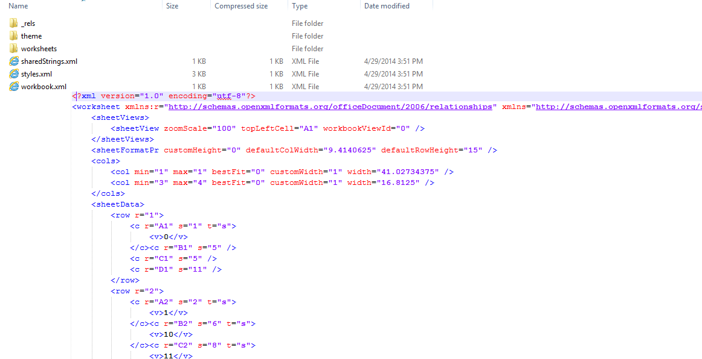

# Xlsx

XLSX, a part of [Office Open XML](https://en.wikipedia.org/wiki/Office_Open_XML), is a zipped, XML-based file format developed by Microsoft for representing spreadsheets. It is one of the supported formats in `RadSpreadProcessing` and `RadSpreadsheet`.
      

XLSX File Unzipped

`XlsxFormatProvider` is compliant with the latest Office Open XML standard - [ECMA-376](https://www.ecma-international.org/publications/standards/Ecma-376.htm) 4th edition, December 2012.
