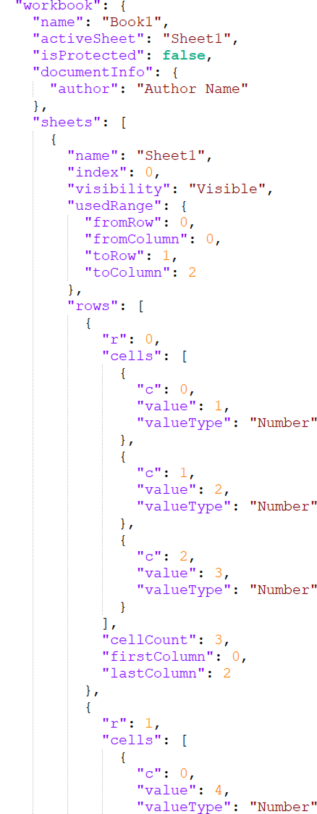

# Json

[JavaScript Object Notation](https://www.json.org/json-en.html) (JSON) is a lightweight, text-based data format used to store and exchange structured information. It represents data as key–value pairs (objects) and ordered lists (arrays). JSON is language-independent but closely resembles JavaScript syntax, making it easy for both humans to read and machines to parse.
      

   

