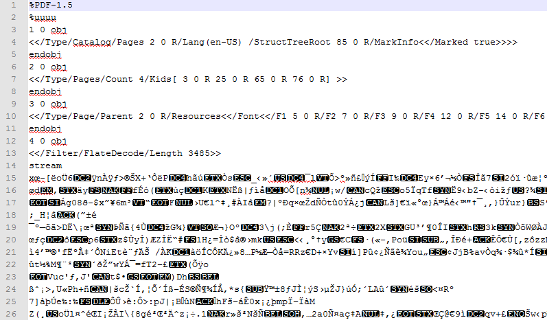

# Pdf

[Portable Document Format](https://en.wikipedia.org/wiki/Portable_Document_Format) (PDF) is a file format used to present documents independently of application software, hardware, and operating system. Each PDF file contains a complete description of a fixed-layout flat document, including text, fonts, graphics, and other information needed to display it.

The following image shows a PDF file opened in a text editor:

`PdfFormatProvider` is compliant with the latest [PDF Reference 1.7](https://opensource.adobe.com/dc-acrobat-sdk-docs/pdfstandards/PDF32000_2008.pdf).
