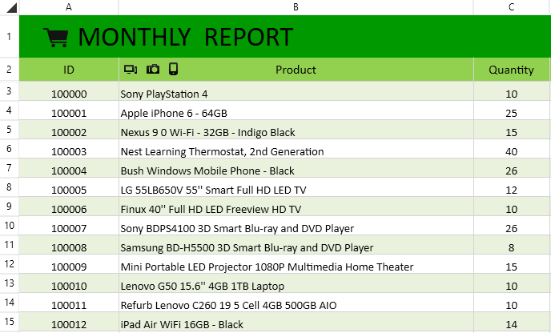

# Overview

Telerik Document Processing includes the **RadSpreadProcessing** library for creating, importing, exporting, and converting spreadsheet documents. **RadSpreadProcessing** supports XLSX, XLSM, XLS, CSV, TXT, and JSON files, as well as PDF export. It includes more than 200 built-in functions, such as `SUM` and `AVERAGE`. Create workbooks from scratch, modify existing files, convert between common spreadsheet formats, and save the result to a file or stream.

This article lists the most popular features of the library. To start right away, see [how to get started with RadSpreadProcessing]().

>note If you do not yet have Telerik Document Processing installed, see [the first steps for installation]().

## Key Features

The following table describes the most popular features of the `RadSpreadProcessing` library.

| Feature | Description |
|---------|-------------|
| [**Shapes and Images**]() | Insert, position, and delete images in worksheets. **RadSpreadProcessing** also supports SVG `FormSource` content. |
| [**Charts**]() | Add, remove, and manipulate chart objects in spreadsheet documents. |
| [**Conditional Formatting**]() | Analyze data more easily by highlighting values, patterns, and trends. |
| [**Hyperlinks**]() | Add, remove, edit, and search for hyperlinks in worksheets. |
| [**Workbook Protection**]() | Prevent users from adding, removing, renaming, or reordering sheets. |
| [**Worksheet Protection**]() | Restrict changes to worksheet content and structure, and choose which commands remain available. |
| [**Grouping**]() | Organize data in sections, and show or hide the relevant ranges. |
| [**Formulas**]() | Use more than 200 built-in functions, and register custom functions. |
| [**Named Ranges**]() | Use named ranges at the workbook and worksheet levels. |
| [**Styling**]() | Apply styles to cells, duplicate predefined styles, or create custom styles. |
| [**Theming**]() | Apply predefined document themes to control colors, fonts, and graphic effects across the workbook. |
| [**Resizing**]() | Autofit or resize rows and columns. |
| [**Number Formats**]() | Format cell data with predefined categories such as **General**, **Number**, **Currency**, **Accounting**, **Date**, **Time**, **Percentage**, **Fraction**, **Scientific**, **Text**, and **Special**, or create custom formats. |
| **Copy and Paste** | Add or [copy worksheets]() within or across workbooks. [Copy and paste cells]() as well. |
| [**Data Validation**]() | Control the data or values that users can enter in a cell. Available rules include list, number, date, text length, and custom validation. |
| [**Filtering**]() | Filter worksheet data. |
| [**Sorting**]() | Sort data in the worksheet. |
| [**Find and Replace Data**]() | Find, find all, replace, and replace all values. |
| [**Freeze Panes**]() | Keep part of the worksheet visible at all times when scrolling. |
| [**Hidden Rows and Columns**]() | Set the hidden state of each row or column in the workbook model. |
| [**Merge and Unmerge Cells**]() | Merge adjacent cells into one cell that spans multiple rows and columns, or split them again. |
| **[Auto fill]() and [Auto Fill Series]()** | Fill cells automatically with data following a specific pattern. |
| [**Page Setup**]() | Configure headers, footers, paper size, orientation, scaling, margins, page breaks, and print settings. |
| [**Workbook History**]() | Track workbook changes through history stacks. Each worksheet maintains its own history stack. |
| [**Comments**]() | Add comments and replies to cells for easier collaboration. |
| [**Notes**]() | Add notes to cells to highlight important information. |
| [**GenAI-Powered Document Insights**]() | Extract insights from Excel documents by using large language models (LLMs). |

## Supported Formats

The library supports the following formats:

* Excel formats: [**XLSX**](), [**XLSM**](), and [**XLS**]().
* Text formats: [**CSV**](), [**Plain Text**](), and [**JSON**]() for export.
* Other formats: [**PDF**]() for export.

To populate a workbook from a .NET `DataTable`, see [importing data from a `DataTable`]().

*This documentation is neither affiliated with, nor authorized, sponsored, or approved by, Microsoft Corporation.

## Online Demos

The following demos show common `RadSpreadProcessing` scenarios:

| Demo | Description |
|---|---|
| [SpreadProcessing Basic Usage](https://demos.telerik.com/document-processing/spreadprocessing) | Convert spreadsheet documents between formats such as XLSX, CSV, XLSM, and TXT. You can also export these formats to PDF. |
| [SpreadProcessing Document Generation](https://demos.telerik.com/document-processing/spreadprocessing/generate_documents) | Create documents entirely in code. This demo is useful when you need to export large amounts of data to XLSX, CSV, TXT, or XLSM. |
| [SpreadProcessing Grid Integration](https://demos.telerik.com/document-processing/spreadprocessing/grid_integration) | Integrate `RadSpreadProcessing` with the Kendo UI for ASP.NET Core Grid to export grid data to XLSX, CSV, XLSM, or TXT. |
| [SpreadProcessing Chart Generation](https://demos.telerik.com/document-processing/spreadprocessing/charts) | Create spreadsheet documents with charts entirely in code. |
| [SpreadProcessing Add Notes](https://demos.telerik.com/document-processing/spreadprocessing/notes) | Add notes to cells while you generate a document, and then export the result to XLSX. |
| [SpreadProcessing Add Comments](https://demos.telerik.com/document-processing/spreadprocessing/comments) | Add comments to cells while you generate a document, and then export the result to XLSX. |

## See Also

* [Getting Started]()
* [What is a Workbook]()
* [What is a Worksheet]()
* [Generating Excel Documents from IEnumerable Collections]()
* [Exporting Data from DataGridView Control to Excel File]()
