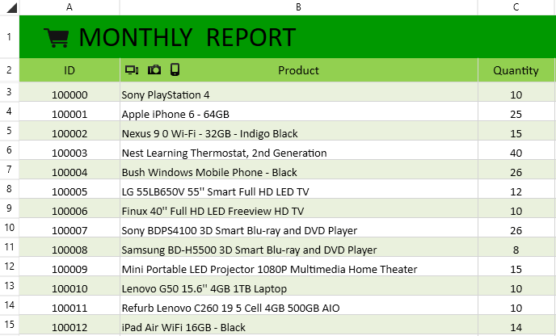

# Overview

Thank you for choosing Telerik __RadSpreadProcessing__.
      

## 

__RadSpreadProcessing__ is a document processing library that enables your applications to easily import and export files to and from the most common spreadsheet file formats.
        

Some of the features which you can use are:
        

* Import/export to different spreadsheet formats. Check the [Formats and Conversion]() section for more information on this topic.
            

* More than 200 built-in [formulas]().
            

* Powerful and easy-to-use API.

            
* [Data Validation]()

* [Filtering]()

* [Grouping]()

* [Sorting]()
