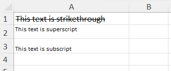
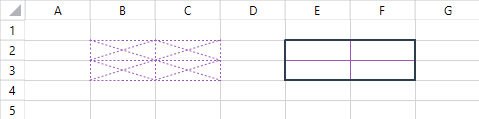
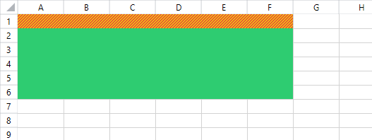

# Get, Set and Clear Cell Properties

Cells are the atomic parts of a worksheet and its basic data units. Each cell can be assigned a value, borders, fill, format, style and much more. This article aims to describe the properties offered by cells and demonstrate how to retrieve and change them. It contains the following sections:
      

* [Get Set and Clear Methods](#get,-set-and-clear-methods)

* [Cell Properties](#cell-properties)

* [Value Property](#value-property)

* [Borders Property](#borders-property)

* [Fill Property](#fill-property)

* [Indent Property](#indent-property)

## Get, Set and Clear Methods

In order to access cell properties, you have to create a __CellSelection__ object that contains the region of cells you would like to change. More information about retrieving __CellSelection__ instances is available in the [Accessing Cells of a Worksheet]() article.
        

__Example 1__ creates a selection for cells in the range A1:F6.
        

#### Example 1: Create CellSelection

<snippet id='codeblock-cqx'/>

Once you have a __CellSelection__ instance, you can easily set and retrieve the properties of its cells. Each property is manipulated through three methods that get, set and clear the value of the property, respectively. Typically, the set methods take a single argument, which indicates the value to be set. Similarly, the clear methods have no parameters and reset the properties to their default values. The get methods, however, require more attention.
        

With one minor exception, the get methods of all cell properties return an object of type __RangePropertyValue&lt;T&gt;__. The class exposes two properties that indicate the value of the property for the cell range:
        

* __IsIndeterminate__: Indicates whether the value of the retrieved property is consistent among all cells in the specified __CellSelection__. If the property has one and the same value for all cells, __IsIndeterminate__ is set to false. However, if the value of the retrieved property varies throughout the cells in the __CellSelection__, the __IsIndeterminate__ property is set to true and the __Value__ property of the __RangePropertyValue&lt;T&gt;__ class is set to its default value.
            

* __Value__: Contains the value of the retrieved property. If the __IsIndeterminate__ property is set to false, __Value__ contains the value of the retrieved property for the whole __CellSelection__ region. If the __IsIndeterminate__ property is set to true, the __Value__ property is set to its default value.
            

## Cell Properties

Cells in __RadSpreadProcessing__ offer a number of properties that allow you to change their content and appearance. The following list outlines all cell properties:
        

* Value

* Border

* Fill

* FontFamily

* FontSize

* ForeColor

* Format

* HorizontalAlignment

* Indent

* IsBold

* IsItalic

* IsWrapped

* IsStrikethrough

* VerticalTextAlignment ((none, superscript, or subscript))

* StyleName

* Underline

* VerticalAlignment

* IsLocked

* TextRotation

As already mentioned, the __CellSelection__ class exposes methods that get, set and clear methods for each of the above properties. The names of the methods are constructed through the concatenation of the action the method executes (Get, Set, Clear) and the name of the property. For example, the methods that get, set and clear the __IsBold__ property are respectively, __GetIsBold()__, __SetIsBold()__ and __ClearIsBold()__.
        

__Example 2__ illustrates how to use these methods on the region A1:F6.
        

#### Example 2: Use GetIsBold(), SetIsBold() and ClearIsBold() methods

<snippet id='codeblock-cqy'/>

Using the above approach you can set the value of almost all cell properties. There are a few exceptions to the general get, set and clear rule, though, and each of them is described into one of the following sections.

>When using **GetFontSize()** and **SetFontSize()** methods you have to keep in mind that measurement units used in **RadSpreadProcessing** are [Device Independent Pixels]() (DIPs). You can convert it to points or other units using the [Unit](https://docs.telerik.com/devtools/document-processing/api/Telerik.Windows.Documents.Media.Unit.html) class. For more information go to [Measurement Units](#measurement-units) help topic.
 
**Example 3** demonstrates how to apply basic text formatting to worksheet cells. The first cell applies a strikethrough effect, while the following cells illustrate vertical text alignment by rendering text as superscript and subscript respectively.

#### Example 3: Using SetIsStrikethrough and SetVerticalTextAlignment

<snippet id='codeblock-strikethrough'/>

 

## Value Property

The __Value__ property uses an instance of __ICellValue__ to retrieve and change its value. The property has support for the following types of cell values, all of which conform to the ICellValue interface: *EmptyCellValue*, *NumberCellValue*, *BooleanCellValue*, *TextCellValue*, *FormulaCellValue*. Similarly to the other properties, __Value__ has three methods that control the property: __GetValue()__, __SetValue()__ and __ClearValue()__. More information about different value types is available in the [Cell Value Types]() article.
        

The __GetValue()__ method retrieves the value of the property and returns an instance of __RangePropertyValue&lt;ICellValue&gt;__. The __Value__ property of the __RangePropertyValue__ instance returns the actual value of the selected region.
        

__Example 4__ illustrates who to retrieve the value of cell B2.
        

#### Example 4: Retrieve value of cell

<snippet id='codeblock-cqz'/>

As the document model supports different types of cell values, the __CellSelection__ class offers multiple overloads of the __SetValue()__ method that allow you to produce different types of values. For example, if you choose the method that accepts a double instance, the __Value__ of the cell will be an instance of NumberCellValue. The __SetValue()__  method has three more overloads that take DateTime, string and ICellValue, respectively.
        

__Example 5__ demonstrates how to set the value of a given selection.
        

#### Example 5: Set value of CellSelection

<snippet id='codeblock-cra'/>

## Borders Property

The __Borders__ property uses a __CellBorders__ object for getting and setting its property value. The __CellBorders__ class contains eight instances of type __CellBorder__ that describe respectively the left, top, right, bottom, inside horizontal, inside vertical, diagonal up, and diagonal down borders. In turn, the __CellBorder__ object holds information about the style and color of the border. The __GetBorders()__ method returns an instance of RangePropertyValue&lt;CellBorders&gt;.
        

__Example 6__ demonstrates how to set the value of the Borders of the regions B2:C4 and E2:F4.
        

#### Example 6: Set value of Borders

<snippet id='codeblock-crb'/>

The result of __Example 6__ is demonstrated in __Figure 1__.
        

#### Figure 1: Resulting Borders

## Fill Property

The __Fill__ property uses an __IFill__ object for getting and setting its property value. The document model supports two types of fills that are represented through the __PatternFill__ and __GradientFill__ classes, both of which conform to the __IFill__ interface.
        

As its name suggests, the __PatternFill__ object is used to fill the background of a region of cells using a repeated pattern of shapes. To create a PatternFill instance, you need to specify the type of the pattern, the background color and pattern color of the fill. You can choose between [eighteen types of patterns](https://docs.telerik.com/devtools/document-processing/api/Telerik.Windows.Documents.Spreadsheet.Model.PatternType.html), such as HorizontalStripe, DiagonalCrossHatch, Gray75Percent and many more. The PatternFill object also allows you to set the background of a cell to a solid color.
        

__Example 7__ creates two PatternFill objects with a DiagonalStripe and Solid PatternType respectively.
        

#### Example 7: Create and set PatternFill

<snippet id='codeblock-crc'/>

The result of __Example 7__ is illustrated in __Figure 2__.

#### Figure 2: Applied PatternFill

The __GradientFill__ is used to set the background of a region of cells to a gradual blending of two colors. To create a GradientFill, you need to specify a [GradientType](https://docs.telerik.com/devtools/document-processing/api/Telerik.Windows.Documents.Spreadsheet.Model.GradientType.html) and the two colors that will blend.
        

__Example 8__ assigns the region A1:F1 a smooth horizontal green gradient.
        

#### Example 8: Create and set GradientFill

<snippet id='codeblock-crd'/>

The result of __Example 8__ is illustrated in __Figure 3__.
        

#### Figure 3: Applied GradientFill

## Indent Property

In addition to the __GetIndent()__, __SetIndent()__ and __ClearIndent()__ methods, __CellSelection__ offers two more methods that are used to increase and decrease the value of the __Indent__ property. Those methods are __IncreaseIndent()__ and __DecreaseIndent()__ and neither of them takes arguments. __Example 9__ snippet shows how to use the methods.
        

#### Example 9: Increase and decrease indent

<snippet id='codeblock-cre'/>

## See Also
 * [Accessing Cells of a Worksheet - CellSelection] ()
 * [Cell Value Types]()
 * [PatternType Enumeration](https://docs.telerik.com/devtools/document-processing/api/Telerik.Windows.Documents.Spreadsheet.Model.PatternType.html)
 * [GradientType Enumeration](https://docs.telerik.com/devtools/document-processing/api/Telerik.Windows.Documents.Spreadsheet.Model.GradientType.html)
