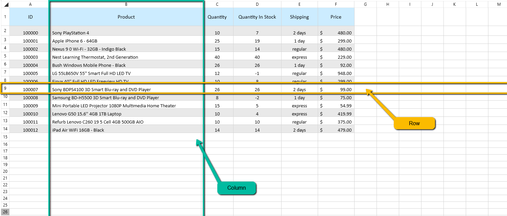

# What is a Row? What is a Column?

Rows and columns are the structural units of every RadSpreadProcessing worksheet. Use this article to understand how rows and columns are identified, what sizing options they provide, and which related APIs help you work with them in code.

## Row and Column Addressing

A worksheet organizes cells into rows and columns. **Rows** are groups of cells on the same horizontal line. Each row is identified by a number - the first row has index 1 and the last row is 1048576.

**Columns** are groups of cells stacked on the same vertical line. Each column is identified by a letter or combination of letters - the first column is A and the last column is XFD.

A cell sits at the intersection of one row and one column, and its address combines the column letter and row number. For example, `B3` refers to the cell in column B, row 3.

Similarly, a **column** is a group of cells that are vertically stacked and appear on the same **vertical line**. Columns in `RadSpreadProcessing` are identified by a letter or a combination of letters. For example, the first column is called A, the second is B, and the last column is XFD.
        

## Row Height

Rows offer several approaches for determining their height:

| Option | Description |
|---|---|
| Default Height | Each row has a default height of 20. When the row does not have an explicitly set height, it appears with its default height. |
| Height | Allows you to make a given set of rows appear with a fixed height. |
| Auto Fit | Sets the height of a specific row based on the content of all cells in the row. The height is determined by the cell with the tallest content. |

## Column Width

Columns offer several approaches for determining their width:

| Option | Description |
|---|---|
| Default Width | Each column has a default width of 65. When the column does not have an explicit width set, it appears with its default width. |
| Width | Allows you to make a given set of columns appear with a fixed width. |
| Auto Fit | Sets the width of a specified column based on the content of all cells in the column. The width is determined by the cell with the widest content. |

For more information about setting row height and column width, see [Resizing Rows and Columns]().

## See Also

* [Insert and Remove Rows and Columns]()
* [Resizing Rows and Columns]()
* [Hidden Rows and Columns]()
