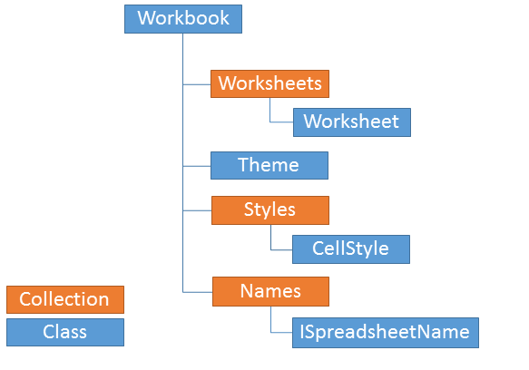

# What is a Workbook?

This article will help you get familiar with the representation of an Excel workbook in the model of SpreadProcessing.

## Overview

The workbook lays in the core of the SpreadProcessing' document model. It is the primary document that you use to retrieve, manipulate and store data. The workbook can also be viewed as a collection of worksheets, where a worksheet is in turn defined as a collection of cells organized in rows and columns. Each workbook contains, at least, one worksheet and often holds several sheets with related information.

The workbook is designed to hold together multiple worksheets in order to allow efficient organization and consolidation of data. Typically, a workbook has a single theme and contains worksheets with related data. For example, an annual budget workbook may comprise four worksheets that break down the budget in quarters.

You can create a workbook from scratch or import an existing document. To save a document you can export its contents into a `csv`, `txt`, `xlsx`, `xls` file or a `DataTable`. Further information is available in the [Create, Open and Save Workbooks]() article and the [Formats and Conversion]() section.

## What is in it?

The workbook has several important characteristics:

| Characteristic | Description |
|---|---|
| Collection of Worksheets | Each workbook maintains a collection of worksheets that allows you to add and delete worksheets, move worksheets within the workbook, or iterate through them. More information is available in [What is a Worksheet?](). |
| Active Worksheet | The workbook exposes a property that indicates the active worksheet. There is a single active worksheet in a workbook at a time. See [Activate a Worksheet](). |
| History | Each workbook maintains a history stack that records all changes to its content, enabling undo and redo operations. You can also group several actions into one undo step. For more information, see [History](). |
| Names (Named Ranges) | The `Workbook` class exposes a `Names` property of type `NameCollection` that allows you to create, update and manage names. More about the feature is available in [Names](). |
| Collection of Cell Styles | Each workbook contains a collection of cell styles — predefined sets of formatting options (borders, fonts, fills, number formats) that you can apply to a cell. For more information, see [Cell Styles](). |
| Theme | The workbook has a theme that lets you specify colors, fonts and graphic effects for the whole document. For more information, see [Document Themes](). |
| Find and Replace | The `Workbook` class offers an API to find and replace text and numbers across all worksheets. For more information, see [Find and Replace](). |
| Protection | Lets you prevent users from modifying the structure of the workbook (adding, removing, renaming, or reordering sheets). See [Workbook Protection](). |
| `DocumentInfo` | Enables you to set and obtain document metadata. Of type `DocumentInfo`, it exposes `Author`, `Title`, `Subject`, `Keywords`, and `Description` properties. |

*This documentation is neither affiliated with, nor authorized, sponsored, or approved by, Microsoft® Corporation.

## See Also

* [Create, Open and Save Workbooks]()
* [Formats and Conversion]()
