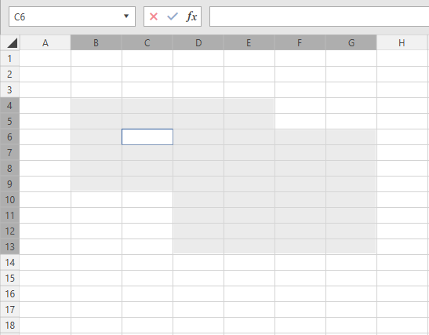
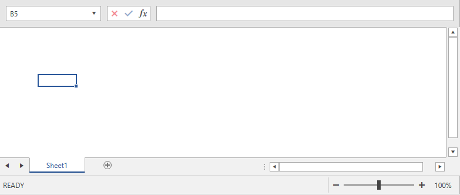

# Manage View State

**RadSpreadProcessing** enables you to apply different properties on the Worksheet that affect its visualization when the document is rendered in an application. These properties can be used through the **ViewState** property of the **Worksheet** object.

The following sections describe the members of the WorskheetViewState class.

### **ScaleFactor**

Allows you to get or set the current scale factor of the worksheet. You can use this property to zoom in or out according to your needs. The values you can apply are between 0.5 and 4, corresponding to 50% and 400% respectively.

#### __[C#] Example 1: Set the zoom level of a worksheet to 50%__
{{region cs-radspreadprocessing-working-with-worksheets-view-state_0}}

    workbook.Worksheets[0].ViewState.ScaleFactor = new Size(0.5, 0.5);
{{endregion}}

### **TopLeftCellIndex**

Determines the top left cell visible on the screen. You can use this property to ensure that the data you would like to visualize when the worksheet is opened is in the user viewport.

#### __[C#] Example 2: Set the top left cell to be C11__
{{region cs-radspreadprocessing-working-with-worksheets-view-state_1}}

    workbook.Worksheets[0].ViewState.TopLeftCellIndex = new CellIndex(10, 2);
{{endregion}}

### **SelectionState**

Gets or sets the state of the selection inside the worksheet.

**Example 3** demonsrates how you can create two selection ranges (one from B3 to E9 and one from D6 to G13) and change the active cell inside that selection.

#### __[C#] Example 3: Change the selection__
{{region cs-radspreadprocessing-working-with-worksheets-view-state_2}}

    CellIndex selectionActiveCellIndex = new CellIndex(5, 2); // C6
    List<CellRange> selectionRanges = new List<CellRange>()
    {
        new CellRange(new CellIndex(3, 1), new CellIndex(8, 4)),// B3:E9 
        new CellRange(new CellIndex(5, 3), new CellIndex(12, 6)),// D6:G13
    };
    
    SelectionState selectionState = new SelectionState(selectionRanges, selectionActiveCellIndex, ViewportPaneType.Scrollable);
    workbook.Worksheets[0].ViewState.SelectionState = selectionState;
{{endregion}}

#### Figure 1: Selection in worksheet

    
### **IsSelected**

Gets or sets a value indicating whether the sheet is selected.

### **ShowGridLines**

Allows you to get or set a boolean value determining whether the gridlines should be visualized when the document is rendered. 

#### __[C#] Example 4: Remove grid lines__
{{region cs-radspreadprocessing-working-with-worksheets-view-state_3}}
    workbook.Worksheets[0].ViewState.ShowGridLines = false;
{{endregion}}

### **ShowRowColHeaders**

Determines whether the headers of the rows and columns should be visualized when the document is rendered.

#### __[C#] Example 5: Remove row and column headers__
{{region cs-radspreadprocessing-working-with-worksheets-view-state_4}}
    workbook.Worksheets[0].ViewState.ShowRowColHeaders = false;
{{endregion}}

#### Figure 2: Worksheet with hidden row/column headers and grid lines

### **Pane**

Gets or sets the pane of the worksheet. Applicable when the worksheet contains [frozen panes]().

### **CircleInvalidData**

Gets or sets a value indicating whether to circle the invalid data. Applicable when using the [Data Validation]() feature.

### **FreezePanes()**

Allows you to freeze panes. Read more about this feature and its usage in the [Freeze Panes]() topic.

### **TabColor**

Allows you to set the color of the worksheet's tab.

#### __[C#] Example 6: Change the color of the tab__
{{region cs-radspreadprocessing-working-with-worksheets-view-state_5}}
    workbook.Worksheets[0].ViewState.TabColor = new ThemableColor(Colors.Green);
{{endregion}}

#### Figure 3: Worskheet with green tab

    
### **IsInvalidated**

Boolean property determining whether the view state must be updated.

### **ViewType**

Allows you to set the view type. The supported values are **Normal**, **PageBreakPreview**, and **PageLayout**.

## See Also

* [Iterate through Worksheets]()
* [Rename a Worksheet]()
* [Add and Remove Worksheets]()
