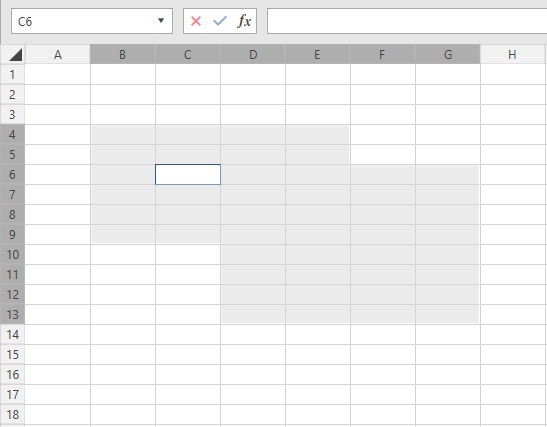
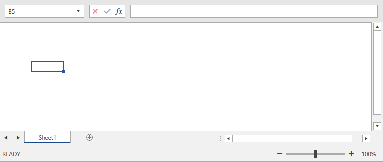
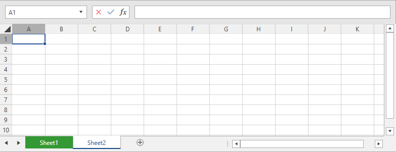

# Manage View State

**RadSpreadProcessing** enables you to apply different properties on the worksheet that affect its visualization when the document is rendered in an application. You can access these properties through the `ViewState` property of the `Worksheet` object.

The following sections describe the members of the `WorksheetViewState` class.

## ScaleFactor

Gets or sets the current scale factor of the worksheet. Use this property to zoom in or out according to your needs. The values you can apply are between 0.5 and 4, corresponding to 50% and 400% respectively.

**Example 1: Set the Zoom Level of a Worksheet to 50%**

<snippet id='libraries-spread-working-with-worksheets-view-state-1'/>

## TopLeftCellIndex

Determines the top left cell visible on the screen. Use this property to make sure that the data you want to visualize when the worksheet is opened is in the user viewport.

**Example 2: Set the Top Left Cell to Be C11**

<snippet id='libraries-spread-working-with-worksheets-view-state-2'/>

## SelectionState

Gets or sets the state of the selection inside the worksheet.

**Example 3** demonstrates how you can create two selection ranges (one from B3 to E9 and one from D6 to G13) and change the active cell inside that selection.

**Example 3: Change the Selection**

<snippet id='libraries-spread-working-with-worksheets-view-state-3'/>

## IsSelected

Gets or sets a value indicating whether the sheet is selected.

## ShowGridLines

Gets or sets a boolean value determining whether the gridlines are visualized when the document is rendered.

**Example 4: Remove Grid Lines**

<snippet id='libraries-spread-working-with-worksheets-view-state-4'/>

## ShowRowColHeaders

Determines whether the headers of the rows and columns are visualized when the document is rendered.

**Example 5: Remove Row and Column Headers**

<snippet id='libraries-spread-working-with-worksheets-view-state-5'/>

## Pane

Gets or sets the pane of the worksheet. Applicable when the worksheet contains [frozen panes]().

## CircleInvalidData

Gets or sets a value indicating whether to circle the not valid data. Applicable when using the [Data Validation]() feature. This property is not preserved when exporting the document because there is no alternative representation in the supported formats. Its value is used only by viewers integrated with SpreadProcessing.

## FreezePanes

Allows you to freeze panes. For more information about this feature and its usage, refer to the [Freeze Panes]() topic.

## TabColor

Sets the color of the worksheet tab.

**Example 6: Change the Color of the Tab**

<snippet id='libraries-spread-working-with-worksheets-view-state-6'/>

## IsInvalidated

Boolean property determining whether the view state must be updated.

## ViewType

Sets the view type. The supported values are `Normal`, `PageBreakPreview`, and `PageLayout`.

## See Also

* [Iterate Through Worksheets]()
* [Rename a Worksheet]()
* [Add and Remove Worksheets]()
