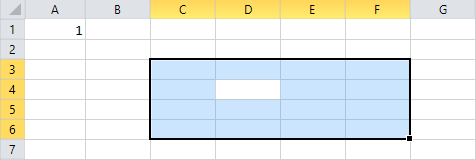
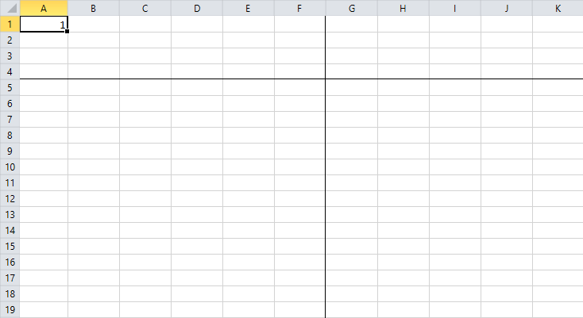

# Worksheet View Exporter

The **IWorksheetViewExporter** interface allows you to manipulate the way the exported document looks like when opened in an application. This article explains the available members of the interface and how you can use it.

* [Creating Worksheet View Exporter](#creating-worksheet-view-exporter)

* [Working with IWorksheetViewExporter](#working-with-iworksheetviewexporter)
	
	* [Change the First Visible Cell](#change-the-first-visible-cell)
	
	* [Add Selection to a Document](#add-selection-to-a-document)
	
	* [Scale a Document](#scale-a-document)
	
	* [Hide Grid Lines and Row or Column Headers](#hide-grid-lines-and-row-or-column-headers)
	
	* [Freeze Panes](#freeze-panes)
 
## Creating Worksheet View Exporter

You can create an instance of the IWorksheetViewExporter interface using the corresponding method of [IWorksheetExporter]().

#### **[C#] Example 1: Create IWorksheetViewExporter instance**

{{region cs-radspreadstreamprocessing-features-worksheet-view-exporter_0}}
	using (IWorksheetViewExporter worksheetView = worksheetExporter.CreateWorksheetViewExporter())
	{
	    // ...
	}
{{endregion}}

>IWorksheetViewExporter inherits from [IDisposable](https://msdn.microsoft.com/en-us/library/system.idisposable(v=vs.110).aspx). Make sure the object is disposed when you are done with it. Otherwise, the content won't be written in the exported file. The best way to ensure this is handled properly is to wrap it in a *using* statement.

## Working with IWorksheetViewExporter

The IWorksheetViewExporter interface allows you perform the following operations:

### Change the First Visible Cell

With the IWorksheetViewExporter interface you can set the first visible cell. This cell will be positioned at the top left position of the visible area when the document is rendered. **Example 2** shows how you can generate a document containing one worksheet, which, when visualized, will show the C5 cell as the top left cell.

#### **[C#] Example 2: Export a document with first visible cell C5**

{{region cs-radspreadstreamprocessing-features-worksheet-view-exporter_1}}
	using (IWorksheetExporter worksheetExporter = workbookExporter.CreateWorksheetExporter("Sheet 1"))
	{
	    using (IWorksheetViewExporter worksheetView = worksheetExporter.CreateWorksheetViewExporter())
	    {
	        worksheetView.SetFirstVisibleCell(4, 2);
	    }
	    // Fill the worksheet.
	}
{{endregion}}

### Add Selection to a Document

IWorksheetViewExporter defines methods that allow you apply selection to the exported document so that it contains selection ranges when visualized. You can also change the position of the selection's active cell.

#### **[C#] Example 3: Export a document with applied multiple selection ranges**

{{region cs-radspreadstreamprocessing-features-worksheet-view-exporter_2}}
	using (IWorksheetExporter worksheetExporter = workbookExporter.CreateWorksheetExporter("Sheet 1"))
	{
	    using (IWorksheetViewExporter worksheetView = worksheetExporter.CreateWorksheetViewExporter())
	    {
	        worksheetView.AddSelectionRange(2, 2, 5, 5);
	        worksheetView.AddSelectionRange(4, 4, 8, 8);
	        worksheetView.AddSelectionRange(3, 3, 10, 10);
	    }
	    // Fill the worksheet.
	}
{{endregion}}

#### **[C#] Example 4: Export a document with selection range and specified active cell of the selection**

{{region cs-radspreadstreamprocessing-features-worksheet-view-exporter_3}}
	using (IWorksheetExporter worksheet = workbookExporter.CreateWorksheetExporter("Sheet 1"))
	{
	    using (IWorksheetViewExporter worksheetView = worksheet.CreateWorksheetViewExporter())
	    {
	        worksheetView.AddSelectionRange(2, 2, 5, 5);
	        worksheetView.SetActiveSelectionCell(3, 3);
	    }
	    // Fill the worksheet with data.
	}
{{endregion}}

#### Figure 1: Selection with specified active cell

### Scale a Document

You can apply a scale factor to the exported document.

#### **[C#] Example 5: Set scale factor**

{{region cs-radspreadstreamprocessing-features-worksheet-view-exporter_4}}
	worksheetView.SetScaleFactor(0.5);
{{endregion}}

### Hide Grid Lines and Row or Column Headers

IWorksheetViewExporter enables you to set whether the resultant document should be visualized with grid lines and headers. **Example 6** demonstrates how you can hide both, grid lines and row/column headers.

#### **[C#] Example 6: Hide grid lines and row/column headers**

{{region cs-radspreadstreamprocessing-features-worksheet-view-exporter_5}}
	worksheetView.SetShouldShowGridLines(false);
	worksheetView.SetShouldShowRowColumnHeaders(false);
{{endregion}}

### Freeze Panes

You can freeze panes in the spreadsheet document using the SetFreezePanes() method.

#### **[C#] Example 7: Set freeze panes**

{{region cs-radspreadstreamprocessing-features-worksheet-view-exporter_6}}
	worksheetView.SetFreezePanes(4, 6);
{{endregion}}

#### Figure 2: Frozen panes

An overload of the SetFreezePanes() method enables you to change the first visible cell of the scrollable pane (the right-bottom pane).

#### **[C#] Example 8: Set freeze panes and change the first visible cell of the scrollable pane**

{{region cs-radspreadstreamprocessing-features-worksheet-view-exporter_7}}
	worksheetView.SetFreezePanes(4, 6, 10, 10);
{{endregion}}

In **Figure 3**, you can see that the first visible cell of the scrollable pane is K11.

#### Figure 3: Frozen panes with modified first visible cell of the scrollable pane

## See Also

* [Workbook]()
* [Worksheet]()
* [Columns]()
* [Rows]()